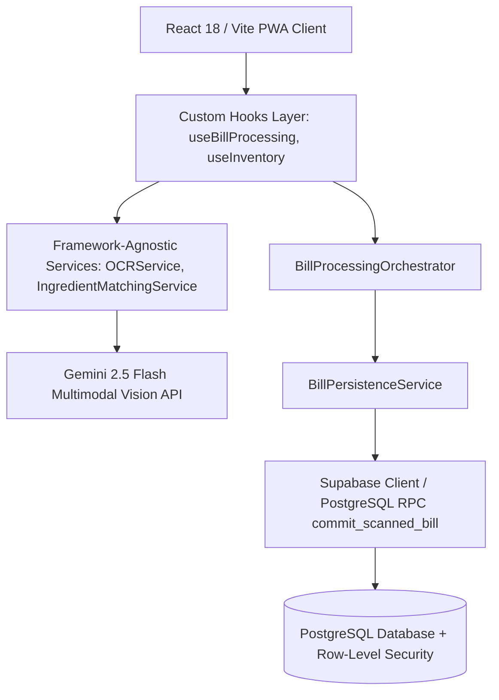
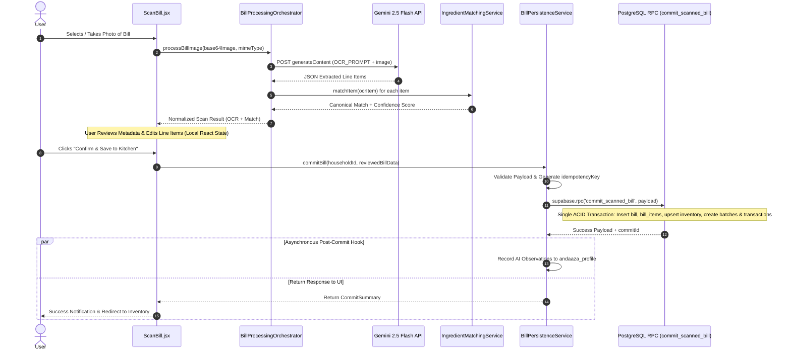

# KitchenMind — System Architecture Specification

---

## 1. Architectural Overview

KitchenMind uses a **Layered Service-Oriented Web Architecture** designed around modern single-page client rendering, asynchronous external AI pipeline processing, and single-roundtrip atomic database persistence.

---

## 2. Component System Layers

### 2.1 UI Component Layer (`src/pages`, `src/components`)
- **Responsibility**: Pure view rendering, user interaction, client-side form validation, and active component state.
- **Key Views**:
  - `ScanBill.jsx`: Multi-phase receipt capture, vision AI triggering, and interactive line-item review UI.
  - `Inventory.jsx`: Real-time stock display grouped by category with low-stock visual pills.
  - `AddItem.jsx`: Manual inventory entry with unit selector and auto-calculated grams.
  - `Onboarding.jsx`: Multi-step household setup wizard (members, fasting rules, roti preferences, tiffin config).

### 2.2 Custom Hooks Layer (`src/hooks`)
- **Responsibility**: Connect UI components to underlying domain services while managing React component lifecycles, load states, and errors.
- **Hooks**: `useBillProcessing`, `useInventory`, `useHousehold`, `useAuth`.

### 2.3 Domain Services Layer (`src/services`)
- **Responsibility**: Framework-agnostic pure JS business logic, external API integration, error normalization, and data transformations.
- **Key Services**:
  - `OCRService`: Wraps Gemini Vision API for receipt parsing.
  - `IngredientMatchingService`: Maps raw scanned bill strings to canonical ingredient names.
  - `BillProcessingOrchestrator`: Coordinates OCR and matching workflows without DB persistence.
  - `BillPersistenceService`: Validates UI payloads and invokes atomic PostgreSQL RPC functions.
  - `InventoryService`, `HouseholdService`, `RecipeService`, `AndaazaLearningService`.

### 2.4 Data & Security Layer (Supabase / PostgreSQL)
- **Responsibility**: Relational persistence, Row-Level Security (RLS) enforcement, atomic execution via stored procedures, and immutable transaction logging.

---

## 3. Data Flow Architecture

### Bill Scanning & Persistence Lifecycle

---

## 4. Key Architectural Decisions (ADR Summary)

1. **ADR-001: Separation of Processing and Persistence**
   - *Decision*: Receipt scanning and UI review operates strictly in-memory without database writes. Persistence only occurs when the user explicitly clicks "Confirm".
2. **ADR-002: Single-Roundtrip Database Commits via RPC**
   - *Decision*: Consolidate multi-table updates (`bills`, `bill_items`, `inventory`, `inventory_batches`, `inventory_transactions`) into a single PostgreSQL stored procedure `commit_scanned_bill()`.
   - *Rationale*: Eliminates client-side partial failures and guarantees 100% ACID compliance.
3. **ADR-003: Asynchronous AI Calibration**
   - *Decision*: Decouple `andaaza_profile` learning observations from the ACID transaction.
   - *Rationale*: Guarantees that a failure in AI logging never breaks a successful bill commit.
4. **ADR-004: Atomic Inventory Upserts**
   - *Decision*: Enforce `INSERT INTO inventory ... ON CONFLICT (household_id, canonical_name) DO UPDATE SET quantity_grams = inventory.quantity_grams + EXCLUDED.quantity_grams`.
   - *Rationale*: Eliminates race conditions and lost updates under concurrent access.
