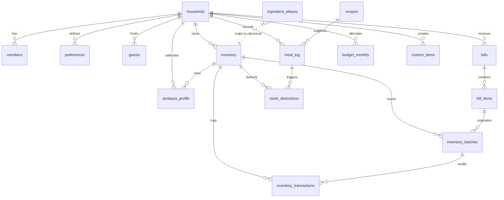

# KitchenMind — Database ERD & Schema Specification

---

## 1. Complete Entity-Relationship Diagram (ERD)



---

## 2. Comprehensive Table Specifications

### 2.1 `household`
Primary tenant entity representing a family unit.

| Column | Type | Constraints | Description |
| :--- | :--- | :--- | :--- |
| `id` | `uuid` | Primary Key, `default gen_random_uuid()` | Unique household identifier. |
| `name` | `text` | `NOT NULL` | Household name (e.g. "Sharma Family"). |
| `baseline_members` | `int` | `NOT NULL, default 4` | Base headcount count. |
| `roti_per_adult` | `int` | `NOT NULL, default 3` | Default rotis consumed per adult per meal. |
| `roti_per_child` | `int` | `NOT NULL, default 2` | Default rotis consumed per child per meal. |
| `created_at` | `timestamptz`| `NOT NULL, default now()` | Record creation timestamp. |

---

### 2.2 `members`
Individual family members belonging to a household.

| Column | Type | Constraints | Description |
| :--- | :--- | :--- | :--- |
| `id` | `uuid` | Primary Key, `default gen_random_uuid()` | Unique member identifier. |
| `household_id` | `uuid` | `FK -> household.id ON DELETE CASCADE` | Parent household reference. |
| `user_id` | `uuid` | `FK -> auth.users.id ON DELETE SET NULL` | Linked auth account (null for children/dependents). |
| `name` | `text` | `NOT NULL` | Member name. |
| `role` | `text` | `CHECK (role IN ('adult', 'child', 'elder'))` | Demographic role for consumption calculations. |
| `roti_preference`| `int` | Optional override | Custom roti count override. |
| `created_at` | `timestamptz`| `NOT NULL, default now()` | Record timestamp. |

---

### 2.3 `bills`
Grocery purchase receipt header.

| Column | Type | Constraints | Description |
| :--- | :--- | :--- | :--- |
| `id` | `uuid` | Primary Key, `default gen_random_uuid()` | Unique bill identifier. |
| `household_id` | `uuid` | `FK -> household.id ON DELETE CASCADE` | Owning household reference. |
| `idempotency_key`| `text` | `UNIQUE` per household | Client transaction key to prevent duplicate commits. |
| `bill_date` | `date` | `NOT NULL, default current_date` | Receipt purchase date. |
| `merchant` | `text` | Optional | Store or supermarket name. |
| `total_amount` | `numeric(10,2)`| `NOT NULL, default 0` | Total bill cost in INR. |
| `source` | `text` | `CHECK (source IN ('scan', 'manual'))` | Receipt origin. |
| `created_at` | `timestamptz`| `NOT NULL, default now()` | Creation timestamp. |

---

### 2.4 `bill_items`
Individual line items extracted from a grocery bill.

| Column | Type | Constraints | Description |
| :--- | :--- | :--- | :--- |
| `id` | `uuid` | Primary Key, `default gen_random_uuid()` | Unique line item identifier. |
| `bill_id` | `uuid` | `FK -> bills.id ON DELETE CASCADE` | Parent bill reference. |
| `item_name` | `text` | `NOT NULL` | Original text printed on bill. |
| `canonical_name` | `text` | `NOT NULL` | Standardized kitchen ingredient name. |
| `category` | `text` | Optional | Item category (Staples, Dairy, Spices, etc.). |
| `quantity_value`| `numeric(10,3)`| Optional | Extracted numeric quantity. |
| `andaaza_unit` | `text` | Optional | Display unit (kg, g, L, ml, pcs). |
| `unit_grams` | `numeric(10,3)`| Optional | Total standardized weight/volume in grams or ml. |
| `cost` | `numeric(10,2)`| Optional | Line item price in INR. |
| `purchase_date` | `date` | Optional | Date of purchase. |

---

### 2.5 `inventory`
Real-time stock ledger per household.

| Column | Type | Constraints | Description |
| :--- | :--- | :--- | :--- |
| `id` | `uuid` | Primary Key, `default gen_random_uuid()` | Unique inventory item identifier. |
| `household_id` | `uuid` | `FK -> household.id ON DELETE CASCADE` | Owning household reference. |
| `item_name` | `text` | `NOT NULL` | Display name of inventory item. |
| `canonical_name` | `text` | `NOT NULL` | Canonical name used for matching & deductions. |
| `category` | `text` | Optional | Item category. |
| `quantity_grams` | `numeric(10,3)`| `NOT NULL, default 0` | Total current stock in grams or ml. |
| `display_unit` | `text` | `NOT NULL, default 'g'` | Preferred UI display unit. |
| `low_stock_threshold`| `numeric(10,3)`| `NOT NULL, default 0` | Gram threshold triggering low stock alert. |
| `last_updated` | `timestamptz`| `NOT NULL, default now()` | Timestamp of last stock modification. |

*Unique Constraint*: `UNIQUE (household_id, canonical_name)` — Enforces atomic upsert matching.

---

### 2.6 `inventory_batches`
Tracks specific purchases, cost per batch, and remaining stock.

| Column | Type | Constraints | Description |
| :--- | :--- | :--- | :--- |
| `id` | `uuid` | Primary Key, `default gen_random_uuid()` | Unique batch identifier. |
| `inventory_id` | `uuid` | `FK -> inventory.id ON DELETE CASCADE` | Linked inventory item. |
| `bill_item_id` | `uuid` | `FK -> bill_items.id ON DELETE SET NULL` | Origin bill item. |
| `initial_grams` | `numeric(10,3)`| `NOT NULL` | Initial purchased stock in grams. |
| `remaining_grams`| `numeric(10,3)`| `NOT NULL` | Current remaining stock in grams. |
| `cost` | `numeric(10,2)`| Optional | Purchase price of this batch. |
| `purchase_date` | `date` | `NOT NULL` | Batch purchase date. |
| `expiry_date` | `date` | Optional | Estimated batch expiration date. |
| `status` | `text` | `CHECK (status IN ('active', 'depleted', 'expired'))` | Current batch status. |

---

### 2.7 `inventory_transactions`
Immutable audit log of all stock increases (purchases) and decreases (cooking/edits).

| Column | Type | Constraints | Description |
| :--- | :--- | :--- | :--- |
| `id` | `uuid` | Primary Key, `default gen_random_uuid()` | Unique audit transaction ID. |
| `household_id` | `uuid` | `FK -> household.id ON DELETE CASCADE` | Owning household. |
| `inventory_id` | `uuid` | `FK -> inventory.id ON DELETE CASCADE` | Linked inventory item. |
| `batch_id` | `uuid` | `FK -> inventory_batches.id ON DELETE SET NULL` | Linked purchase batch. |
| `bill_id` | `uuid` | `FK -> bills.id ON DELETE SET NULL` | Linked bill reference. |
| `transaction_type`| `text` | `CHECK (transaction_type IN ('purchase', 'cooking_deduction', 'manual_adjustment', 'spoilage'))` | Nature of transaction. |
| `quantity_grams` | `numeric(10,3)`| `NOT NULL` | Gram change (+ for purchase, - for deduction). |
| `cost` | `numeric(10,2)`| Optional | Associated cost impact. |
| `created_at` | `timestamptz`| `NOT NULL, default now()` | Audit timestamp. |

---

### 2.8 `andaaza_profile`
AI calibration table mapping informal volumetric expressions to gram weights per household.

| Column | Type | Constraints | Description |
| :--- | :--- | :--- | :--- |
| `id` | `uuid` | Primary Key, `default gen_random_uuid()` | Unique profile record. |
| `household_id` | `uuid` | `FK -> household.id ON DELETE CASCADE` | Owning household. |
| `ingredient_id` | `uuid` | `FK -> inventory.id ON DELETE CASCADE` | Linked inventory ingredient. |
| `expression` | `text` | `NOT NULL` | Informal expression (e.g. "1 katori"). |
| `grams_assumed` | `numeric(10,3)`| `NOT NULL` | Baseline assumed weight. |
| `grams_observed`| `numeric(10,3)`| Optional | Measured/calibrated weight. |
| `confidence` | `numeric(4,3)`| `NOT NULL, default 0.5` | Confidence score (0.000 to 1.000). |
| `sample_count` | `int` | `NOT NULL, default 0` | Number of feedback observations recorded. |
| `last_calibrated`| `timestamptz`| Optional | Timestamp of last weight adjustment. |

---

### 2.9 `ingredient_aliases`
Global lookup table mapping raw bill strings to canonical names.

| Column | Type | Constraints | Description |
| :--- | :--- | :--- | :--- |
| `id` | `uuid` | Primary Key, `default gen_random_uuid()` | Unique alias record. |
| `alias_name` | `text` | `NOT NULL, UNIQUE` | Scanned bill text (e.g. "tata salt 1kg"). |
| `canonical_name`| `text` | `NOT NULL` | Standardized canonical ingredient ("Salt"). |

---

### 2.10 `preferences`
Dietary rules, rotation schedules, and tiffin options per household.

| Column | Type | Constraints | Description |
| :--- | :--- | :--- | :--- |
| `id` | `uuid` | Primary Key, `default gen_random_uuid()` | Unique preference record. |
| `household_id` | `uuid` | `FK -> household.id ON DELETE CASCADE` | Owning household. |
| `breakfast_rotation`| `jsonb`| `NOT NULL, default '[]'` | Scheduled breakfast dishes array. |
| `non_veg_days` | `jsonb` | `NOT NULL, default '[]'` | Days of week non-veg is allowed. |
| `fasting_days` | `jsonb` | `NOT NULL, default '[]'` | Days designated for fasting menus. |
| `dal_order` | `jsonb` | `NOT NULL, default '[]'` | Preferred rotation order for dals. |
| `excluded_vegetables`| `jsonb`| `NOT NULL, default '[]'` | Vegetables excluded by household. |
| `tiffin_boxes` | `int` | `NOT NULL, default 0` | Number of active tiffin boxes. |
| `tiffin_box1_options`| `jsonb`| `NOT NULL, default '[]'` | Dish preferences for Tiffin Box 1. |
| `tiffin_box2_options`| `jsonb`| `NOT NULL, default '[]'` | Dish preferences for Tiffin Box 2. |

---

### 2.11 `guests`
Temporary guest headcount tracking for dynamic meal portion scaling.

| Column | Type | Constraints | Description |
| :--- | :--- | :--- | :--- |
| `id` | `uuid` | Primary Key, `default gen_random_uuid()` | Unique guest entry. |
| `household_id` | `uuid` | `FK -> household.id ON DELETE CASCADE` | Owning household. |
| `count` | `int` | `NOT NULL, default 1` | Number of visiting guests. |
| `duration_type`| `text` | `CHECK (duration_type IN ('single_meal', 'full_day', 'multi_day'))` | Stay duration. |
| `meal_scope` | `text` | `CHECK (meal_scope IN ('breakfast', 'lunch', 'dinner', 'all'))` | Target meals. |
| `date` | `date` | `NOT NULL, default current_date` | Visit date. |

---

### 2.12 `recipes`
Global catalogue of baseline recipes and ingredient requirements.

| Column | Type | Constraints | Description |
| :--- | :--- | :--- | :--- |
| `id` | `uuid` | Primary Key, `default gen_random_uuid()` | Unique recipe identifier. |
| `name` | `text` | `NOT NULL` | Dish name (e.g. "Dal Tadka"). |
| `meal_type` | `text` | `CHECK (meal_type IN ('breakfast', 'lunch', 'dinner', 'tiffin', 'snack'))` | Target meal category. |
| `cuisine_region`| `text` | Optional | Region (North, South, West, East). |
| `base_servings` | `int` | `NOT NULL, default 4` | Servings yield for baseline ingredients. |
| `ingredients` | `jsonb` | `NOT NULL, default '[]'` | Array of `{ canonical_name, andaaza_expression, base_grams }`. |
| `instructions` | `text` | Optional | Cooking instructions. |

---

### 2.13 `meal_log`
Historical and planned meal tracking log.

| Column | Type | Constraints | Description |
| :--- | :--- | :--- | :--- |
| `id` | `uuid` | Primary Key, `default gen_random_uuid()` | Unique log entry. |
| `household_id` | `uuid` | `FK -> household.id ON DELETE CASCADE` | Owning household. |
| `date` | `date` | `NOT NULL, default current_date` | Meal date. |
| `meal_type` | `text` | `CHECK (meal_type IN ('breakfast', 'lunch', 'dinner', 'tiffin', 'snack'))` | Meal type. |
| `recipe_id` | `uuid` | `FK -> recipes.id ON DELETE SET NULL` | Linked recipe. |
| `headcount` | `int` | `NOT NULL, default 4` | Total headcount served. |
| `status` | `text` | `CHECK (status IN ('planned', 'cooked', 'skipped'))` | Meal lifecycle status. |

---

### 2.14 `stock_deductions`
Audit table recording ingredient stock deductions triggered by cooked meals.

| Column | Type | Constraints | Description |
| :--- | :--- | :--- | :--- |
| `id` | `uuid` | Primary Key, `default gen_random_uuid()` | Unique deduction entry. |
| `meal_log_id` | `uuid` | `FK -> meal_log.id ON DELETE CASCADE` | Parent cooked meal log entry. |
| `inventory_id` | `uuid` | `FK -> inventory.id ON DELETE CASCADE` | Target inventory item. |
| `andaaza_expression`| `text` | Optional | Expression used to compute deduction. |
| `grams_deducted`| `numeric(10,3)`| `NOT NULL` | Total grams deducted from stock. |
| `deducted_at` | `timestamptz`| `NOT NULL, default now()` | Timestamp of deduction. |

---

### 2.15 `budget_monthly`
Monthly household grocery budget and spending tracking.

| Column | Type | Constraints | Description |
| :--- | :--- | :--- | :--- |
| `id` | `uuid` | Primary Key, `default gen_random_uuid()` | Unique budget record. |
| `household_id` | `uuid` | `FK -> household.id ON DELETE CASCADE` | Owning household. |
| `month` | `int` | `CHECK (month BETWEEN 1 AND 12)` | Budget month. |
| `year` | `int` | `NOT NULL` | Budget year. |
| `total` | `numeric(10,2)`| `NOT NULL, default 0` | Total monthly budget limit. |
| `by_category` | `jsonb` | `NOT NULL, default '{}'` | Spending targets by category. |
| `misc_total` | `numeric(10,2)`| `NOT NULL, default 0` | Miscellaneous expenses accumulator. |
| `outside_food_total`| `numeric(10,2)`| `NOT NULL, default 0` | Outside food/restaurant spend accumulator. |

---

### 2.16 `custom_items`
Household-specific custom dishes not present in the global recipe catalogue.

| Column | Type | Constraints | Description |
| :--- | :--- | :--- | :--- |
| `id` | `uuid` | Primary Key, `default gen_random_uuid()` | Unique custom item ID. |
| `household_id` | `uuid` | `FK -> household.id ON DELETE CASCADE` | Owning household. |
| `name` | `text` | `NOT NULL` | Custom dish name. |
| `meal_type` | `text` | `CHECK (meal_type IN ('breakfast','lunch','dinner','tiffin','snack'))` | Meal type. |
| `ingredients` | `jsonb` | `NOT NULL, default '[]'` | Array of ingredients. |
| `created_at` | `timestamptz`| `NOT NULL, default now()` | Creation timestamp. |

---

## 3. Database Indexes

To guarantee high performance and fast lookup across all screens:

```sql
-- Idempotency and Ownership Indexes
CREATE UNIQUE INDEX IF NOT EXISTS bills_idempotency_idx ON bills(household_id, idempotency_key);
CREATE INDEX IF NOT EXISTS bills_household_id_idx ON bills(household_id);

-- Inventory Upsert and Search Indexes
CREATE UNIQUE INDEX IF NOT EXISTS inventory_canonical_unique_idx ON inventory(household_id, canonical_name);
CREATE INDEX IF NOT EXISTS inventory_household_id_idx ON inventory(household_id);

-- Relationships Indexes
CREATE INDEX IF NOT EXISTS bill_items_bill_id_idx ON bill_items(bill_id);
CREATE INDEX IF NOT EXISTS inventory_batches_inventory_id_idx ON inventory_batches(inventory_id);
CREATE INDEX IF NOT EXISTS inventory_transactions_inventory_id_idx ON inventory_transactions(inventory_id);
CREATE INDEX IF NOT EXISTS andaaza_profile_household_idx ON andaaza_profile(household_id, ingredient_id);
CREATE INDEX IF NOT EXISTS ingredient_aliases_canonical_idx ON ingredient_aliases(canonical_name);
```
