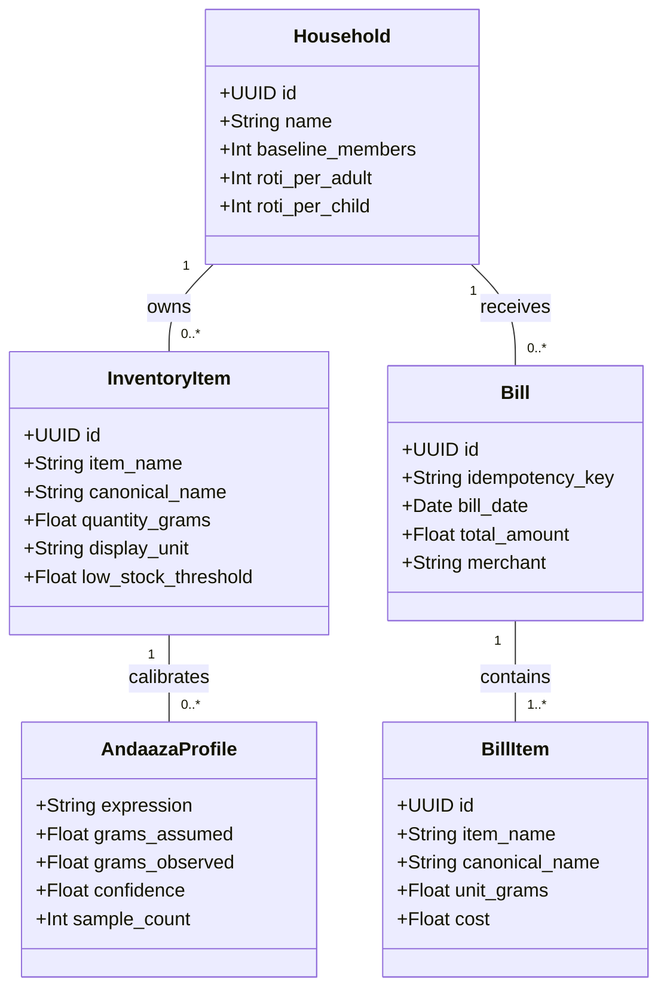

# KitchenMind — Domain Model & Glossary Specification

---

## 1. Domain Model Overview

KitchenMind's domain architecture centers around the **Indian Kitchen Logistical Lifecycle**: transforming raw commercial transactions into standardized kitchen inventory, tracking informal culinary measurements, and planning dynamic household meals.

---

## 2. Ubiquitous Language & Domain Glossary

| Term | Definition | Domain Context |
| :--- | :--- | :--- |
| **Household** | The primary multi-tenant boundary representing a physical family or living unit. All inventory, preferences, meal logs, and bills belong strictly to one household. | Core Tenant Model |
| **Canonical Name** | The standardized, clean culinary name of an ingredient (e.g. "Salt", "Cooking Oil", "Toor Dal", "Atta") stripped of brand names, sizes, and packaging details. | Inventory & Deductions |
| **Alias Name** | The raw text printed on a commercial store receipt (e.g. "TATA SALT 1KG CRISTAL", "FORTUNE SUNFLOWER OIL 1L POUCH"). | OCR & Receipt Scanning |
| **Andaaza** | The traditional Indian culinary practice of estimating ingredient quantities by volume or experience rather than precise metric scales (e.g., "1 katori dal", "1 pinch hing"). | AI Learning Engine |
| **Roti Index** | The calculated total wheat flour requirement (in grams) for a meal, computed dynamically from adult/child headcounts and roti preferences. | Meal Planning |
| **Unit Normalization** | The conversion of arbitrary volumetric or weight units (`kg`, `L`, `ml`, `pcs`) into standardized base grams/milliliters for storage. | Inventory Ledger |
| **Batch** | A specific purchase event of an ingredient with a distinct cost, purchase date, initial stock, and estimated expiration date. | Expiry & FIFO Inventory |
| **Idempotency Key** | A unique client transaction identifier attached to a bill commit payload to prevent duplicate DB writes if retried. | System Reliability |
| **Manual Review** | The stage in the receipt review UI where low-confidence OCR matches or unknown aliases require human validation. | Human-in-the-loop AI |
| **Tiffin Box** | Packed lunch boxes prepared for school or office family members, requiring specific dietary planning rules. | Preference Management |

---

## 3. Bounded Contexts

KitchenMind is partitioned into 5 core bounded contexts:

1. **Receipt Processing & Vision Context**: Handles image capture, OCR extractions via Gemini Flash, line item normalization, and match confidence scoring.
2. **Bill Persistence & Financial Ledger Context**: Manages atomic commit transactions, idempotency de-duplication, bill creation, and expenditure logs.
3. **Inventory & Batch Ledger Context**: Maintains real-time stock balances, batch freshness tracking, display unit formatting, and low-stock alerts.
4. **Andaaza Learning & Calibration Context**: Machine learning feedback loop that converts informal culinary expressions into calibrated metric weights over time.
5. **Household & Dietary Preferences Context**: Manages member headcounts, adult/child roti ratios, fasting day restrictions, and tiffin preferences.
