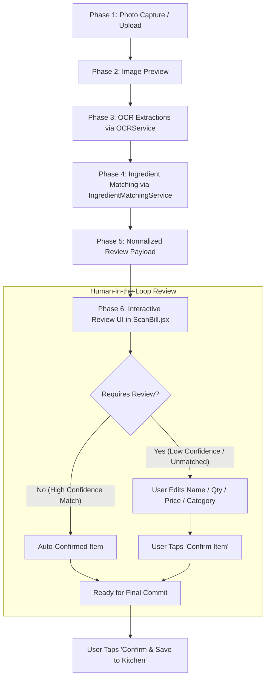

# KitchenMind — Bill Processing Pipeline Specification

---

## 1. Pipeline Overview

The **Bill Processing Pipeline** transforms physical grocery receipt photographs into structured, normalized, human-reviewed line items. It operates strictly in-memory on the client side during processing and review, guaranteeing zero database mutations until the user explicitly confirms the bill.



---

## 2. OCR Extraction Stage (`OCRService`)

### Gemini 2.5 Flash Vision Prompt Strategy
The system sends the base64-encoded receipt photograph to Gemini 2.5 Flash using a specialized prompt optimized for Indian grocery bills:

```javascript
const OCR_PROMPT = `You are extracting grocery items from an Indian supermarket or store bill photograph.
Return ONLY a JSON object. No preamble. No explanation. No markdown backticks.

Structure your output exactly as follows:
{
  "merchant": "Store / Supermarket name if visible, or null",
  "billDate": "YYYY-MM-DD format if date is visible, or null",
  "totalAmount": number only representing total bill amount if visible, or null,
  "items": [
    {
      "itemName": "exact text as it appears on bill",
      "canonicalName": "common kitchen name (e.g. TATA SALT 1KG -> Salt, FORTUNE OIL 1L -> Cooking Oil)",
      "quantity": number only (default 1 if unstated),
      "unit": "g / kg / ml / L / pcs",
      "price": number only (cost of item),
      "category": "one of Staples / Fresh & Vegetables / Non-Veg / Dairy / Spices / Miscellaneous",
      "confidence": "high or low"
    }
  ]
}`
```

---

## 3. Ingredient Alias & Matching Stage (`IngredientMatchingService`)

After receiving raw OCR items, the `IngredientMatchingService` resolves each item against the global `ingredient_aliases` table and existing household inventory:

1. **Exact Alias Match**: Checks if `item.itemName` exists in `ingredient_aliases`. If found, returns the linked `canonical_name` with `confidence: 'HIGH'`.
2. **Canonical Inventory Match**: Performs case-insensitive matching against existing household inventory items (`inventory.canonical_name`).
3. **Fuzzy Fallback**: If no alias or inventory match is found, uses the raw canonical suggestion from OCR with `confidence: 'LOW'`, flagging `requiresManualReview: true`.

---

## 4. Normalized Review UI Schema (`ScanBill.jsx`)

The orchestration pipeline (`BillProcessingOrchestrator`) produces a clean local state payload for `ScanBill.jsx`:

```javascript
{
  merchant: "Reliance Fresh",
  billDate: "2026-08-06",
  totalAmount: 450.00,
  items: [
    {
      id: "local-uid-1",
      status: "pending", // "pending" | "confirmed" | "removed"
      ocr: {
        itemName: "TATA SALT 1KG",
        quantity: 1,
        unit: "kg",
        price: 28.00
      },
      match: {
        ingredientId: "uuid-salt",
        canonicalName: "Salt",
        category: "Staples",
        confidence: "HIGH",
        requiresManualReview: false
      },
      userEdits: {
        itemName: "TATA SALT 1KG",
        canonicalName: "Salt",
        category: "Staples",
        quantity: 1,
        unit: "kg",
        price: 28.00
      }
    }
  ]
}
```

---

## 5. Review UI & Data Isolation Rules

1. **In-Memory Isolation**: All user edits to merchant, bill date, total amount, quantities, units, prices, and canonical names update local component React state (`useState`).
2. **Zero DB Persistence**: Zero database calls, zero inventory updates, and zero bill records are written during scanning or editing.
3. **Visual Review Cards**: Items flagged with `requiresManualReview: true` render inside amber warning cards with explicit edit controls and a `✓ Confirm` button.
4. **Validation Guard**: The "Review Complete" button remains disabled until all pending flagged items have been explicitly confirmed or removed by the user.
