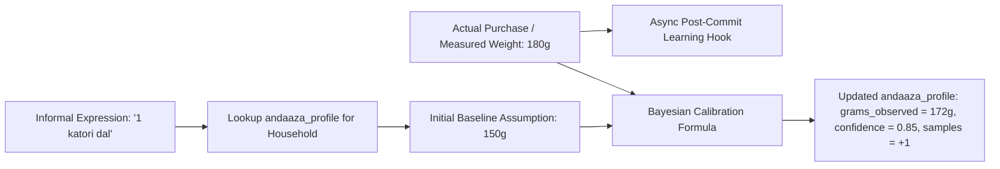
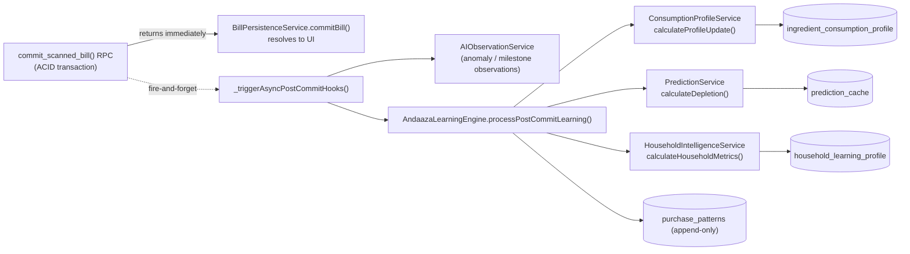

# KitchenMind — Andaaza AI Learning Engine Specification

---

## 1. Engine Overview & Conceptual Model

In traditional Indian cooking, recipe quantities are rarely measured on precision kitchen scales. Instead, home cooks use informal, volumetric, or count-based expressions—referred to as **"Andaaza"** (e.g. "1 katori arhar dal", "3 rotis", "1 pinch hing", "half gaddi spinach").

The **Andaaza AI Learning Engine** is an adaptive observation feedback system that converts these abstract culinary expressions into precise, calibrated metric weights (grams/milliliters) tailored specifically to each individual household.



---

## 2. Mathematical Calibration Model

The learning engine updates weight assumptions using a weighted sample-count calibration formula:

$$\text{Grams}_{\text{new}} = \alpha \cdot \text{Grams}_{\text{observed}} + (1 - \alpha) \cdot \text{Grams}_{\text{assumed}}$$

Where the learning weight factor $\alpha$ is defined by sample count $n$:

$$\alpha = \frac{1}{\sqrt{n + 1}}$$

### Confidence Score Growth
Confidence score $C \in [0.0, 1.0]$ scales logarithmically with observation count $n$:

$$C(n) = \min\left(1.0, \; 0.5 + 0.15 \cdot \ln(n + 1)\right)$$

---

## 3. `andaaza_profile` Table Integration

- **Table**: `andaaza_profile`
- **Fields**:
  - `household_id`: Owning household.
  - `ingredient_id`: FK to `inventory.id`.
  - `expression`: Informal expression text (e.g., `"1 katori"`).
  - `grams_assumed`: Baseline default weight.
  - `grams_observed`: Calibrated empirical average weight.
  - `confidence`: Calculated confidence multiplier.
  - `sample_count`: Total observation feedback data points recorded.
  - `last_calibrated`: Timestamp of last calibration calculation.

---

## 4. Asynchronous Non-Blocking Execution Architecture

> [!IMPORTANT]
> **Decoupled Post-Commit Hook**:
> - Calibration calculations occur asynchronously *after* the core `commit_scanned_bill()` RPC returns a successful summary.
> - If the `AndaazaLearningService` throws an exception or network timeout occurs, the error is caught and logged, while the committed bill and inventory updates remain **100% safe and unaffected**.

```javascript
// Post-commit execution pattern in BillPersistenceService.js
async function commitBill(householdId, reviewedBillData) {
  // Step 1: Execute Core ACID Transaction
  const commitSummary = await supabaseClient.rpc('commit_scanned_bill', { p_payload: payload })
  
  // Step 2: Trigger Asynchronous Non-Blocking Learning Hook
  AndaazaLearningService.recordObservationsAsync(householdId, reviewedBillData.items)
    .catch(err => logger.warn('Andaaza AI observation logging failed silently:', err))
    
  return commitSummary
}
```

---

## 5. Global Alias Promotion Workflow

When raw receipt line items (e.g. `"TATA SALT 1KG"`) are repeatedly confirmed as a canonical ingredient (e.g. `"Salt"`):
1. **Local State**: Confirmed immediately for current bill.
2. **Threshold Count**: When a specific household confirms the same raw receipt string to a canonical name $\ge 3$ times, the system queues an alias promotion candidate.
3. **Background Alias Promotion**: A background job inserts or updates the global `ingredient_aliases` table (`alias_name` -> `canonical_name`), enabling auto-matching for all future bill scans across all households.

---

# Phase 4A — Andaaza Intelligence Engine (Household Learning & Consumption Modeling)

> [!NOTE]
> Sections 1–5 above describe **volumetric expression calibration** (`andaaza_profile`) — learning what "1 katori" means in grams for a household. Phase 4A is a distinct, complementary system: it learns **purchasing and consumption behaviour** (how often, how much, which brand) rather than unit conversion. Both systems share the same asynchronous, post-commit, non-blocking execution model.

## 6. Learning Model

### 6.1 Event Flow



- **Purchase events**: every confirmed line item on a committed bill is one purchase event. `AndaazaLearningEngine.processPostCommitLearning(householdId, activeItems, billMeta)` is the single entry point, invoked from `BillPersistenceService._triggerAsyncPostCommitHooks` **after** `commit_scanned_bill()` has already returned successfully.
- **Observation events**: `AIObservationService.generateObservations()` runs in parallel and emits discrete facts (`NEW_INGREDIENT_DISCOVERED`, `UNUSUAL_PURCHASE_QUANTITY`, `DUPLICATE_PURCHASE`, `FIRST_PURCHASE`, `PANTRY_DIVERSITY`) — a separate, lower-level signal stream from the quantitative learning pipeline.
- **Learning pipeline**: for each purchase event, the engine (1) reads the existing `ingredient_consumption_profile` row, (2) computes updated statistics via a deterministic recurrence formula, (3) writes an append-only `purchase_patterns` row, (4) upserts the recalculated profile, and (5) upserts a fresh `prediction_cache` row.
- **Profile updates**: profiles are recalculated incrementally (an exponentially-weighted recurrence over the previous profile + the new observation), never recomputed from full history on every write — this keeps per-item cost O(1) regardless of how many purchases a household has accumulated.
- **Confidence scoring**: see §6.2 — deterministic, not probabilistic/ML-based, so the same input sequence always produces the same output (required for reproducible tests and predictable UI behaviour).
- **Retraining strategy**: there is no offline "retraining" step. The model is *online* — every commit incrementally recalibrates the relevant profile in real time. This avoids batch jobs and keeps household intelligence always current as of the last bill.

### 6.2 Confidence Scoring

Ingredient-level confidence uses a deterministic, sample-count-driven formula (distinct from the andaaza volumetric-calibration formula in §2):

$$C(n) = \min(0.95, \; 0.40 + 0.10 \cdot n)$$

Where $n$ is `sample_count` (number of purchase observations for that canonical ingredient in that household). This reaches 0.95 confidence at the 6th observation and never claims certainty (capped below 1.0, since consumption behaviour can always shift). It is implemented in `ConsumptionProfileService.calculateProfileUpdate()` and covered by `AndaazaIntelligence.test.js` Test 1 (asserts convergence at n=1, n=2, and the n=10 cap).

## 7. Consumption Model

Implemented in `ConsumptionProfileService.calculateProfileUpdate(currentProfile, newPurchaseEvent, history)`, a pure function (no I/O) so it is independently unit-testable and reused by both the live engine and the benchmark harness.

| Metric | Formula / Strategy | Field |
| :--- | :--- | :--- |
| **Average purchase interval** | Exponential moving average: `avg_interval_days = avg * 0.5 + observed_gap_days * 0.5`, only accepted when `0 < gap < 180` days (rejects same-day duplicate scans and multi-month gaps that would distort the average) | `avg_interval_days` |
| **Average quantity purchased** | EMA: `avg_purchase_grams = prev * 0.6 + new_qty_grams * 0.4` (60/40 weighting favours purchase-history stability over a single outlier) | `avg_purchase_grams` |
| **Consumption velocity** | `avg_purchase_grams / avg_interval_days` (g/day) — the rate at which a household depletes an ingredient between restocks | `consumption_velocity_g_per_day` |
| **Preferred brand** | Frequency count across purchase history; most-observed brand wins; falls back to latest non-empty brand for cold-start | `preferred_brand` |
| **Preferred package size / unit** | Latest observed unit of purchase | `preferred_unit` |
| **Seasonal purchasing** | Captured at the raw-data layer: `purchase_patterns` is append-only with `purchase_date`, enabling month/festival-window aggregation queries later without any schema change. No seasonal model is computed synchronously today (see §10 Known Limitations) | `purchase_patterns.purchase_date` |
| **Repeat purchase confidence** | `confidence_score`, see §6.2 | `confidence_score` |
| **Ingredient popularity** | Derived from `household_learning_profile.top_categories` (category-level) and `pantry_diversity_score` (count of distinct canonical ingredients ever purchased) | `household_learning_profile.top_categories` |

## 8. Household Intelligence Model

Implemented in `HouseholdIntelligenceService.calculateHouseholdMetrics(householdId, inventoryItems, billHistory)`, also a pure function, invoked once per commit (not once per item) since it summarizes household-wide state rather than per-ingredient state.

| Capability | Approach |
| :--- | :--- |
| **Pantry behaviour / diversity** | `pantry_diversity_score` = count of distinct `canonical_name` values currently in `inventory` |
| **Household preferences** | `top_categories` = category frequency histogram over current inventory, sorted descending, top 5 retained |
| **Shopping frequency & habits** | `preferred_shopping_day` = mode of `DAYOFWEEK(bill_date)` across bill history; `shopping_frequency_days` tracks average days between bills |
| **Cooking style / ingredient diversity** | Approximated today via pantry diversity + category spread; a dedicated cooking-style classifier is future work (§10) |
| **Stock habits** | Captured indirectly via `avg_purchase_grams` and `avg_interval_days` per ingredient — a household that buys large infrequent quantities vs. small frequent top-ups is distinguishable from the consumption profile table without a separate model |
| **Waste patterns** (future) | Out of scope for 4A — requires a "discarded/expired" observation type not yet emitted. Schema already supports adding this without migration churn (`purchase_patterns` + future `waste_events` table) |
| **Festival purchasing patterns** (future) | Out of scope for 4A — requires calendar-aware aggregation over `purchase_patterns.purchase_date`; the append-only design means this can be added as a read-only query later with zero backfill cost |

## 9. Prediction Model

Implemented in `PredictionService`, pure functions consuming the outputs of §7/§8 — no independent I/O, so predictions are only as fresh as the last processed bill (acceptable for a pantry-depletion use case measured in days, not seconds).

### 9.1 Predicted Depletion Date & Next Purchase Prediction

$$\text{daysRemaining} = \left\lfloor \frac{\text{currentStockGrams}}{\text{velocityGramsPerDay}} \right\rfloor \qquad \text{depletionDate} = \text{purchaseDate} + \text{daysRemaining}$$

`velocityGramsPerDay` is floored at 1 to avoid division by zero / infinite depletion dates for brand-new ingredients with no established consumption rate. The depletion date **is** the next-purchase prediction — depletion and "when will they need to buy this again" are treated as the same event under the current single-household, single-store model.

### 9.2 Low Stock Prediction

$$\text{isLowStockRisk} = \text{daysRemaining} \le 3$$

A fixed 3-day threshold, chosen to be shorter than the shortest realistic restocking cycle observed in typical Indian household grocery cadences, and stored per-ingredient in `prediction_cache.is_low_stock_risk` for O(1) read access.

### 9.3 Abnormal Purchase Detection

Not a `PredictionService` responsibility — implemented today as an observation, not a prediction, in `AIObservationService` (`UNUSUAL_PURCHASE_QUANTITY` when a single line item ≥ 3000g, `DUPLICATE_PURCHASE` when the same canonical ingredient appears more than once in one receipt). This keeps anomaly *detection* (a fact about one bill) separate from depletion *prediction* (a forecast about future state).

### 9.4 Pantry Health Score

$$\text{healthScore} = \frac{|\{\text{ingredients with daysUntilDepletion} \ge 7\}|}{|\text{ingredients}|} \times 100$$

An aggregate household-level score (0–100) computed on demand from a set of per-ingredient depletion predictions; not persisted (cheap to recompute, and persisting it would risk staleness relative to the ingredients it summarizes).

### 9.5 Confidence Score (Prediction-Level)

`prediction_cache.confidence_score` is copied through from the source `ingredient_consumption_profile.confidence_score` at write time — a prediction inherits the confidence of the consumption data it was derived from, rather than maintaining a second, independently-drifting confidence figure.

## 10. Known Limitations & Future Extensibility

- **No seasonal/festival model yet.** The append-only `purchase_patterns` table is deliberately unaggregated so a seasonal or festival-window model can be added later as a pure read-side query (e.g. a materialized view or scheduled job) without any migration or backfill.
- **No waste tracking yet.** Requires a new observation type (e.g. `INGREDIENT_DISCARDED`) fed from a future "mark as wasted" UI action; the schema is additive-only from here.
- **Predictions are recalculated synchronously per commit, not on a schedule.** A household that stops buying an ingredient will have a stale `prediction_cache` row (last known velocity) rather than a decaying one. `prediction_cache.ttl_expires_at` (24h) exists so future read paths can distinguish "fresh" from "stale" predictions and trigger a background recompute — no such background job is implemented in 4A.
- **Recommendation/meal-planning logic is explicitly out of scope.** This engine produces *knowledge* (profiles, predictions, confidence) for other systems to consume; it does not decide what a household should buy or cook.

## 11. Database Schema Additions (Phase 4A)

All four tables are added in `supabase/migrations/0005_andaaza_intelligence_schema.sql`, each with `household_id`-scoped Row Level Security via the existing `auth_household_id()` function (see [15_SECURITY_AUTHENTICATION_AND_RLS_POLICIES.md](./15_SECURITY_AUTHENTICATION_AND_RLS_POLICIES.md)):

| Table | Nature | Purpose |
| :--- | :--- | :--- |
| `ingredient_consumption_profile` | Mutable, upserted (`UNIQUE (household_id, canonical_name)`) | Latest calculated consumption statistics per ingredient — the "current belief state" |
| `purchase_patterns` | Append-only | Immutable purchase event log; source-of-truth history for any future re-aggregation or seasonal modeling |
| `prediction_cache` | Mutable, upserted (`UNIQUE (household_id, canonical_name)`) | Latest depletion/low-stock prediction per ingredient, with a 24h `ttl_expires_at` |
| `household_learning_profile` | Mutable, upserted (`UNIQUE (household_id)`) | One row per household summarizing pantry diversity, category trends, and shopping cadence |

Derived values are deliberately **not** stored on `inventory` — the intelligence layer owns its own tables so inventory remains the operational source of truth for "what's on the shelf right now" and the learning layer remains free to evolve its statistics independently.
