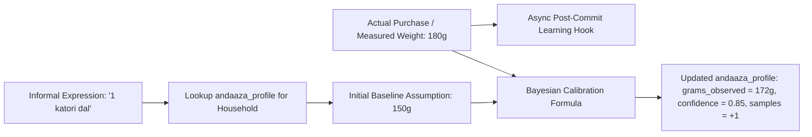

# KitchenMind — Andaaza AI Learning Engine Specification

---

## 1. Engine Overview & Conceptual Model

In traditional Indian cooking, recipe quantities are rarely measured on precision kitchen scales. Instead, home cooks use informal, volumetric, or count-based expressions—referred to as **"Andaaza"** (e.g. "1 katori arhar dal", "3 rotis", "1 pinch hing", "half gaddi spinach").

The **Andaaza AI Learning Engine** is an adaptive observation feedback system that converts these abstract culinary expressions into precise, calibrated metric weights (grams/milliliters) tailored specifically to each individual household.



---

## 2. Mathematical Calibration Model

The learning engine updates weight assumptions using a weighted sample-count calibration formula:

$$\text{Grams}_{\text{new}} = \alpha \cdot \text{Grams}_{\text{observed}} + (1 - \alpha) \cdot \text{Grams}_{\text{assumed}}$$

Where the learning weight factor $\alpha$ is defined by sample count $n$:

$$\alpha = \frac{1}{\sqrt{n + 1}}$$

### Confidence Score Growth
Confidence score $C \in [0.0, 1.0]$ scales logarithmically with observation count $n$:

$$C(n) = \min\left(1.0, \; 0.5 + 0.15 \cdot \ln(n + 1)\right)$$

---

## 3. `andaaza_profile` Table Integration

- **Table**: `andaaza_profile`
- **Fields**:
  - `household_id`: Owning household.
  - `ingredient_id`: FK to `inventory.id`.
  - `expression`: Informal expression text (e.g., `"1 katori"`).
  - `grams_assumed`: Baseline default weight.
  - `grams_observed`: Calibrated empirical average weight.
  - `confidence`: Calculated confidence multiplier.
  - `sample_count`: Total observation feedback data points recorded.
  - `last_calibrated`: Timestamp of last calibration calculation.

---

## 4. Asynchronous Non-Blocking Execution Architecture

> [!IMPORTANT]
> **Decoupled Post-Commit Hook**:
> - Calibration calculations occur asynchronously *after* the core `commit_scanned_bill()` RPC returns a successful summary.
> - If the `AndaazaLearningService` throws an exception or network timeout occurs, the error is caught and logged, while the committed bill and inventory updates remain **100% safe and unaffected**.

```javascript
// Post-commit execution pattern in BillPersistenceService.js
async function commitBill(householdId, reviewedBillData) {
  // Step 1: Execute Core ACID Transaction
  const commitSummary = await supabaseClient.rpc('commit_scanned_bill', { p_payload: payload })
  
  // Step 2: Trigger Asynchronous Non-Blocking Learning Hook
  AndaazaLearningService.recordObservationsAsync(householdId, reviewedBillData.items)
    .catch(err => logger.warn('Andaaza AI observation logging failed silently:', err))
    
  return commitSummary
}
```

---

## 5. Global Alias Promotion Workflow

When raw receipt line items (e.g. `"TATA SALT 1KG"`) are repeatedly confirmed as a canonical ingredient (e.g. `"Salt"`):
1. **Local State**: Confirmed immediately for current bill.
2. **Threshold Count**: When a specific household confirms the same raw receipt string to a canonical name $\ge 3$ times, the system queues an alias promotion candidate.
3. **Background Alias Promotion**: A background job inserts or updates the global `ingredient_aliases` table (`alias_name` -> `canonical_name`), enabling auto-matching for all future bill scans across all households.
