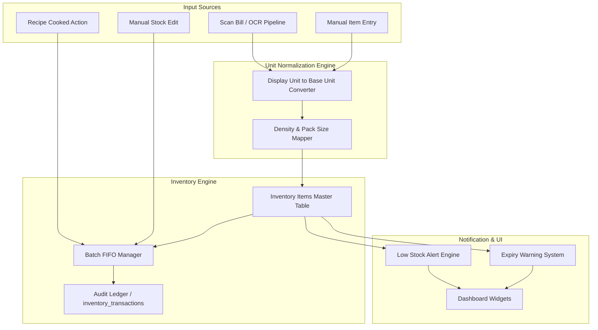
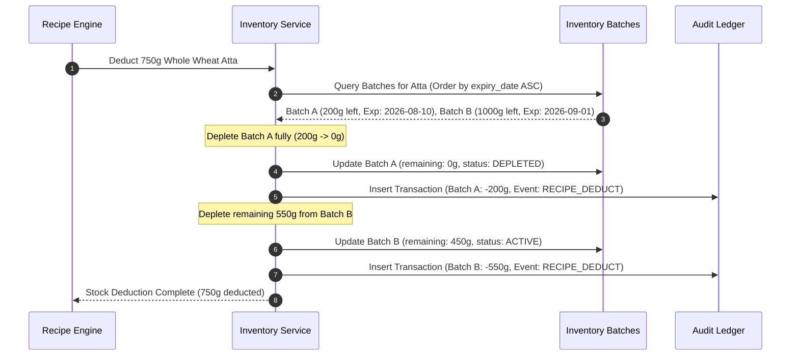

# KitchenMind: Inventory Management Specification

**Document Version:** 1.0.0  
**Status:** Approved Specification  
**Domain:** Core Domain - Inventory & Stock Operations  

---

## 1. Executive Summary & Domain Overview

The **KitchenMind Inventory Management Module** serves as the single source of truth for all household food stock, ingredients, and consumables. Designed specifically for modern household logistics, it manages unit normalization, batch-level tracking, automated expiry alerts, FIFO (First-In, First-Out) stock depletion, and an append-only transaction audit log (`inventory_transactions`).

Key capabilities include:
- **Base Quantity Normalization**: Automatically converts user-facing display units (e.g., `1 kg`, `500 ml`, `2 packets`, `3 tbsp`) into canonical base storage units (grams for solids, milliliters for liquids, units for discrete items).
- **Batch & Expiry Management**: Tracks individual purchase lots with distinct expiration dates, manufacture dates, and remaining stock, ensuring older stock is consumed first.
- **Low Stock Intelligence**: Monitors dynamic reorder levels based on household consumption velocity and triggers visual alerts before stock-outs occur.
- **Immutable Audit Ledger**: Records every stock change with explicit event types (`PURCHASE_ADD`, `RECIPE_DEDUCT`, `MANUAL_ADJUSTMENT`, `WASTAGE_EXPIRE`) for full financial and consumption auditability.

---

## 2. High-Level Architecture & Data Flow



---

## 3. Display Units vs Base Grams Normalization

In household pantry management, items are purchased and measured in diverse units (e.g., kilograms, grams, liters, milliliters, cups, tablespoons, brand-specific packets, or count). To perform accurate recipe scaling and deduction, KitchenMind normalizes all quantities internally into canonical **Base Units**:
- **Solids / Powders**: `base_grams` (Float)
- **Liquids**: `base_ml` (Float)
- **Discrete Items**: `base_units` (Integer/Float)

### 3.1 Conversion Matrix & Multipliers

| Category | Input Display Unit | Standard Base Unit | Conversion Factor / Formula | Example |
| :--- | :--- | :--- | :--- | :--- |
| Mass | `kg` (Kilograms) | Grams (`g`) | $1 \text{ kg} = 1000 \text{ g}$ | $2.5 \text{ kg} \rightarrow 2500 \text{ g}$ |
| Mass | `g` (Grams) | Grams (`g`) | $1 \text{ g} = 1 \text{ g}$ | $500 \text{ g} \rightarrow 500 \text{ g}$ |
| Volume | `l` / `L` (Liters) | Milliliters (`ml`) | $1 \text{ L} = 1000 \text{ ml}$ | $1.5 \text{ L} \rightarrow 1500 \text{ ml}$ |
| Volume | `ml` (Milliliters) | Milliliters (`ml`) | $1 \text{ ml} = 1 \text{ ml}$ | $250 \text{ ml} \rightarrow 250 \text{ ml}$ |
| Culinary | `tbsp` (Tablespoon) | Grams / ml | $1 \text{ tbsp} = 15 \text{ g / ml}$ | $2 \text{ tbsp oil} \rightarrow 30 \text{ ml}$ |
| Culinary | `tsp` (Teaspoon) | Grams / ml | $1 \text{ tsp} = 5 \text{ g / ml}$ | $3 \text{ tsp salt} \rightarrow 15 \text{ g}$ |
| Culinary | `cup` (Standard Cup) | Grams / ml | $1 \text{ cup} = 240 \text{ g / ml}$ | $2 \text{ cups rice} \rightarrow 480 \text{ g}$ |
| Discrete | `pc` / `unit` / `piece` | Count | $1 \text{ pc} = 1 \text{ unit}$ | $6 \text{ eggs} \rightarrow 6 \text{ units}$ |
| Packets | `packet` / `pack` | Grams / ml / Count | Custom Net Weight per Pack | $1 \text{ packet Paneer (200g)} \rightarrow 200 \text{ g}$ |

### 3.2 JavaScript Conversion Module Implementation

```javascript
/**
 * Normalizes input quantity and unit to base grams, ml, or units.
 * @param {number} quantity - Numerical amount entered
 * @param {string} unit - Display unit string (e.g. 'kg', 'ml', 'tbsp', 'packet')
 * @param {number} [packageWeightGrams] - Net weight if unit is 'packet'
 * @returns {{ baseQuantity: number, baseUnit: 'g' | 'ml' | 'units' }}
 */
export function normalizeToBaseUnit(quantity, unit, packageWeightGrams = null) {
  const sanitizedUnit = unit.toLowerCase().trim();
  
  switch (sanitizedUnit) {
    case 'kg':
    case 'kilogram':
      return { baseQuantity: quantity * 1000, baseUnit: 'g' };
    case 'g':
    case 'gram':
    case 'grams':
      return { baseQuantity: quantity, baseUnit: 'g' };
    case 'l':
    case 'liter':
    case 'litres':
      return { baseQuantity: quantity * 1000, baseUnit: 'ml' };
    case 'ml':
    case 'milliliter':
      return { baseQuantity: quantity, baseUnit: 'ml' };
    case 'tbsp':
    case 'tablespoon':
      return { baseQuantity: quantity * 15, baseUnit: 'g' };
    case 'tsp':
    case 'teaspoon':
      return { baseQuantity: quantity * 5, baseUnit: 'g' };
    case 'cup':
    case 'cups':
      return { baseQuantity: quantity * 240, baseUnit: 'g' };
    case 'packet':
    case 'pack':
    case 'pkt':
      const unitWeight = packageWeightGrams || 500; // fallback to 500g
      return { baseQuantity: quantity * unitWeight, baseUnit: 'g' };
    case 'pc':
    case 'piece':
    case 'unit':
    case 'nos':
    default:
      return { baseQuantity: quantity, baseUnit: 'units' };
  }
}
```

---

## 4. Expiry & Batch Management (FIFO Strategy)

To minimize food waste, KitchenMind tracks inventory at the **Batch level** within each item entry. When a purchase is recorded, a new batch record is registered with its specific manufacture date, expiration date, and purchase batch quantity.

### 4.1 FIFO (First-In, First-Out) Depletion Sequence

When a meal is logged as cooked, the system depletes stock from batches sorted by:
1. `expiry_date` ASC (Earliest expiring items used first)
2. `created_at` ASC (Oldest purchased items used second if expiry is equal)



### 4.2 Expiry Classification Tiers

Items are evaluated against current date ($T_{current}$) to determine UI status:

```
Expiry Status Matrix:
- EXPIRED      : expiry_date < T_current
- CRITICAL     : T_current <= expiry_date <= T_current + 2 days
- WARNING      : T_current + 2 days < expiry_date <= T_current + 7 days
- FRESH        : expiry_date > T_current + 7 days
```

---

## 5. Low Stock Threshold Alerts

Each inventory item maintains a configurable threshold level. When total `available_base_quantity` drops to or below `min_threshold_base_quantity`, the item state flips to `LOW_STOCK`.

### 5.1 Static vs Dynamic Predictive Thresholds

1. **Static Threshold**: Defined manually by the user during item creation (e.g., "Alert me when Atta drops below 1000g").
2. **Dynamic Predictive Threshold (Andaaza Engine)**: Calculates daily consumption rate ($V_{daily}$) over the last 14 days and sets threshold to:
   $$\text{Threshold}_{dynamic} = V_{daily} \times \text{LeadTimeDays} \quad (\text{Default LeadTime} = 3 \text{ days})$$

### 5.2 UI Warning States & Badges

- 🔴 **OUT_OF_STOCK** (`quantity == 0`): Red badge, automatic suggestion to add to Shopping List.
- 🟠 **LOW_STOCK** (`0 < quantity <= min_threshold`): Amber badge, highlighted in Dashboard alerts.
- 🟢 **IN_STOCK** (`quantity > min_threshold`): Neutral/Green badge.

---

## 6. Audit Ledger (`inventory_transactions`)

All modifications to inventory must create an entry in the append-only `inventory_transactions` ledger table. Direct `UPDATE` or `DELETE` on existing transaction records is strictly forbidden by database RLS rules.

### 6.1 Transaction Event Types

- `PURCHASE_ADD`: Stock added via manual entry or receipt scan.
- `RECIPE_DEDUCT`: Automated deduction triggered by cooked meal.
- `MANUAL_ADJUSTMENT`: Manual correction by user (e.g. spilled flour).
- `WASTAGE_EXPIRE`: Stock purged due to expiry or spoilage.
- `RETURN_REFUND`: Item returned to store.

### 6.2 Database Schema Definition

```sql
-- Inventory Master Table
CREATE TABLE public.inventory_items (
    id UUID PRIMARY KEY DEFAULT gen_random_uuid(),
    household_id UUID NOT NULL REFERENCES public.households(id) ON DELETE CASCADE,
    name VARCHAR(255) NOT NULL,
    category VARCHAR(100) NOT NULL, -- 'Grains', 'Vegetables', 'Dairy', 'Spices', etc.
    display_unit VARCHAR(50) NOT NULL, -- 'kg', 'g', 'l', 'packet'
    base_unit VARCHAR(20) NOT NULL, -- 'g', 'ml', 'units'
    total_base_quantity NUMERIC(12, 3) NOT NULL DEFAULT 0.000,
    min_threshold_base_quantity NUMERIC(12, 3) DEFAULT 500.000,
    created_at TIMESTAMPTZ NOT NULL DEFAULT NOW(),
    updated_at TIMESTAMPTZ NOT NULL DEFAULT NOW()
);

-- Inventory Batches Table (FIFO support)
CREATE TABLE public.inventory_batches (
    id UUID PRIMARY KEY DEFAULT gen_random_uuid(),
    inventory_item_id UUID NOT NULL REFERENCES public.inventory_items(id) ON DELETE CASCADE,
    household_id UUID NOT NULL REFERENCES public.households(id) ON DELETE CASCADE,
    batch_number VARCHAR(100),
    initial_base_quantity NUMERIC(12, 3) NOT NULL,
    remaining_base_quantity NUMERIC(12, 3) NOT NULL,
    cost_per_base_unit NUMERIC(10, 4), -- Cost per gram/ml
    manufacture_date DATE,
    expiry_date DATE NOT NULL,
    status VARCHAR(50) NOT NULL DEFAULT 'ACTIVE', -- 'ACTIVE', 'DEPLETED', 'EXPIRED'
    created_at TIMESTAMPTZ NOT NULL DEFAULT NOW()
);

-- Immutable Inventory Audit Ledger
CREATE TABLE public.inventory_transactions (
    id UUID PRIMARY KEY DEFAULT gen_random_uuid(),
    household_id UUID NOT NULL REFERENCES public.households(id) ON DELETE CASCADE,
    inventory_item_id UUID NOT NULL REFERENCES public.inventory_items(id) ON DELETE CASCADE,
    batch_id UUID REFERENCES public.inventory_batches(id) ON DELETE SET NULL,
    transaction_type VARCHAR(50) NOT NULL, -- 'PURCHASE_ADD', 'RECIPE_DEDUCT', 'MANUAL_ADJUSTMENT', 'WASTAGE_EXPIRE'
    quantity_change_base NUMERIC(12, 3) NOT NULL, -- Positive for additions, Negative for deductions
    previous_base_quantity NUMERIC(12, 3) NOT NULL,
    new_base_quantity NUMERIC(12, 3) NOT NULL,
    reference_id UUID, -- References meal_logs.id or bill_items.id
    notes TEXT,
    created_by UUID REFERENCES auth.users(id),
    created_at TIMESTAMPTZ NOT NULL DEFAULT NOW()
);

-- Indexing for high-performance FIFO queries & analytics
CREATE INDEX idx_inventory_batches_fifo ON public.inventory_batches (inventory_item_id, expiry_date ASC, created_at ASC) WHERE status = 'ACTIVE';
CREATE INDEX idx_inventory_tx_household ON public.inventory_transactions (household_id, created_at DESC);
```

---

## 7. Operational Workflow Examples

### 7.1 Receipt Processing to Inventory Addition
1. **User scans bill**: OCR extracts `Atta 5kg` @ ₹260.
2. **Ingredient Matching**: Mapped to canonical item `Whole Wheat Atta`.
3. **Normalization**: `5 kg` $\rightarrow$ `5000 g`. Cost per base unit = ₹260 / 5000 = ₹0.052/g.
4. **Batch Insert**: Creates batch record `Batch #202608-01` with `5000 g` remaining, expiry set to 6 months out.
5. **Ledger Record**: Inserts `PURCHASE_ADD` transaction (+5000g).

### 7.2 Recipe Cooking Stock Deduction
1. **User logs Dinner**: "Roti (8 count) + Dal Tadka".
2. **Recipe Engine Calculation**: Requires 240g Whole Wheat Atta, 150g Toor Dal, 20g Ghee.
3. **Batch Query**: Finds earliest batch of Whole Wheat Atta.
4. **Deduction Execution**: Deducts 240g, updates batch remaining weight, writes transaction row (`RECIPE_DEDUCT`, -240g).
5. **Threshold Re-evaluation**: If Atta remaining < threshold, emit real-time WebSocket / UI state alert.
