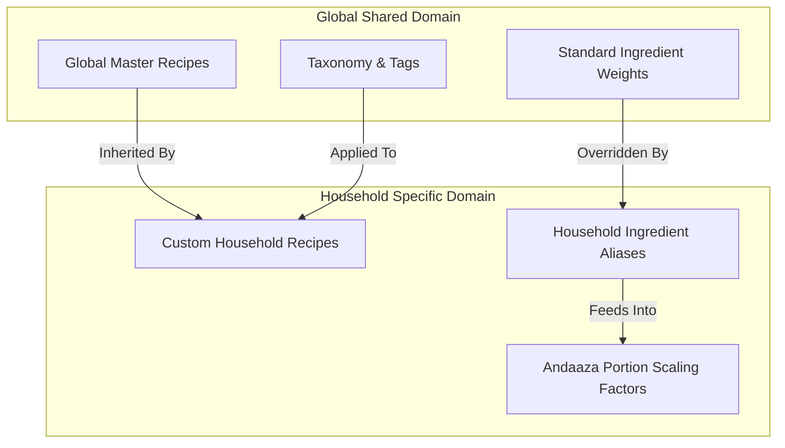
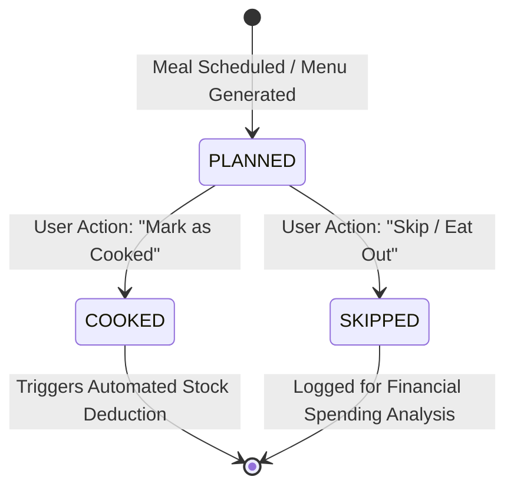
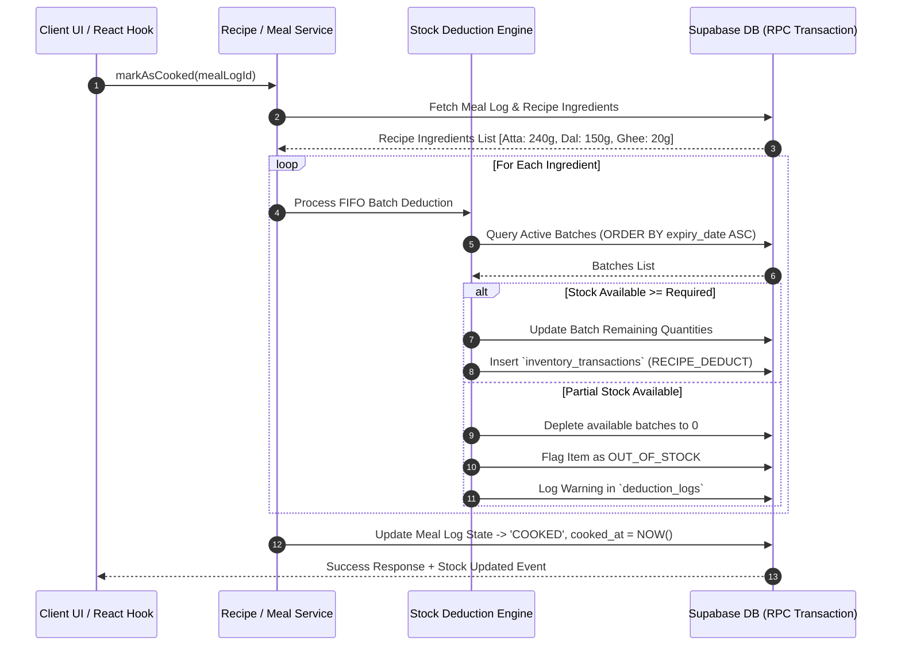

# KitchenMind: Recipe & Meal Logging Specification

**Document Version:** 1.1.0  
**Status:** Implemented (Phase 4B core — see §7)  
**Domain:** Core Domain - Recipes, Meal Lifecycle & Roti Computation  

---

> [!IMPORTANT]
> Sections 1-6 below are the **original design document**, written before `recipes`, `meal_log`,
> `stock_deductions`, `guests`, and `household.roti_per_adult/roti_per_child` existed in the
> committed schema (`0001_initial_schema.sql`). The actual implementation (migration `0006`,
> `RecipeService.js`, `MealLogService.js`, `rotiCalculator.js`) deliberately deviates from this
> design in the ways listed in **§7 — Implementation Notes**, because the real schema is simpler
> and already captures the same intent through different fields. Read §7 alongside §1-6 rather
> than treating §1-6's SQL/JS as literally accurate — this mirrors how `07_ANDAAZA_AI_LEARNING_ENGINE.md`
> documents Phase 4A on top of its own original design.

---

## 1. Executive Summary & Domain Overview

The **Recipe and Meal Logging Module** bridges culinary planning with automated inventory tracking in KitchenMind. It manages a dual-tiered recipe system (Global Master Catalogue vs. Custom Household Overrides), provides dynamic portion scaling algorithms—including the specialized **Roti Calculation Algorithm** for South Asian households—and enforces an audit-backed meal lifecycle (`PLANNED` $\rightarrow$ `COOKED` $\rightarrow$ `SKIPPED`).

When a meal transitions to the `COOKED` state, the system executes an automated, transactional stock deduction pipeline, drawing down pantry inventory in exact base grams using FIFO batch rules.

---

## 2. Global Recipe Catalogue vs Custom Household Items

KitchenMind employs a multi-tenant hierarchy separating shared culinary knowledge from household-specific preferences.



### 2.1 Global Master Recipe Structure

Global recipes store standardized ingredient quantities calculated for 1 base serving ($S_{base} = 1$). All quantities use canonical base units (`g`, `ml`, `units`).

- **Cuisine Taxonomy**: North Indian, South Indian, Gujarati, Maharashtrian, Indo-Chinese, Continental, Snack/Tiffin.
- **Complexity Meta**: `prep_time_mins`, `cook_time_mins`, `difficulty` (`EASY`, `MEDIUM`, `HARD`), `nutritional_profile` (Calories, Protein, Carbs, Fats).

### 2.2 Custom Recipes & Household Aliases

Households can either:
1. **Extend Global Recipes**: Override specific ingredient ratios (e.g., "Use 40g Paneer per serving instead of standard 30g").
2. **Create Custom Household Recipes**: Define proprietary family recipes visible only to their `household_id`.
3. **Ingredient Aliases**: Map localized names (e.g. *"Kanda"* $\rightarrow$ *Onion*, *"Toor Dal"* $\rightarrow$ *Arhar Dal*) for seamless OCR and inventory matching.

---

## 3. Specialized Roti Calculation Algorithm

In Indian households, bread/roti calculation cannot rely on simple per-capita averages due to varying consumption patterns across age groups, meal times, dough moisture absorption, and guest presence.

### 3.1 Mathematical Foundation

The standard baseline for whole wheat flour (Atta) required per Roti:
$$\text{Weight}_{\text{flour\_per\_roti}} = 28.5 \text{ grams} \quad (\text{Range: } 25\text{g} - 32\text{g})$$
$$\text{Water Ratio} = 0.65 \times \text{Weight}_{\text{flour}} \quad \Rightarrow \text{Yields } \approx 47\text{g dough per Roti}$$

### 3.2 Member-Weighted Consumption Formula

For a given meal, total Roti count ($R_{total}$) and required Flour ($F_{required\_grams}$) are calculated as:

$$R_{total} = \sum_{i \in \text{Adults}} \text{Roti}_{adult\_i} + \sum_{j \in \text{Children}} (\text{Roti}_{child\_j} \times C_{ratio}) + \sum_{k \in \text{Guests}} \text{Roti}_{guest\_k}$$

Where:
- $C_{ratio}$: Child consumption ratio (Default = `0.50` for age < 10, `0.75` for age 10–14).
- $\text{Roti}_{adult\_i}$: Adult baseline appetite setting (Default = `3.0` rotis/meal for males, `2.5` for females, customizable per member profile).

$$F_{required\_grams} = R_{total} \times \text{Weight}_{\text{flour\_per\_roti}} \times M_{andaaza}$$

Where $M_{andaaza}$ is the household's learned **Andaaza Modifier** (default `1.0`, adjusts over time based on residual dough logs).

### 3.3 JavaScript Roti Calculation Engine

```javascript
/**
 * Calculates total Rotis and dry Atta weight required for a household meal.
 * @param {Array<{ role: string, age: number, baseRotiAppetite: number }>} members 
 * @param {number} guestCount - Extra adult guests
 * @param {number} [flourPerRotiGrams=28.5] - Standard weight of flour per roti
 * @param {number} [andaazaFactor=1.0] - Household historical multiplier
 * @returns {{ totalRotis: number, totalFlourGrams: number, estimatedDoughGrams: number }}
 */
export function calculateRotiRequirement(members, guestCount = 0, flourPerRotiGrams = 28.5, andaazaFactor = 1.0) {
  let totalRotis = 0;

  members.forEach(member => {
    let weight = 1.0;
    if (member.age < 10) weight = 0.50;
    else if (member.age < 15) weight = 0.75;
    
    const count = (member.baseRotiAppetite || 3) * weight;
    totalRotis += count;
  });

  // Add guest rotis (assumed standard adult appetite = 3)
  totalRotis += (guestCount * 3.0);

  const totalFlourGrams = Math.ceil(totalRotis * flourPerRotiGrams * andaazaFactor);
  const estimatedDoughGrams = Math.ceil(totalFlourGrams * 1.65); // 65% water hydration

  return {
    totalRotis: Math.round(totalRotis * 10) / 10,
    totalFlourGrams,
    estimatedDoughGrams
  };
}
```

---

## 4. Meal Log Lifecycle State Machine

Every planned or executed meal follows a strict 3-state lifecycle.



### 4.1 State Definitions & Transitions

| State | Description | Inventory Action | Financial / Analytics Action |
| :--- | :--- | :--- | :--- |
| `PLANNED` | Meal added to weekly calendar or daily schedule. | None (Stock reserved virtually in UI warning checks). | None. |
| `COOKED` | Meal prepared and consumed. | **Automated Stock Deduction Executed**: Deducts ingredients from active batches. | Increments household nutrition counters; logs home meal savings. |
| `SKIPPED` | Meal cancelled due to dining out, ordering delivery, or fasting. | None (Stock preserved). | Triggers outside meal expense logging prompt. |

---

## 5. Automated Stock Deduction Pipeline

When `updateMealLogStatus(mealId, 'COOKED')` is called, the system executes an atomic transaction.



---

## 6. Database Schema Definition

```sql
-- Global Recipes Table
CREATE TABLE public.recipes (
    id UUID PRIMARY KEY DEFAULT gen_random_uuid(),
    household_id UUID REFERENCES public.households(id) ON DELETE CASCADE, -- NULL if global master recipe
    title VARCHAR(255) NOT NULL,
    description TEXT,
    cuisine VARCHAR(100) NOT NULL,
    meal_type VARCHAR(50) NOT NULL, -- 'BREAKFAST', 'LUNCH', 'DINNER', 'SNACK', 'TIFFIN'
    base_servings INT NOT NULL DEFAULT 1,
    prep_time_mins INT,
    cook_time_mins INT,
    is_custom BOOLEAN DEFAULT FALSE,
    created_at TIMESTAMPTZ DEFAULT NOW()
);

-- Recipe Ingredients Mapping
CREATE TABLE public.recipe_ingredients (
    id UUID PRIMARY KEY DEFAULT gen_random_uuid(),
    recipe_id UUID NOT NULL REFERENCES public.recipes(id) ON DELETE CASCADE,
    master_ingredient_name VARCHAR(255) NOT NULL,
    base_quantity NUMERIC(10, 3) NOT NULL, -- Quantity for base_servings in base_unit
    base_unit VARCHAR(20) NOT NULL, -- 'g', 'ml', 'units'
    is_optional BOOLEAN DEFAULT FALSE
);

-- Meal Logs Table
CREATE TABLE public.meal_logs (
    id UUID PRIMARY KEY DEFAULT gen_random_uuid(),
    household_id UUID NOT NULL REFERENCES public.households(id) ON DELETE CASCADE,
    recipe_id UUID REFERENCES public.recipes(id) ON DELETE SET NULL,
    custom_meal_name VARCHAR(255),
    meal_type VARCHAR(50) NOT NULL, -- 'BREAKFAST', 'LUNCH', 'DINNER', 'TIFFIN'
    servings_prepared INT NOT NULL DEFAULT 1,
    roti_count_prepared INT DEFAULT 0,
    status VARCHAR(50) NOT NULL DEFAULT 'PLANNED', -- 'PLANNED', 'COOKED', 'SKIPPED'
    scheduled_for DATE NOT NULL,
    cooked_at TIMESTAMPTZ,
    notes TEXT,
    created_by UUID REFERENCES auth.users(id),
    created_at TIMESTAMPTZ DEFAULT NOW()
);
```

---

## 7. Implementation Notes: Actual Schema & Deviations (Phase 4B)

### 7.1 Real Schema (as committed)

| §6's design | Actual (`0001` + `0006`) | Why |
| :--- | :--- | :--- |
| `households` (plural), `recipe_ingredients` join table, `meal_logs` (plural) | `household` (singular), `recipes.ingredients` jsonb column, `meal_log` (singular) | `0001_initial_schema.sql` already committed these names before this spec was written to this level of detail; the RPC/service layer must match what's actually deployed, not rename tables retroactively |
| `members.age` drives child/adult roti ratio via $C_{ratio}$ | `members.role` (`'adult'\|'child'\|'elder'`) + optional `members.roti_preference` override; household-level `roti_per_adult`/`roti_per_child` defaults | The schema never stored `age` — role + an explicit override is simpler and was already there |
| `recipe_ingredients.master_ingredient_name` | `recipes.ingredients` jsonb array: `[{ canonical_name, base_quantity_grams, is_optional? }]`, scaled by `base_servings` | Keeps ingredient references as `canonical_name` text, consistent with `inventory`/Phase 4A's convention, instead of a separate ingredient-ID FK table that doesn't exist |
| `recipes.household_id` nullable from the start | `recipes.household_id` added in `0006` (was global-only in `0001`); RLS split into a global-read policy (`household_id IS NULL`) and a household-owned-recipe policy, replacing the original all-authenticated-read policy that would otherwise have leaked custom recipes cross-tenant once the column existed | Additive migration on top of what actually shipped |
| Standalone `deduction_logs` table for partial-stock warnings | `mark_meal_cooked()`'s return payload includes a `deductions` array with `shortfall_grams`/`out_of_stock` per ingredient; no separate table | The RPC's JSON response already carries this per-call; a persisted table can be added later if a UI needs to list historical shortfalls, but nothing reads one today |

### 7.2 `mark_meal_cooked(p_payload jsonb)` — the real atomic deduction RPC

Mirrors `commit_scanned_bill()`'s (0004) architecture rather than the `Service -> DeductEngine -> DB` multi-call sequence diagram in §5 above — the same reasoning applies here as there: multiple independent client-to-DB round trips for what must be one atomic operation is a correctness risk (partial application on failure, or a race between two concurrent deductions), not just a style preference.

- **Payload**: `{ household_id, meal_log_id, required_ingredients: [{ canonical_name, quantity_grams }] }`. Required ingredients are computed client-side (`RecipeService.scaleRecipeIngredients` + `rotiCalculator.calculateRotiRequirement`) and passed in — the same client-computes/RPC-persists split `commit_scanned_bill` already established.
- **Idempotent**: a meal already `'cooked'` short-circuits (`already_cooked: true`) without deducting again — necessary because "mark as cooked" is a plain UI button tap, not an idempotency-keyed request like bill commits.
- **FIFO**: deducts from `inventory_batches` ordered by soonest `expiry_date` first (NULLs last), then oldest `purchase_date` — same ordering rule as the `alt` branch in §5's sequence diagram, `SELECT ... FOR UPDATE` locked per batch to prevent a concurrent deduction (e.g. two meals cooked back-to-back) from double-spending the same batch.
- **Partial stock**: never fails the whole call — deducts what's available, reports `shortfall_grams`/`out_of_stock` per ingredient, and still marks the meal cooked (matches §4.1's `COOKED` row: the deduction is a side effect of cooking, not a precondition for it).
- **Security**: same hardening as `commit_scanned_bill` post-review — unconditional membership check (not skipped for `auth.uid() IS NULL`), `SET search_path = public, pg_temp`, `EXECUTE` revoked from `PUBLIC` and granted only to `authenticated`.

### 7.3 Not yet implemented (as of Phase 4B)

- No UI: `/meals` and `/recipe/:id` routes remain `<Soon>` placeholders in `App.jsx`. `RecipeService`, `MealLogService`, and `rotiCalculator` are backend/logic-layer only, unit-tested via `Phase4BMealDeduction.test.js`, not yet wired to any page.
- `$M_{andaaza}$` (the household historical multiplier) defaults to `1.0` in `calculateRotiRequirement` — `AndaazaLearningService.js` (the volumetric calibration service referenced in §2 of `07_ANDAAZA_AI_LEARNING_ENGINE.md`) is still an unimplemented stub, so there is no learned value to feed in yet.
- Global recipe seed data does not exist — `recipes` has no rows until either a seed migration or the (not-yet-built) custom recipe creation UI populates it.

> **Phase 4C resolved the first and third bullets** — the Recipe Workspace UI now exists and migration `0007` seeds 8 global recipes. The `$M_{andaaza}$` gap is still open; see §8.6.

---

## 8. Phase 4C — Recipe Workspace (UI Architecture)

### 8.1 Routing & Page Map

| Route | Page | Purpose |
| :--- | :--- | :--- |
| `/recipes` | `RecipeLibrary.jsx` | Browse/search/filter global + household recipes; Browse / Favorites / Recently Cooked tabs |
| `/recipe/:id` | `RecipeDetail.jsx` | Recipe info, base-serving ingredient list, cooking history, entry point to the cook workflow |
| `/recipes/new`, `/recipes/:id/edit` | `RecipeEditor.jsx` | Create / edit a household custom recipe (same component, mode inferred from the presence of `:id`) |
| `/meals/history` | `MealHistory.jsx` | Cooked meal log, most recent first, expandable per-ingredient deduction detail |

`BottomNav`'s "Meals" tab now opens `/recipes` (the Recipe Workspace is the app's central cooking experience, per this phase's brief) — `/meals` itself stays reserved as a `<Soon>` placeholder for a future meal-planner calendar (explicitly out of scope for 4C). `RecipeDetail`'s route stayed the pre-existing singular `/recipe/:id` rather than moving to a new path.

### 8.2 Component Hierarchy

```
Pages → Hooks → Services → supabaseClient → PostgreSQL
```

No page or component calls `supabaseClient` directly — every network access goes through a service method, matching the rest of the codebase.

```
RecipeLibrary.jsx                    RecipeDetail.jsx                  RecipeEditor.jsx           MealHistory.jsx
  useRecipes()                         useRecipeById()                   useRecipeById()             useMealHistory()
  useFavoriteRecipes()                 useRecipeCookingHistory()         useRecipeMutations()         useMealDeductions()
  useRecentlyCookedRecipes()           useRecipeMutations()
  ├─ RecipeCard.jsx (×N)               useFavoriteRecipes()
  └─ InfiniteScrollSentinel.jsx        └─ CookMealFlow.jsx (on demand)
                                            useCookMeal()
                                              ├─ ServingScaleSelector.jsx
                                              ├─ IngredientAvailabilityList.jsx
                                              └─ InventoryImpactPreview.jsx

Shared: Skeleton.jsx (loading), ErrorBoundary.jsx (mounted once in ProtectedLayout),
        ToastContainer.jsx (mounted once in ProtectedLayout), useToast.js
```

`useCookMeal` is deliberately owned by `CookMealFlow`, not `RecipeDetail` — it fetches inventory and household members, so those network calls only happen while the cook sheet is actually open, not on every recipe view.

### 8.3 State Management

- **Server state**: React Query (`@tanstack/react-query`, already a dependency), same pattern as `useInventory`/`useHousehold`. Library pagination uses `useInfiniteQuery`; everything else uses `useQuery`/`useMutation` with `invalidateQueries` on mutation success (e.g. cooking a meal invalidates `['inventory', householdId]`, `['mealHistory']`, `['recentlyCookedRecipeIds', householdId]`).
- **Local UI state**: plain `useState` in each page/component (search text, active filter tab, serving count, editor form fields) — no global store needed for this.
- **Favorites**: `localStorage`, keyed per household (`kitchenmind:favoriteRecipes:<household_id>`) via `useFavoriteRecipes()`. **Deliberately not a backend concept** — no `favorites` table exists or was added. This means favorites don't sync across devices and are lost if browser storage is cleared. "Recently Cooked" is *not* the same mechanism — it's derived from real `meal_log` history (`MealLogService.getRecentlyCookedRecipeIds`), so it's accurate and shared across devices.
- **Toasts**: a small zustand store (`useToast.js`), matching the existing `authStore` pattern rather than introducing a React Context provider for equivalent global state.

### 8.4 Cook Meal Workflow (implementation of docs' original §5 pipeline)

```
RecipeDetail: "Cook This Recipe" tap
  → CookMealFlow opens, calls useCookMeal(recipe)
  → user adjusts servings (ServingScaleSelector) / toggles roti
  → useCookMeal recomputes: RecipeService.scaleRecipeIngredients() → computeIngredientAvailability()
    against useInventory()'s live data → IngredientAvailabilityList + InventoryImpactPreview render
    (read-only projection; nothing is written yet)
  → user taps "Confirm & Cook"
  → MealLogService.cookRecipeNow() → createMealLog() then mark_meal_cooked() RPC (FIFO deduction, atomic)
  → onSuccess: invalidate inventory / meal history / recently-cooked queries, show success step + toast
  → "Andaaza Learning" / "Kitchen Intelligence Refresh" (from the brief's workflow diagram) already
    happen automatically: mark_meal_cooked() writes inventory_transactions, and any future purchase
    that follows still flows through AndaazaLearningEngine (Phase 4A) unaffected. There is no
    dedicated *cooking-side* learning hook — Phase 4A's engine observes purchases, not consumption;
    see §8.6 for what that gap would take to close.
```

A shortfall (partial stock) never blocks this flow — `mark_meal_cooked()` deducts what's available and reports it; the UI shows a warning toast and a shortfall note in the success step, matching the RPC's design (§7.2).

### 8.5 Testing

`npm test` (vitest + `@testing-library/react` + jsdom — added this phase; the repo previously only had Node-script tests for the service layer, no DOM test runner). Coverage:

| File | Covers |
| :--- | :--- |
| `utils/__tests__/ingredientAvailability.spec.js` | Available/low/missing classification, case-insensitive matching, `canCookFully` |
| `hooks/__tests__/useCookMeal.spec.jsx` | Serving-scale recalculation, roti opt-in, `cookRecipeNow` payload, error surfacing |
| `components/recipes/__tests__/*.spec.jsx` | `ServingScaleSelector`, `IngredientAvailabilityList`, `InventoryImpactPreview`, `CookMealFlow` (full review→confirm→success/shortfall/error workflow, hook mocked) |
| `pages/__tests__/RecipeLibrary.spec.jsx`, `RecipeDetail.spec.jsx`, `MealHistory.spec.jsx` | Empty states, tab switching, favorite/duplicate/delete actions, expandable history rows |
| `pages/__tests__/responsiveLayout.spec.jsx` | Regression check that pages keep the codebase's `max-w-md mx-auto` mobile-first container convention |

**Known limitation**: this sandbox has no way to run a real browser (Playwright/Cypress) or a live Supabase project, so there is no true cross-device visual regression testing or end-to-end click-through against real auth — verification here is jsdom + mocked services (real DOM rendering and interaction, not real network/visual). `npm run build`'s module graph resolution and a dev-server module-transform smoke check were used as an additional static check before tests were written.

### 8.6 Known Limitations & Future Enhancements

- **Favorites don't sync across devices** (localStorage-only — see §8.3). A `favorites` table would be a small additive migration if cross-device sync is ever wanted.
- **No image hosting** — recipes can store `image_url`, but nothing in this phase uploads or hosts images; seeded/created recipes without one show a category emoji instead. `RecipeCard`/`RecipeDetail` already use `loading="lazy"` and a graceful fallback, so wiring in real image upload later needs no component changes.
- **No virtualized list** — the Library uses `useInfiniteQuery` + an `IntersectionObserver` sentinel (`InfiniteScrollSentinel.jsx`) rather than a windowing library (no virtualization dependency existed in this repo, and recipe catalogues are not expected to reach a size where DOM node count becomes the bottleneck). Worth revisiting if a household's combined global+custom catalogue grows into the thousands.
- **`$M_{andaaza}$` is still always `1.0`** in the roti calculation — depends on the still-unimplemented `AndaazaLearningService.js` (volumetric calibration, distinct from Phase 4A's `AndaazaLearningEngine`).
- **Cooking does not feed back into Phase 4A's consumption model** — `AndaazaLearningEngine.processPostCommitLearning()` only runs on bill commits (purchases). A household that cooks frequently but buys rarely won't see that reflected in `consumption_velocity_g_per_day` from cooking alone. Closing this would mean deciding whether `mark_meal_cooked()` should also trigger (a variant of) the Phase 4A learning hook — a deliberate design question for a future phase, not a bug in this one.
- **Nutrition info and average rating are UI placeholders**, as explicitly scoped — no nutrition data source or rating system exists.
- **`recipes.tags`** is stored and seeded but has no filter UI yet (only meal type, cuisine via search, and veg/non-veg are exposed as filters in the Library) — a small addition on top of what's already there.

---

## 9. Phase 5B — Smart Meal Planner & Shopping Intelligence

An AI-assisted planning system, not a drag-and-drop calendar or a manual shopping checklist — every suggestion is generated deterministically and explained, and "accepting" one just creates a normal `meal_log` row (the same one `MealLogService.createMealLog` already produced for Phase 4B/4C, nothing new). **No new database migration was needed for this phase** — see §9.1.

### 9.1 Why no new schema

| Planner need | Reused instead of new | 
| :--- | :--- |
| Store an accepted suggestion | `meal_log` (status `'planned'`) via existing `MealLogService.createMealLog` |
| Show already-planned meals in the week view | `MealLogService.getMealLogs(householdId, { from, to })` (existed since Phase 4B, just never called from a hook before) |
| Household dietary preferences | `preferences` table via `HouseholdService.getPreferences` (existed since Phase 1/2, only ever read by the abandoned pre-service-layer onboarding flow — this is its first real use) |
| "Dismiss" a suggestion | In-memory hook state (`usePlanner.js`), not persisted — a dismissal means "not today," not "never suggest again forever"; persisting it (like Phase 4C's localStorage Favorites) would risk permanently suppressing a good recipe from one accidental tap |

### 9.2 PlanningEngine.js — architecture

`src/services/PlanningEngine.js` is deliberately **not** a Supabase-calling service like the rest of `src/services/` — it's a pure computation module (no I/O), living there only because this phase's brief names it explicitly. It takes data `usePlanner.js` already fetched and derives suggestions, following the exact "pure derivation over pre-fetched aggregated data" pattern `dashboardInsights.js` established in Phase 5A — and reuses it directly rather than reimplementing:

| Need | Reused from |
| :--- | :--- |
| Ingredient availability against real stock | `ingredientAvailability.computeIngredientAvailability` / `summarizeAvailability` (Phase 4C) |
| Recipe ingredient scaling | `RecipeService.scaleRecipeIngredients` (Phase 4B) |
| "What's expiring" / "what's low" | `dashboardInsights.deriveExpiryRisk` / `deriveLowStockPredictions` (Phase 5A) |
| Base shopping list (item, quantity, brand, confidence) | `dashboardInsights.deriveShoppingIntelligence` (Phase 5A) |
| "Ready to cook now" / "uses at-risk ingredients" as a plain bucket (not day-ranked) | `dashboardInsights.deriveCookingSuggestions`, re-exported from `PlanningEngine.js` |

No new prediction, scoring, or depletion algorithm exists in this codebase after this phase. The **one** genuinely new heuristic is day-of-week pattern detection (§9.3) — and even that follows the existing confidence-scales-with-sample-count shape `ConsumptionProfileService` already established, not a new kind of model.

### 9.3 Meal Suggestion Scoring

For each candidate recipe in a meal-type slot, `scoreMealCandidate` computes a score and an explanation list (never empty — every suggestion has at least a baseline "Matches your `mealType` recipes" reason if nothing more specific applies):

| Signal | Score | Reason text |
| :--- | :--- | :--- |
| Uses an ingredient expiring soon | +50, confidence ≥ 0.9 | "Uses X expiring soon" |
| Fully covered by current stock | +30, confidence ≥ 0.85 | "Everything you need is already in stock" |
| Missing 1-2 ingredients | +10 | "Just needs N more ingredient(s)" |
| Day-of-week pattern: same recipe cooked ≥2 times on this weekday | +35, confidence `min(0.95, 0.5 + n×0.15)` | "You usually cook X on `Weekday`s" |
| Day-of-week pattern: same cuisine cooked ≥2 times on this weekday (weaker signal, used when no exact-recipe pattern exists) | +15, confidence `min(0.85, 0.4 + n×0.1)` | "You often cook `Cuisine` food on `Weekday`s" |
| Cooked very recently (in the last 5 cooked meals) | −40 | *(no reason text — a negative signal, not something to explain away)* |

Candidates are ranked by score descending. **Today's Plan** picks the top candidate per slot; **This Week Preview** additionally tracks which recipes have already been picked earlier in the week and prefers a fresh one where possible (falling back to a repeat only if no alternative exists) — the explicit "variety optimization" requirement.

### 9.4 Preference Filtering (Decision Rules)

Hard filters, applied before scoring (never a scoring signal — dietary restrictions aren't negotiable):

- `preferences.non_veg_days`: read as "non-veg is permitted on these days." **Empty/unset is treated as "no restriction configured," not "always vegetarian"** — the safer default for the many households that never explicitly set this. When non-empty, a non-vegetarian recipe (`is_vegetarian === false`) is excluded on any day not listed.
- `preferences.excluded_vegetables`: a recipe is excluded if any of its ingredients match an excluded vegetable's canonical name (case-insensitive).
- `preferences.fasting_days` **is not used as a filter** — there's no fasting-appropriate recipe tagging in the schema to filter *toward*, and guessing at what a specific household's fasting means (no onion/garlic? no grains? no cooking at all?) would be presumptuous. Not implemented, not planned to be guessed at.
- `preferences.dal_order` and `preferences.breakfast_rotation` **are not used**. Both are free-text rotation lists from onboarding with no reliable mapping to `recipes.name`/`canonical_name` (would need fuzzy matching, e.g. via `IngredientMatchingService`, for uncertain payoff) — left as a disclosed gap rather than a shaky heuristic.

### 9.5 Shopping Suggestion Generation

`generateShoppingSuggestions` starts from `deriveShoppingIntelligence`'s depletion-based list (item, quantity, brand, confidence — all already Phase 5A logic) and adds, per item:

- **Priority**: `HIGH` (≤2 days until depletion), `MEDIUM` (≤5 days), `LOW` (otherwise).
- **Reason**: a plain-language depletion statement — `"X stock will run out in N days"` (≤3 days) or `"X stock is sufficient for N more days"` (matching the brief's example text exactly).
- **Expected purchase window**: `"Buy now"` (≤2 days), `"Buy by <date>"` (within the household's typical shopping cadence, `household_learning_profile.shopping_frequency_days`), or `"Can wait until your next regular shop"` (comfortably beyond it).
- **Category** (for grouping): from `ingredient_consumption_profile.category`.

It then cross-references **upcoming planned meals** (`meal_log` rows with status `'planned'` in the visible window): for each, it scales that recipe's ingredients to the meal's `headcount` and checks availability against *current* inventory. Any shortfall becomes a `HIGH`-priority shopping entry reasoned as `"Needed for <Recipe>, planned <date>"` — or, if that ingredient already has a depletion-based suggestion, the two reasons are merged into one entry (never a duplicate row for the same ingredient) and the priority is escalated to `HIGH`.

**Known simplification, disclosed rather than hidden**: planned-meal gap-checking is done independently per meal against current stock — it does not simulate inventory being consumed by an earlier planned meal before a later one in the same window (that would require assuming a cooking order across days that hasn't happened yet, and the resulting complexity wasn't judged worth it for how rarely two planned meals in one week would draw down the same ingredient to zero). Items are grouped by category and sorted `HIGH → MEDIUM → LOW` within each group; groups are sorted alphabetically.

### 9.6 UI: Explainability

Every suggestion card renders its full `reasons` array (never fewer than one) plus a rounded confidence percentage — `ReasonChips.jsx` has no code path that renders a suggestion without a reason, by construction (the underlying data can't produce one). **Accept** writes a real `meal_log` row via the same `MealLogService` Phase 4B/4C already use. **Dismiss** and **Regenerate** share one mechanism: both add the current candidate's recipe id to an in-memory per-slot exclusion set, causing the next-best-ranked alternative to surface — deterministic, not random, so "regenerate" is itself explainable (it's just "the next one down the ranked list").

### 9.7 Not a 6th bottom-nav tab

The Planner is reached via a dedicated always-visible card on the Kitchen Intelligence Dashboard ("📅 Plan your meals"), not a new `BottomNav` tab. Five tabs (Home, Scan, Recipes, Inventory, Insights) was already judged close to the practical limit for a mobile bottom nav; a sixth risked crowding rather than improving discoverability. `/planner` is still directly linkable and routed normally — this is a navigation-surface decision, not a feature limitation.

### 9.8 Known Limitations & Future Extensions

- **`fasting_days`, `dal_order`, `breakfast_rotation` are not used** (§9.4) — the most likely next enhancement if these fields matter enough to a household to invest in fuzzy-matching/tagging.
- **No cross-meal inventory simulation** for planned-meal shopping gaps (§9.5).
- **Week Preview has no per-day Accept/Dismiss/Regenerate** — only Today's Plan is individually actionable this phase; the week view is a glance, not yet an editable surface.
- **This is explicitly not a scored recommendation engine** — every ranking signal in §9.3 is disclosed and traceable to a reason string. A learned/personalized ranking model remains out of scope, consistent with every prior phase's same boundary.
- **Recipe pool is capped at 60** (`RecipeService.getRecipes(..., { limit: 60 })`) for planning purposes — a single aggregated query, large enough for real variety without an unbounded fetch; revisit if a household's combined catalogue meaningfully exceeds that.
