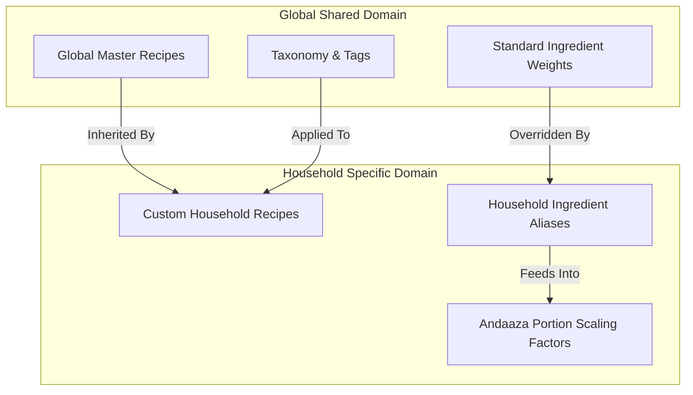
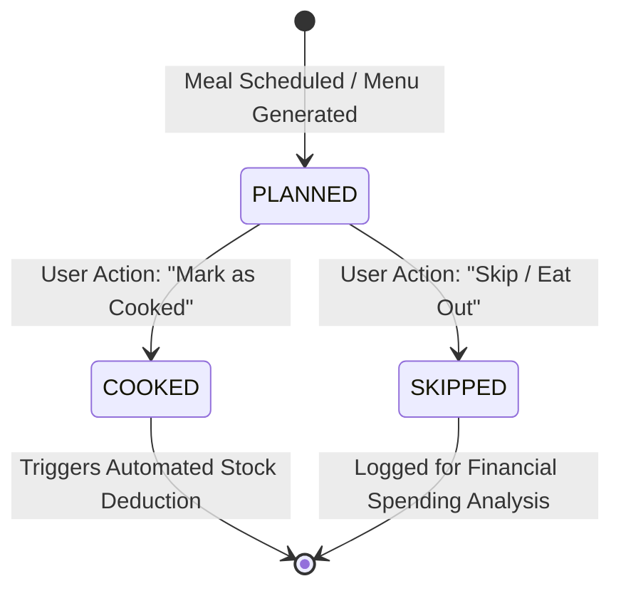
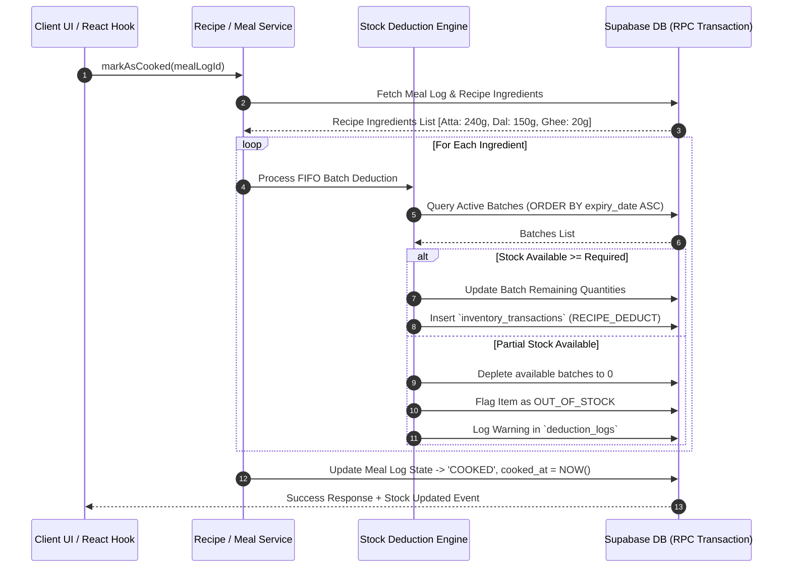

# KitchenMind: Recipe & Meal Logging Specification

**Document Version:** 1.1.0  
**Status:** Implemented (Phase 4B core — see §7)  
**Domain:** Core Domain - Recipes, Meal Lifecycle & Roti Computation  

---

> [!IMPORTANT]
> Sections 1-6 below are the **original design document**, written before `recipes`, `meal_log`,
> `stock_deductions`, `guests`, and `household.roti_per_adult/roti_per_child` existed in the
> committed schema (`0001_initial_schema.sql`). The actual implementation (migration `0006`,
> `RecipeService.js`, `MealLogService.js`, `rotiCalculator.js`) deliberately deviates from this
> design in the ways listed in **§7 — Implementation Notes**, because the real schema is simpler
> and already captures the same intent through different fields. Read §7 alongside §1-6 rather
> than treating §1-6's SQL/JS as literally accurate — this mirrors how `07_ANDAAZA_AI_LEARNING_ENGINE.md`
> documents Phase 4A on top of its own original design.

---

## 1. Executive Summary & Domain Overview

The **Recipe and Meal Logging Module** bridges culinary planning with automated inventory tracking in KitchenMind. It manages a dual-tiered recipe system (Global Master Catalogue vs. Custom Household Overrides), provides dynamic portion scaling algorithms—including the specialized **Roti Calculation Algorithm** for South Asian households—and enforces an audit-backed meal lifecycle (`PLANNED` $\rightarrow$ `COOKED` $\rightarrow$ `SKIPPED`).

When a meal transitions to the `COOKED` state, the system executes an automated, transactional stock deduction pipeline, drawing down pantry inventory in exact base grams using FIFO batch rules.

---

## 2. Global Recipe Catalogue vs Custom Household Items

KitchenMind employs a multi-tenant hierarchy separating shared culinary knowledge from household-specific preferences.



### 2.1 Global Master Recipe Structure

Global recipes store standardized ingredient quantities calculated for 1 base serving ($S_{base} = 1$). All quantities use canonical base units (`g`, `ml`, `units`).

- **Cuisine Taxonomy**: North Indian, South Indian, Gujarati, Maharashtrian, Indo-Chinese, Continental, Snack/Tiffin.
- **Complexity Meta**: `prep_time_mins`, `cook_time_mins`, `difficulty` (`EASY`, `MEDIUM`, `HARD`), `nutritional_profile` (Calories, Protein, Carbs, Fats).

### 2.2 Custom Recipes & Household Aliases

Households can either:
1. **Extend Global Recipes**: Override specific ingredient ratios (e.g., "Use 40g Paneer per serving instead of standard 30g").
2. **Create Custom Household Recipes**: Define proprietary family recipes visible only to their `household_id`.
3. **Ingredient Aliases**: Map localized names (e.g. *"Kanda"* $\rightarrow$ *Onion*, *"Toor Dal"* $\rightarrow$ *Arhar Dal*) for seamless OCR and inventory matching.

---

## 3. Specialized Roti Calculation Algorithm

In Indian households, bread/roti calculation cannot rely on simple per-capita averages due to varying consumption patterns across age groups, meal times, dough moisture absorption, and guest presence.

### 3.1 Mathematical Foundation

The standard baseline for whole wheat flour (Atta) required per Roti:
$$\text{Weight}_{\text{flour\_per\_roti}} = 28.5 \text{ grams} \quad (\text{Range: } 25\text{g} - 32\text{g})$$
$$\text{Water Ratio} = 0.65 \times \text{Weight}_{\text{flour}} \quad \Rightarrow \text{Yields } \approx 47\text{g dough per Roti}$$

### 3.2 Member-Weighted Consumption Formula

For a given meal, total Roti count ($R_{total}$) and required Flour ($F_{required\_grams}$) are calculated as:

$$R_{total} = \sum_{i \in \text{Adults}} \text{Roti}_{adult\_i} + \sum_{j \in \text{Children}} (\text{Roti}_{child\_j} \times C_{ratio}) + \sum_{k \in \text{Guests}} \text{Roti}_{guest\_k}$$

Where:
- $C_{ratio}$: Child consumption ratio (Default = `0.50` for age < 10, `0.75` for age 10–14).
- $\text{Roti}_{adult\_i}$: Adult baseline appetite setting (Default = `3.0` rotis/meal for males, `2.5` for females, customizable per member profile).

$$F_{required\_grams} = R_{total} \times \text{Weight}_{\text{flour\_per\_roti}} \times M_{andaaza}$$

Where $M_{andaaza}$ is the household's learned **Andaaza Modifier** (default `1.0`, adjusts over time based on residual dough logs).

### 3.3 JavaScript Roti Calculation Engine

```javascript
/**
 * Calculates total Rotis and dry Atta weight required for a household meal.
 * @param {Array<{ role: string, age: number, baseRotiAppetite: number }>} members 
 * @param {number} guestCount - Extra adult guests
 * @param {number} [flourPerRotiGrams=28.5] - Standard weight of flour per roti
 * @param {number} [andaazaFactor=1.0] - Household historical multiplier
 * @returns {{ totalRotis: number, totalFlourGrams: number, estimatedDoughGrams: number }}
 */
export function calculateRotiRequirement(members, guestCount = 0, flourPerRotiGrams = 28.5, andaazaFactor = 1.0) {
  let totalRotis = 0;

  members.forEach(member => {
    let weight = 1.0;
    if (member.age < 10) weight = 0.50;
    else if (member.age < 15) weight = 0.75;
    
    const count = (member.baseRotiAppetite || 3) * weight;
    totalRotis += count;
  });

  // Add guest rotis (assumed standard adult appetite = 3)
  totalRotis += (guestCount * 3.0);

  const totalFlourGrams = Math.ceil(totalRotis * flourPerRotiGrams * andaazaFactor);
  const estimatedDoughGrams = Math.ceil(totalFlourGrams * 1.65); // 65% water hydration

  return {
    totalRotis: Math.round(totalRotis * 10) / 10,
    totalFlourGrams,
    estimatedDoughGrams
  };
}
```

---

## 4. Meal Log Lifecycle State Machine

Every planned or executed meal follows a strict 3-state lifecycle.



### 4.1 State Definitions & Transitions

| State | Description | Inventory Action | Financial / Analytics Action |
| :--- | :--- | :--- | :--- |
| `PLANNED` | Meal added to weekly calendar or daily schedule. | None (Stock reserved virtually in UI warning checks). | None. |
| `COOKED` | Meal prepared and consumed. | **Automated Stock Deduction Executed**: Deducts ingredients from active batches. | Increments household nutrition counters; logs home meal savings. |
| `SKIPPED` | Meal cancelled due to dining out, ordering delivery, or fasting. | None (Stock preserved). | Triggers outside meal expense logging prompt. |

---

## 5. Automated Stock Deduction Pipeline

When `updateMealLogStatus(mealId, 'COOKED')` is called, the system executes an atomic transaction.



---

## 6. Database Schema Definition

```sql
-- Global Recipes Table
CREATE TABLE public.recipes (
    id UUID PRIMARY KEY DEFAULT gen_random_uuid(),
    household_id UUID REFERENCES public.households(id) ON DELETE CASCADE, -- NULL if global master recipe
    title VARCHAR(255) NOT NULL,
    description TEXT,
    cuisine VARCHAR(100) NOT NULL,
    meal_type VARCHAR(50) NOT NULL, -- 'BREAKFAST', 'LUNCH', 'DINNER', 'SNACK', 'TIFFIN'
    base_servings INT NOT NULL DEFAULT 1,
    prep_time_mins INT,
    cook_time_mins INT,
    is_custom BOOLEAN DEFAULT FALSE,
    created_at TIMESTAMPTZ DEFAULT NOW()
);

-- Recipe Ingredients Mapping
CREATE TABLE public.recipe_ingredients (
    id UUID PRIMARY KEY DEFAULT gen_random_uuid(),
    recipe_id UUID NOT NULL REFERENCES public.recipes(id) ON DELETE CASCADE,
    master_ingredient_name VARCHAR(255) NOT NULL,
    base_quantity NUMERIC(10, 3) NOT NULL, -- Quantity for base_servings in base_unit
    base_unit VARCHAR(20) NOT NULL, -- 'g', 'ml', 'units'
    is_optional BOOLEAN DEFAULT FALSE
);

-- Meal Logs Table
CREATE TABLE public.meal_logs (
    id UUID PRIMARY KEY DEFAULT gen_random_uuid(),
    household_id UUID NOT NULL REFERENCES public.households(id) ON DELETE CASCADE,
    recipe_id UUID REFERENCES public.recipes(id) ON DELETE SET NULL,
    custom_meal_name VARCHAR(255),
    meal_type VARCHAR(50) NOT NULL, -- 'BREAKFAST', 'LUNCH', 'DINNER', 'TIFFIN'
    servings_prepared INT NOT NULL DEFAULT 1,
    roti_count_prepared INT DEFAULT 0,
    status VARCHAR(50) NOT NULL DEFAULT 'PLANNED', -- 'PLANNED', 'COOKED', 'SKIPPED'
    scheduled_for DATE NOT NULL,
    cooked_at TIMESTAMPTZ,
    notes TEXT,
    created_by UUID REFERENCES auth.users(id),
    created_at TIMESTAMPTZ DEFAULT NOW()
);
```

---

## 7. Implementation Notes: Actual Schema & Deviations (Phase 4B)

### 7.1 Real Schema (as committed)

| §6's design | Actual (`0001` + `0006`) | Why |
| :--- | :--- | :--- |
| `households` (plural), `recipe_ingredients` join table, `meal_logs` (plural) | `household` (singular), `recipes.ingredients` jsonb column, `meal_log` (singular) | `0001_initial_schema.sql` already committed these names before this spec was written to this level of detail; the RPC/service layer must match what's actually deployed, not rename tables retroactively |
| `members.age` drives child/adult roti ratio via $C_{ratio}$ | `members.role` (`'adult'\|'child'\|'elder'`) + optional `members.roti_preference` override; household-level `roti_per_adult`/`roti_per_child` defaults | The schema never stored `age` — role + an explicit override is simpler and was already there |
| `recipe_ingredients.master_ingredient_name` | `recipes.ingredients` jsonb array: `[{ canonical_name, base_quantity_grams, is_optional? }]`, scaled by `base_servings` | Keeps ingredient references as `canonical_name` text, consistent with `inventory`/Phase 4A's convention, instead of a separate ingredient-ID FK table that doesn't exist |
| `recipes.household_id` nullable from the start | `recipes.household_id` added in `0006` (was global-only in `0001`); RLS split into a global-read policy (`household_id IS NULL`) and a household-owned-recipe policy, replacing the original all-authenticated-read policy that would otherwise have leaked custom recipes cross-tenant once the column existed | Additive migration on top of what actually shipped |
| Standalone `deduction_logs` table for partial-stock warnings | `mark_meal_cooked()`'s return payload includes a `deductions` array with `shortfall_grams`/`out_of_stock` per ingredient; no separate table | The RPC's JSON response already carries this per-call; a persisted table can be added later if a UI needs to list historical shortfalls, but nothing reads one today |

### 7.2 `mark_meal_cooked(p_payload jsonb)` — the real atomic deduction RPC

Mirrors `commit_scanned_bill()`'s (0004) architecture rather than the `Service -> DeductEngine -> DB` multi-call sequence diagram in §5 above — the same reasoning applies here as there: multiple independent client-to-DB round trips for what must be one atomic operation is a correctness risk (partial application on failure, or a race between two concurrent deductions), not just a style preference.

- **Payload**: `{ household_id, meal_log_id, required_ingredients: [{ canonical_name, quantity_grams }] }`. Required ingredients are computed client-side (`RecipeService.scaleRecipeIngredients` + `rotiCalculator.calculateRotiRequirement`) and passed in — the same client-computes/RPC-persists split `commit_scanned_bill` already established.
- **Idempotent**: a meal already `'cooked'` short-circuits (`already_cooked: true`) without deducting again — necessary because "mark as cooked" is a plain UI button tap, not an idempotency-keyed request like bill commits.
- **FIFO**: deducts from `inventory_batches` ordered by soonest `expiry_date` first (NULLs last), then oldest `purchase_date` — same ordering rule as the `alt` branch in §5's sequence diagram, `SELECT ... FOR UPDATE` locked per batch to prevent a concurrent deduction (e.g. two meals cooked back-to-back) from double-spending the same batch.
- **Partial stock**: never fails the whole call — deducts what's available, reports `shortfall_grams`/`out_of_stock` per ingredient, and still marks the meal cooked (matches §4.1's `COOKED` row: the deduction is a side effect of cooking, not a precondition for it).
- **Security**: same hardening as `commit_scanned_bill` post-review — unconditional membership check (not skipped for `auth.uid() IS NULL`), `SET search_path = public, pg_temp`, `EXECUTE` revoked from `PUBLIC` and granted only to `authenticated`.

### 7.3 Not yet implemented

- No UI: `/meals` and `/recipe/:id` routes remain `<Soon>` placeholders in `App.jsx`. `RecipeService`, `MealLogService`, and `rotiCalculator` are backend/logic-layer only, unit-tested via `Phase4BMealDeduction.test.js`, not yet wired to any page.
- `$M_{andaaza}$` (the household historical multiplier) defaults to `1.0` in `calculateRotiRequirement` — `AndaazaLearningService.js` (the volumetric calibration service referenced in §2 of `07_ANDAAZA_AI_LEARNING_ENGINE.md`) is still an unimplemented stub, so there is no learned value to feed in yet.
- Global recipe seed data does not exist — `recipes` has no rows until either a seed migration or the (not-yet-built) custom recipe creation UI populates it.
