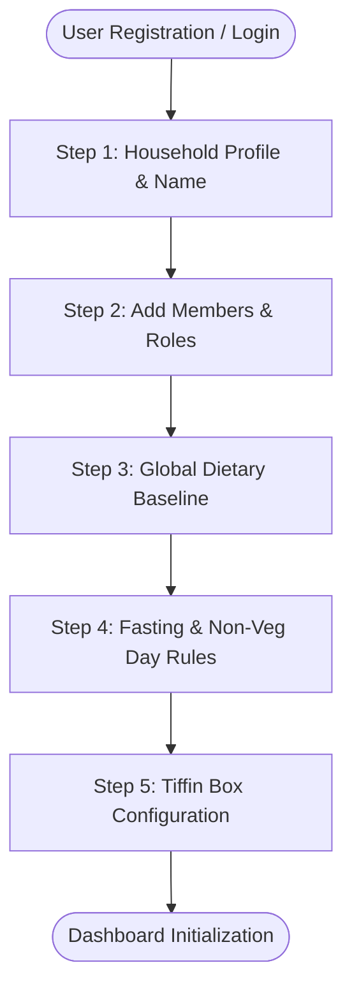
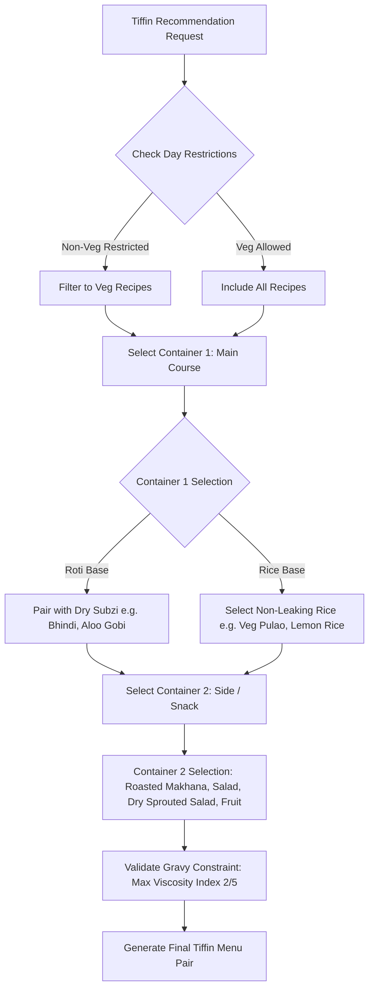

# KitchenMind: Household & Tiffin Preferences Specification

**Document Version:** 1.0.0  
**Status:** Approved Specification  
**Domain:** Core Domain - Household Management, Cultural Restrictions & Tiffin Engineering  

---

## 1. Executive Summary & Domain Overview

The **Household and Tiffin Preferences Module** handles the socio-cultural, dietary, and operational requirements of Indian households. It encapsulates member profiling, dietary restriction matrices (including day-specific fasting and vegetarian constraints), automated breakfast rotation schedules, and double-container **Tiffin Box (Lunchbox)** configuration rules.

---

## 2. Household Onboarding Flow

When a user signs up or initializes a household in KitchenMind, they are guided through a multi-step setup wizard that builds their household operational profile.



### 2.1 Onboarding Steps & Data Collection

1. **Step 1: Household Basics**: Household name (e.g., "Sharma Family Kitchen"), primary currency (`INR`), regional cuisine preference.
2. **Step 2: Member Roster**: Name, role (`ADMIN`, `MEMBER`, `GUEST`), age category (`CHILD`, `ADULT`, `SENIOR`), baseline roti count.
3. **Step 3: Dietary Baseline**: Pure Veg, Eggetarian, Non-Veg, Jain (No onion/garlic), Vegan, Nut/Lactose Allergies.
4. **Step 4: Weekly Religious / Fasting Rules**: Select days on which non-vegetarian or onion/garlic is strictly prohibited.
5. **Step 5: Tiffin Preferences**: Enable/disable daily Tiffin packing, specify number of active tiffin boxes required, and select preferred dish categories.

---

## 3. Member Management & Role Definitions

Each household contains one or more members mapped under a primary admin user.

### 3.1 Role Hierarchy & Permissions

| Role | Administrative Rights | Inventory Management | Recipe & Meal Planning | Financial Access |
| :--- | :--- | :--- | :--- | :--- |
| `PRIMARY_ADMIN` | Full control: Invite/Remove members, edit household profile. | Full read/write/delete. | Full read/write/delete. | View reports, edit budgets. |
| `MEMBER` | None. | Read/write stock items & scans. | Log meals, add recipes. | View summary metrics. |
| `GUEST` | None. | Read only. | View meal menu. | Hidden. |

### 3.2 Age Categories & Consumption Multipliers

```json
{
  "age_groups": {
    "CHILD_UNDER_5": { "portion_multiplier": 0.35, "roti_default": 1.0 },
    "CHILD_5_TO_12": { "portion_multiplier": 0.60, "roti_default": 2.0 },
    "TEEN_ADULT": { "portion_multiplier": 1.00, "roti_default": 3.0 },
    "SENIOR": { "portion_multiplier": 0.80, "roti_default": 2.0 }
  }
}
```

---

## 4. Breakfast Rotation Engine

To combat breakfast monotony, KitchenMind enforces a rotation matrix ensuring no breakfast dish is repeated within a configurable window (Default = 5 days).

### 4.1 Rotation Matrix Rules

- **Category Spacing**: Alternate between Rice-based (Poha, Idli, Upma), Flour-based (Paratha, Puri, Cheela), and High-Protein (Sprouts, Eggs, Paneer Toast).
- **Prep Time Constraints**: Weekday breakfasts limited to $\le 20$ minutes; Weekend breakfasts allow elaborate options (e.g. Chole Puri, Misal Pav).


---

## 5. Fasting & Religious Non-Veg Restrictions

In Indian households, non-vegetarian intake and specific ingredients (onion, garlic, root vegetables) are strictly governed by days of the week, religious festivals, or lunar calendars.

### 5.1 Weekly Restriction Mapping Table

| Day of Week | Non-Veg Allowed? | Onion & Garlic Allowed? | Common Cultural Context |
| :--- | :--- | :--- | :--- |
| **Monday** | Restricted (Conditional) | Allowed | Lord Shiva Fasting |
| **Tuesday** | ❌ Strictly Prohibited | Allowed / Restricted | Lord Hanuman Fasting |
| **Wednesday** | ✅ Allowed | Allowed | Standard |
| **Thursday** | ❌ Strictly Prohibited | ❌ Prohibited (Optional) | Lord Vishnu Fasting |
| **Friday** | ✅ Allowed | Allowed | Standard |
| **Saturday** | ❌ Strictly Prohibited | Allowed / Restricted | Lord Shani / Hanuman Fasting |
| **Sunday** | ✅ Allowed | Allowed | Primary Non-Veg Feast Day |

### 5.2 Dynamic Recipe Filtering Engine

When generating meal recommendations or approving a planned meal, the system checks current day rules:

```javascript
/**
 * Validates if a recipe complies with the household's day-specific restrictions.
 * @param {Object} recipe - Recipe object containing dietary tags and ingredients
 * @param {Object} householdRules - Household preference configuration
 * @param {Date} date - Date of scheduled meal
 * @returns {{ isCompliant: boolean, violationReason?: string }}
 */
export function validateRecipeDayRestrictions(recipe, householdRules, date = new Date()) {
  const daysOfWeek = ['SUNDAY', 'MONDAY', 'TUESDAY', 'WEDNESDAY', 'THURSDAY', 'FRIDAY', 'SATURDAY'];
  const currentDay = daysOfWeek[date.getDay()];

  // Check Non-Veg Prohibition
  const nonVegProhibitedDays = householdRules.non_veg_prohibited_days || ['TUESDAY', 'THURSDAY', 'SATURDAY'];
  if (recipe.is_non_veg && nonVegProhibitedDays.includes(currentDay)) {
    return {
      isCompliant: false,
      violationReason: `Non-vegetarian recipes are prohibited on ${currentDay}s per household rules.`
    };
  }

  // Check Onion/Garlic Fasting Rules
  if (householdRules.is_fasting_day || householdRules.fasting_dates?.includes(date.toISOString().split('T')[0])) {
    if (recipe.contains_onion_garlic || recipe.contains_grains) {
      return {
        isCompliant: false,
        violationReason: `Recipe contains ingredients prohibited during active Fasting mode.`
      };
    }
  }

  return { isCompliant: true };
}
```

---

## 6. Tiffin Box Preferences (Double Container Architecture)

For office and school lunchboxes, recipes must meet practical constraints: dry/semi-dry texture (non-leaking), high reheatability, and freshness retention over 4–6 hours.



### 6.1 Container Configuration Rules

- **Box 1 (Main Course)**: Must be dry or thick semi-gravy. Standard options: 3 Rotis + Dry Sabzi, or Flavored Rice (Jeera Rice, Pulao). Gravies with high fluidity (e.g. thin Rasam or Thin Dal) are flagged with a ⚠️ **Leak Risk Warning**.
- **Box 2 (Side / Accompaniment / Snack)**: Protein bite or crunch element (e.g., Roasted Paneer cubes, Boiled Sprouts, Cucumber sticks, Chana Chat, Roasted Nuts).

---

## 7. Database Schema Definition

```sql
-- Household Master Table
CREATE TABLE public.households (
    id UUID PRIMARY KEY DEFAULT gen_random_uuid(),
    name VARCHAR(255) NOT NULL,
    primary_admin_id UUID NOT NULL REFERENCES auth.users(id),
    currency VARCHAR(10) DEFAULT 'INR',
    non_veg_prohibited_days TEXT[] DEFAULT ARRAY['TUESDAY', 'THURSDAY', 'SATURDAY'],
    fasting_mode_active BOOLEAN DEFAULT FALSE,
    breakfast_rotation_days INT DEFAULT 5,
    created_at TIMESTAMPTZ DEFAULT NOW(),
    updated_at TIMESTAMPTZ DEFAULT NOW()
);

-- Household Members Profile Table
CREATE TABLE public.household_members (
    id UUID PRIMARY KEY DEFAULT gen_random_uuid(),
    household_id UUID NOT NULL REFERENCES public.households(id) ON DELETE CASCADE,
    name VARCHAR(255) NOT NULL,
    role VARCHAR(50) NOT NULL DEFAULT 'MEMBER', -- 'PRIMARY_ADMIN', 'MEMBER', 'GUEST'
    age_category VARCHAR(50) NOT NULL DEFAULT 'ADULT', -- 'CHILD', 'ADULT', 'SENIOR'
    age INT,
    base_roti_appetite NUMERIC(3, 1) DEFAULT 3.0,
    dietary_preference VARCHAR(50) DEFAULT 'VEGETARIAN', -- 'PURE_VEG', 'EGGETARIAN', 'NON_VEG', 'JAIN'
    allergies TEXT[],
    dislikes TEXT[],
    requires_tiffin BOOLEAN DEFAULT FALSE,
    created_at TIMESTAMPTZ DEFAULT NOW()
);

-- Tiffin Preferences Config
CREATE TABLE public.tiffin_preferences (
    id UUID PRIMARY KEY DEFAULT gen_random_uuid(),
    household_member_id UUID NOT NULL REFERENCES public.household_members(id) ON DELETE CASCADE,
    box1_preferred_type VARCHAR(50) DEFAULT 'ROTI_SABZI', -- 'ROTI_SABZI', 'RICE_SPECIAL'
    box2_preferred_type VARCHAR(50) DEFAULT 'PROTEIN_SNACK', -- 'PROTEIN_SNACK', 'SALAD_FRUIT'
    max_prep_time_mins INT DEFAULT 25,
    avoid_gravy BOOLEAN DEFAULT TRUE,
    created_at TIMESTAMPTZ DEFAULT NOW()
);
```
