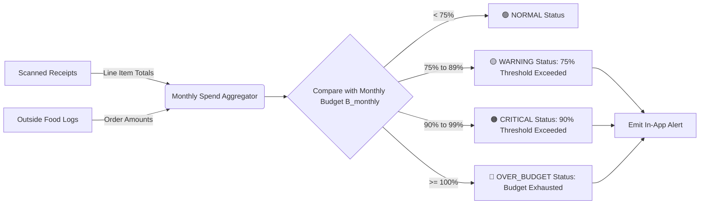
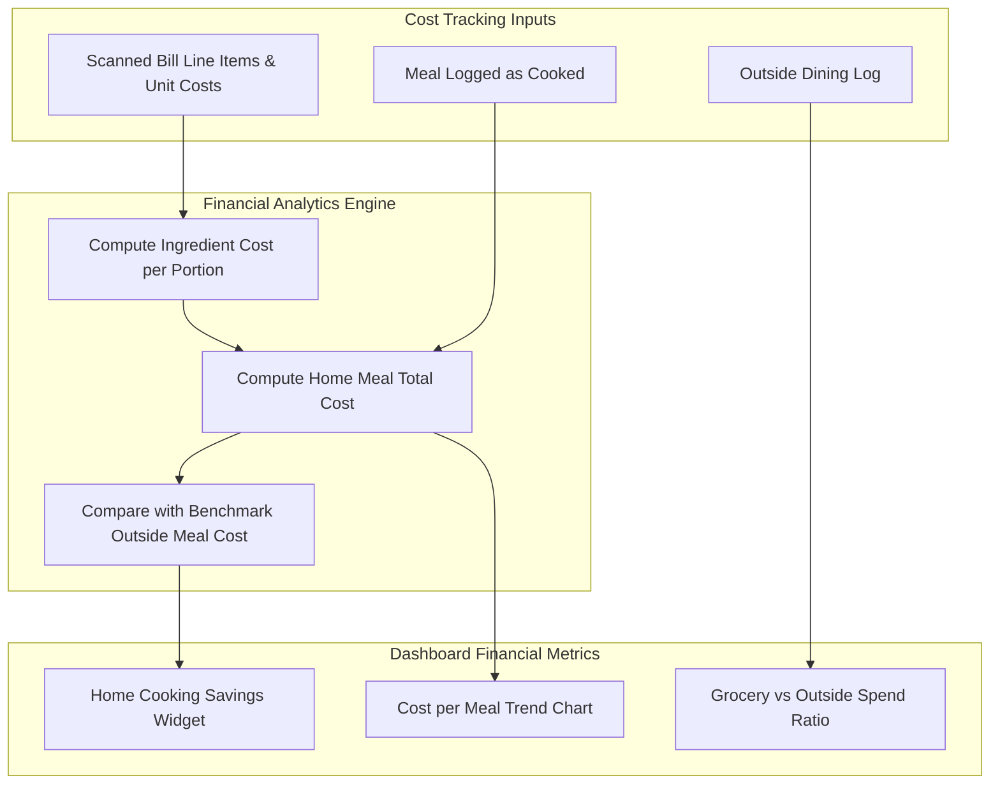

# KitchenMind: Budget & Financial Analytics Specification

**Document Version:** 1.0.0  
**Status:** Approved Specification  
**Domain:** Core Domain - Budgeting, Expense Tracking & Financial Analytics  

---

## 1. Executive Summary & Domain Overview

The **Budget & Financial Analytics Module** provides household money management specialized for food and kitchen expenses. By unifying digitized receipt data (scanned via OCR), manual grocery entries, and outside dining expenditure (logged via skipped meals or direct entry), KitchenMind delivers deep insights into spending patterns, cost-per-meal metrics, and grocery inflation trends.

---

## 2. Monthly Budget Allocation & Alert Engine

Households define a Target Monthly Food Budget ($B_{monthly}$). The system tracks total cumulative spend ($S_{total}$) across two main buckets:
1. **In-Home Groceries** ($S_{grocery}$): Scanned bills & manual ingredient purchases.
2. **Outside Food & Dining** ($S_{outside}$): Swiggy/Zomato orders, restaurants, street food.

$$S_{total} = S_{grocery} + S_{outside}$$



### 2.1 Threshold Notification Tiers

- **75% Budget Warning**: Triggers UI banner indicating spend velocity is high.
- **90% Critical Alert**: Suggests budget-friendly meal plans (e.g. high-grain/legume meals, reducing outside dining).
- **100%+ Over-Budget Exceeded**: Displays remaining month budget as negative balance ($B_{remaining} < 0$).

### 2.2 Unused Budget Rollover Logic

Households can toggle **Budget Rollover Mode**:
$$B_{monthly\_effective}(t) = B_{monthly\_base} + \alpha \cdot \max(0, B_{monthly}(t-1) - S_{total}(t-1))$$

Where $\alpha \in [0, 1.0]$ is the rollover fraction (default `1.0` = 100% leftover budget rolls into the next month).

---

## 3. Category-Wise Expense Taxonomy

To provide granular financial reports, line items extracted from receipt processing are automatically categorized into standardized spending categories.

| Major Category | Sub-Categories Included | Average Household Spend % | Target Unit Metrics |
| :--- | :--- | :--- | :--- |
| **Staples & Grains** | Atta, Rice, Pulses (Dals), Millets, Poha | 25% - 30% | Cost per kg |
| **Fresh Produce** | Fresh Vegetables, Leafy Greens, Fruits, Herbs | 20% - 25% | Cost per kg / count |
| **Dairy & Eggs** | Milk, Curd, Butter, Paneer, Ghee, Cheese, Eggs | 15% - 20% | Cost per Liter / kg |
| **Spices & Oils** | Cooking Oils, Whole Spices, Masala Powders, Salt, Sugar | 10% - 15% | Cost per Liter / 100g |
| **Packaged & Snacks** | Biscuits, Snacks, Instant Noodles, Beverages, Frozen | 10% - 15% | Cost per packet |
| **Outside Dining** | Restaurant Bills, Swiggy, Zomato, Food Delivery Fees | Variable (15% - 40%) | Cost per order / meal |

---

## 4. Outside Food vs Grocery Spend & Savings Analysis

A core metric in KitchenMind is **Home Cooking Financial Savings** ($S_{saved}$).

### 4.1 Cost-Per-Meal Calculation

The average cost per home-cooked meal per person ($C_{home\_meal}$) is derived from ingredient consumption:

$$C_{home\_meal} = \frac{\sum_{i \in \text{Ingredients}} (\text{QuantityUsed}_i \times \text{CostPerBaseUnit}_i)}{\text{ServingsCooked}}$$

The savings achieved compared to an equivalent outside meal baseline ($C_{outside\_baseline}$, default ₹200/meal) is:

$$S_{saved} = \sum_{\text{Cooked Meals}} (\text{Servings} \times C_{outside\_baseline}) - \sum_{\text{Cooked Meals}} C_{home\_meal}$$



---

## 5. Historical Trend Analysis & Inflation Tracking

KitchenMind tracks commodity price movements over time to inform households of grocery inflation.

### 5.1 Price Variance Formula

For any commodity $k$ (e.g., Whole Wheat Atta) purchased on date $t$:

$$\text{PriceVariance}_k(t) = \frac{\text{UnitPrice}_k(t) - \text{UnitPrice}_k(t - 30\text{ days})}{\text{UnitPrice}_k(t - 30\text{ days})} \times 100\%$$

### 5.2 Monthly Analytics JSON Payload Structure

```json
{
  "household_id": "c7a8b9d0-1234-5678-90ab-cdef12345678",
  "period": "2026-08",
  "currency": "INR",
  "budget_summary": {
    "allocated_budget": 15000.00,
    "total_spent": 9450.50,
    "remaining_budget": 5549.50,
    "spent_percentage": 63.00,
    "status": "NORMAL"
  },
  "spend_by_bucket": {
    "groceries": 6200.50,
    "outside_dining": 3250.00
  },
  "category_breakdown": [
    { "category": "Grains & Staples", "amount": 2100.00, "percentage": 33.87 },
    { "category": "Fresh Produce", "amount": 1450.50, "percentage": 23.39 },
    { "category": "Dairy & Eggs", "amount": 1350.00, "percentage": 21.77 },
    { "category": "Spices & Oils", "amount": 800.00, "percentage": 12.90 },
    { "category": "Packaged & Snacks", "amount": 500.00, "percentage": 8.06 }
  ],
  "savings_metrics": {
    "total_home_meals_cooked": 54,
    "avg_home_meal_cost": 42.50,
    "estimated_outside_cost": 200.00,
    "net_financial_savings": 8505.00
  }
}
```

---

## 6. Database Schema Definition

```sql
-- Monthly Household Budgets
CREATE TABLE public.household_budgets (
    id UUID PRIMARY KEY DEFAULT gen_random_uuid(),
    household_id UUID NOT NULL REFERENCES public.households(id) ON DELETE CASCADE,
    month_year VARCHAR(7) NOT NULL, -- Format: 'YYYY-MM'
    allocated_amount NUMERIC(10, 2) NOT NULL,
    rollover_amount NUMERIC(10, 2) DEFAULT 0.00,
    created_at TIMESTAMPTZ DEFAULT NOW(),
    updated_at TIMESTAMPTZ DEFAULT NOW(),
    UNIQUE(household_id, month_year)
);

-- Bills & Receipts Master Table
CREATE TABLE public.bills (
    id UUID PRIMARY KEY DEFAULT gen_random_uuid(),
    household_id UUID NOT NULL REFERENCES public.households(id) ON DELETE CASCADE,
    store_name VARCHAR(255),
    bill_date DATE NOT NULL DEFAULT CURRENT_DATE,
    total_amount NUMERIC(10, 2) NOT NULL,
    tax_amount NUMERIC(10, 2) DEFAULT 0.00,
    image_url TEXT,
    ocr_status VARCHAR(50) DEFAULT 'COMPLETED', -- 'PENDING', 'PROCESSING', 'COMPLETED', 'FAILED'
    created_by UUID REFERENCES auth.users(id),
    created_at TIMESTAMPTZ DEFAULT NOW()
);

-- Bill Line Items Breakdown
CREATE TABLE public.bill_items (
    id UUID PRIMARY KEY DEFAULT gen_random_uuid(),
    bill_id UUID NOT NULL REFERENCES public.bills(id) ON DELETE CASCADE,
    inventory_item_id UUID REFERENCES public.inventory_items(id) ON DELETE SET NULL,
    raw_item_name VARCHAR(255) NOT NULL,
    matched_item_name VARCHAR(255),
    category VARCHAR(100) NOT NULL,
    quantity NUMERIC(10, 3) NOT NULL,
    unit VARCHAR(50) NOT NULL,
    price_per_unit NUMERIC(10, 2),
    total_price NUMERIC(10, 2) NOT NULL,
    created_at TIMESTAMPTZ DEFAULT NOW()
);

-- Outside Dining & Expense Logs
CREATE TABLE public.outside_expense_logs (
    id UUID PRIMARY KEY DEFAULT gen_random_uuid(),
    household_id UUID NOT NULL REFERENCES public.households(id) ON DELETE CASCADE,
    source VARCHAR(100) NOT NULL, -- 'SWIGGY', 'ZOMATO', 'RESTAURANT', 'STREET_FOOD'
    description TEXT,
    amount NUMERIC(10, 2) NOT NULL,
    date DATE NOT NULL DEFAULT CURRENT_DATE,
    meal_log_id UUID REFERENCES public.meal_logs(id) ON DELETE SET NULL,
    created_at TIMESTAMPTZ DEFAULT NOW()
);
```
