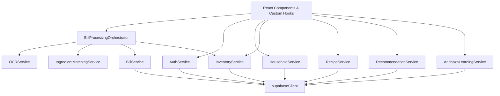
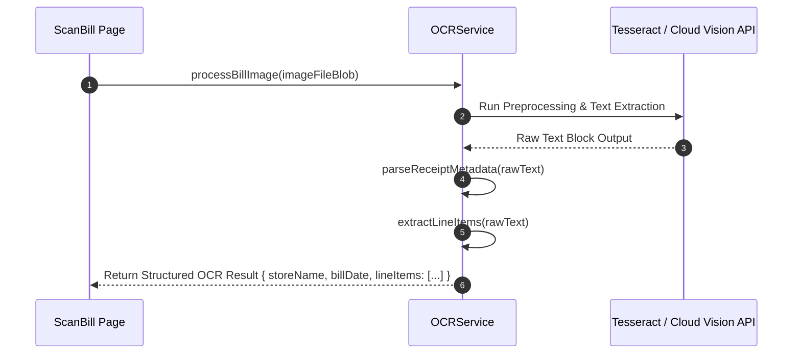

# KitchenMind: API & Services Catalogue

**Document Version:** 1.0.0  
**Status:** Approved Specification  
**Domain:** Core Frontend & API Integration Layer  

---

## 1. Executive Summary & Service Architecture Map

The **KitchenMind Services Layer** is a collection of modular JavaScript service classes and singletons that encapsulate all database communications, OCR image pipelines, intelligent ingredient matching, portion learning algorithms, and Supabase BaaS integrations.



---

## 2. Services Catalogue Specification

---

### 2.1 `AuthService`

Provides authentication methods powered by Supabase Auth (OAuth, Magic Link, Email/Password).

#### `signUp({ email, password, fullName })`
- **Parameters**: `email` (string), `password` (string), `fullName` (string).
- **Returns**: `Promise<{ user: Object|null, session: Object|null, error: Error|null }>`
- **Error Behavior**: Throws or returns error object if email exists or password fails strength validation.

#### `signIn({ email, password })`
- **Parameters**: `email` (string), `password` (string).
- **Returns**: `Promise<{ user: Object, session: Object }>`
- **Error Behavior**: Returns `Invalid login credentials` error on failure.

#### `signOut()`
- **Parameters**: None.
- **Returns**: `Promise<{ error: Error|null }>`
- **Error Behavior**: Clears local session storage and Zustand auth state.

#### `getSession()`
- **Parameters**: None.
- **Returns**: `Promise<Session|null>`

#### `onAuthStateChange(callback)`
- **Parameters**: `callback` (`(event: string, session: Session|null) => void`).
- **Returns**: `{ data: { subscription: Unsubscribe } }`

#### `resetPassword(email)`
- **Parameters**: `email` (string).
- **Returns**: `Promise<{ error: Error|null }>`

---

### 2.2 `HouseholdService`

Manages household onboarding, member profiling, role assignments, and dietary preferences.

#### `getHousehold(householdId)`
- **Parameters**: `householdId` (string UUID).
- **Returns**: `Promise<HouseholdObject>`

#### `createHousehold({ name, currency, nonVegProhibitedDays })`
- **Parameters**: Object with household metadata.
- **Returns**: `Promise<HouseholdObject>`

#### `updateHousehold(householdId, updates)`
- **Parameters**: `householdId` (string UUID), `updates` (Partial<HouseholdObject>).
- **Returns**: `Promise<HouseholdObject>`

#### `addMember(householdId, memberData)`
- **Parameters**: `householdId` (string UUID), `memberData` (`{ name, role, ageCategory, baseRotiAppetite, dietaryPreference }`).
- **Returns**: `Promise<HouseholdMember>`

#### `removeMember(memberId)`
- **Parameters**: `memberId` (string UUID).
- **Returns**: `Promise<{ success: boolean }>`

#### `updatePreferences(householdId, preferences)`
- **Parameters**: `householdId` (string UUID), `preferences` (Object).
- **Returns**: `Promise<HouseholdObject>`

---

### 2.3 `InventoryService`

Handles real-time inventory queries, manual additions, batch management, transaction logging, and FIFO meal deductions.

#### `getInventoryItems(householdId, filters)`
- **Parameters**: `householdId` (string UUID), `filters` (`{ category?: string, status?: string, search?: string }`).
- **Returns**: `Promise<Array<InventoryItemWithBatches>>`

#### `addInventoryItem(householdId, itemPayload)`
- **Parameters**: `householdId` (string UUID), `itemPayload` (`{ name, category, displayUnit, quantity, cost, expiryDate }`).
- **Returns**: `Promise<InventoryItem>`

#### `updateInventoryItem(itemId, updates)`
- **Parameters**: `itemId` (string UUID), `updates` (Object).
- **Returns**: `Promise<InventoryItem>`

#### `deleteInventoryItem(itemId)`
- **Parameters**: `itemId` (string UUID).
- **Returns**: `Promise<{ success: boolean }>`

#### `recordTransaction(transactionPayload)`
- **Parameters**: `transactionPayload` (`{ householdId, inventoryItemId, batchId, type, quantityChangeBase, notes }`).
- **Returns**: `Promise<TransactionRecord>`

#### `deductForMeal(householdId, recipeIngredients, servingsMultiplier)`
- **Parameters**: `householdId` (string UUID), `recipeIngredients` (Array), `servingsMultiplier` (number).
- **Returns**: `Promise<{ success: boolean, deductedItems: Array, warnings: Array }>`

---

### 2.4 `BillService`

Provides persistence and query APIs for receipts and line-item financial records.

#### `createBill(billPayload)`
- **Parameters**: `billPayload` (`{ householdId, storeName, billDate, totalAmount, taxAmount, imageUrl }`).
- **Returns**: `Promise<BillRecord>`

#### `getBills(householdId, pagination)`
- **Parameters**: `householdId` (string UUID), `pagination` (`{ page: number, limit: number }`).
- **Returns**: `Promise<{ bills: Array<BillRecord>, totalCount: number }>`

#### `getBillById(billId)`
- **Parameters**: `billId` (string UUID).
- **Returns**: `Promise<BillRecordWithItems>`

#### `deleteBill(billId)`
- **Parameters**: `billId` (string UUID).
- **Returns**: `Promise<{ success: boolean }>`

---

### 2.5 `OCRService`

Interfaces with Tesseract.js / Cloud OCR APIs to process raw receipt images into structured text line items.



#### `processBillImage(fileBlob, onProgress)`
- **Parameters**: `fileBlob` (File/Blob), `onProgress` (`(progress: number) => void`).
- **Returns**: `Promise<{ rawText: string, confidence: number }>`

#### `extractLineItems(rawText)`
- **Parameters**: `rawText` (string).
- **Returns**: `Array<{ rawName: string, quantity: number, unit: string, price: number }>`

#### `parseReceiptMetadata(rawText)`
- **Parameters**: `rawText` (string).
- **Returns**: `{ storeName: string|null, billDate: string|null, totalAmount: number|null }`

---

### 2.6 `IngredientMatchingService`

Employs fuzzy string matching (Levenshtein Distance & Token Jaccard Similarity) to map raw OCR receipt text to canonical master ingredient IDs.

#### `matchOcrToMasterIngredients(rawItemName, masterCatalogue)`
- **Parameters**: `rawItemName` (string), `masterCatalogue` (Array).
- **Returns**: `{ matchedItem: MasterIngredient|null, confidenceScore: number, matchType: 'EXACT'|'FUZZY'|'ALIAS' }`

#### `calculateMatchConfidence(strA, strB)`
- **Parameters**: `strA` (string), `strB` (string).
- **Returns**: `number` (Value between 0.0 and 1.0)

#### `suggestMappings(rawItemName, masterCatalogue, topN = 3)`
- **Parameters**: `rawItemName` (string), `masterCatalogue` (Array), `topN` (number).
- **Returns**: `Array<{ matchedItem: MasterIngredient, confidenceScore: number }>`

---

### 2.7 `BillProcessingOrchestrator`

Coordinates the end-to-end flow from image upload to verified inventory addition.

#### `orchestrateScanToInventory(fileBlob, householdId, onProgress)`
- **Parameters**: `fileBlob` (File/Blob), `householdId` (string UUID), `onProgress` (`(step: string, pct: number) => void`).
- **Returns**: `Promise<{ billId: string, processedItemsCount: number, matchedItems: Array }>`

#### `validateProcessedItems(itemsList)`
- **Parameters**: `itemsList` (Array).
- **Returns**: `{ isValid: boolean, validationErrors: Array }`

---

### 2.8 `BillPersistenceService`

Sub-service dedicated to transactional creation of bill master records along with their line items.

#### `persistBillWithLineItems(billHeader, verifiedItems)`
- **Parameters**: `billHeader` (Object), `verifiedItems` (Array).
- **Returns**: `Promise<{ billId: string, lineItemIds: Array<string> }>`

---

### 2.9 `RecipeService`

Handles global recipe retrieval, custom recipe creation, and inventory-driven recipe search.

#### `getRecipes(filters)`
- **Parameters**: `filters` (`{ cuisine?: string, mealType?: string, maxPrepTime?: number }`).
- **Returns**: `Promise<Array<Recipe>>`

#### `getRecipeById(recipeId)`
- **Parameters**: `recipeId` (string UUID).
- **Returns**: `Promise<RecipeWithIngredients>`

#### `searchRecipesByInventory(householdId, minimumMatchThreshold = 0.70)`
- **Parameters**: `householdId` (string UUID), `minimumMatchThreshold` (number).
- **Returns**: `Promise<Array<{ recipe: Recipe, missingIngredients: Array, matchPercentage: number }>>`

---

### 2.10 `RecommendationService`

Intelligent recommendation engine producing daily meal plans and Tiffin box pairings.

#### `getMealRecommendations(householdId, targetDate, mealType)`
- **Parameters**: `householdId` (string UUID), `targetDate` (Date), `mealType` ('BREAKFAST'|'LUNCH'|'DINNER').
- **Returns**: `Promise<Array<{ recipe: Recipe, suitabilityScore: number, reason: string }>>`

#### `getTiffinRecommendations(householdId, memberId, targetDate)`
- **Parameters**: `householdId` (string UUID), `memberId` (string UUID), `targetDate` (Date).
- **Returns**: `Promise<{ container1: Recipe, container2: Recipe, leakRiskWarning: boolean }>`

---

### 2.11 `AndaazaLearningService`

Adaptive machine learning engine that calculates household-specific portion modifiers based on cooking feedback.

#### `recordHouseholdCookingRatio(householdId, recipeId, plannedServings, actualUsedGrams)`
- **Parameters**: `householdId`, `recipeId`, `plannedServings`, `actualUsedGrams`.
- **Returns**: `Promise<{ updatedModifier: number }>`

#### `predictPortionMultiplier(householdId, recipeId)`
- **Parameters**: `householdId` (string UUID), `recipeId` (string UUID).
- **Returns**: `Promise<number>` (Modifier multiplier e.g. `1.15`)

---

### 2.12 `supabaseClient`

The unified client configuration initializing Supabase JS SDK.

```javascript
import { createClient } from '@supabase/supabase-js';

const supabaseUrl = import.meta.env.VITE_SUPABASE_URL || 'https://placeholder-url.supabase.co';
const supabaseAnonKey = import.meta.env.VITE_SUPABASE_ANON_KEY || 'placeholder-anon-key';

export const supabase = createClient(supabaseUrl, supabaseAnonKey, {
  auth: {
    persistSession: true,
    autoRefreshToken: true,
    detectSessionInUrl: true
  }
});
```
