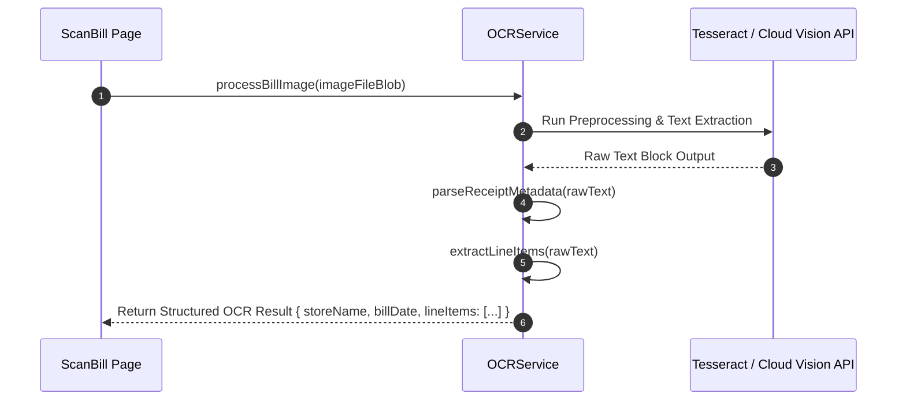

# KitchenMind: API & Services Catalogue

**Document Version:** 1.1.0  
**Status:** Approved Specification  
**Domain:** Core Frontend & API Integration Layer + AI Copilot Runtime (Sprint 6B)  

---

## 1. Executive Summary & Service Architecture Map

The **KitchenMind Services Layer** is a collection of modular JavaScript service classes and singletons that encapsulate all database communications, OCR image pipelines, intelligent ingredient matching, portion learning algorithms, and Supabase BaaS integrations.

```mermaid
graph TD
    UI[React Components & Custom Hooks] --> Orchestrator[BillProcessingOrchestrator]
    UI --> AuthService[AuthService]
    UI --> HouseholdService[HouseholdService]
    UI --> InventoryService[InventoryService]
    UI --> RecipeService[RecipeService]
    UI --> MealLogService[MealLogService]
    UI --> RecommendationService[RecommendationService]
    UI --> AndaazaService[AndaazaLearningService]

    MealLogService -->|scaleRecipeIngredients| RecipeService
    MealLogService -->|"mark_meal_cooked() RPC"| Supabase[supabaseClient]

    Orchestrator --> OCRService[OCRService]
    Orchestrator --> MatchingService[IngredientMatchingService]
    Orchestrator --> BillService[BillService]
    Orchestrator --> InventoryService

    UI --> BillPersistence[BillPersistenceService]
    BillPersistence -->|ACID commit| Supabase[supabaseClient]
    BillPersistence -.->|fire-and-forget post-commit| AIObs[AIObservationService]
    BillPersistence -.->|fire-and-forget post-commit| LearningEngine[AndaazaLearningEngine]
    LearningEngine --> ConsumptionSvc[ConsumptionProfileService]
    LearningEngine --> PredictionSvc[PredictionService]
    LearningEngine --> HouseholdIntelSvc[HouseholdIntelligenceService]

    AuthService --> Supabase
    HouseholdService --> Supabase
    InventoryService --> Supabase
    BillService --> Supabase
    RecipeService --> Supabase
    RecommendationService --> Supabase
    AndaazaService --> Supabase
    AIObs --> Supabase
    ConsumptionSvc --> Supabase
    PredictionSvc --> Supabase
    HouseholdIntelSvc --> Supabase

    UI --> Dashboard["useDashboard (Phase 5A)"]
    Dashboard -->|"reuses, no new logic"| PredictionSvc
    Dashboard -->|"reuses, no new logic"| HouseholdIntelSvc
    Dashboard -->|"reuses, no new logic"| ConsumptionSvc
    Dashboard --> InventoryService
    Dashboard --> AIObs
    Dashboard -->|"scaleRecipeIngredients"| RecipeService

    UI --> Planner["usePlanner (Phase 5B)"]
    Planner --> PlanningEngine["PlanningEngine (pure, no I/O)"]
    PlanningEngine -->|"reuses"| DashboardInsights["dashboardInsights.js (Phase 5A)"]
    Planner -->|"getMealLogs / createMealLog"| MealLogService
    Planner -->|"getPreferences"| HouseholdService
    Planner --> PredictionSvc
    Planner --> ConsumptionSvc
    Planner --> InventoryService
```



---

## 2. Services Catalogue Specification

---

### 2.1 `AuthService`

Provides authentication methods powered by Supabase Auth (OAuth, Magic Link, Email/Password).

#### `signUp({ email, password, fullName })`
- **Parameters**: `email` (string), `password` (string), `fullName` (string).
- **Returns**: `Promise<{ user: Object|null, session: Object|null, error: Error|null }>`
- **Error Behavior**: Throws or returns error object if email exists or password fails strength validation.

#### `signIn({ email, password })`
- **Parameters**: `email` (string), `password` (string).
- **Returns**: `Promise<{ user: Object, session: Object }>`
- **Error Behavior**: Returns `Invalid login credentials` error on failure.

#### `signOut()`
- **Parameters**: None.
- **Returns**: `Promise<{ error: Error|null }>`
- **Error Behavior**: Clears local session storage and Zustand auth state.

#### `getSession()`
- **Parameters**: None.
- **Returns**: `Promise<Session|null>`

#### `onAuthStateChange(callback)`
- **Parameters**: `callback` (`(event: string, session: Session|null) => void`).
- **Returns**: `{ data: { subscription: Unsubscribe } }`

#### `resetPassword(email)`
- **Parameters**: `email` (string).
- **Returns**: `Promise<{ error: Error|null }>`

---

### 2.2 `HouseholdService`

Manages household onboarding, member profiling, role assignments, and dietary preferences.

#### `getHousehold(householdId)`
- **Parameters**: `householdId` (string UUID).
- **Returns**: `Promise<HouseholdObject>`

#### `createHousehold({ name, currency, nonVegProhibitedDays })`
- **Parameters**: Object with household metadata.
- **Returns**: `Promise<HouseholdObject>`

#### `updateHousehold(householdId, updates)`
- **Parameters**: `householdId` (string UUID), `updates` (Partial<HouseholdObject>).
- **Returns**: `Promise<HouseholdObject>`

#### `addMember(householdId, memberData)`
- **Parameters**: `householdId` (string UUID), `memberData` (`{ name, role, ageCategory, baseRotiAppetite, dietaryPreference }`).
- **Returns**: `Promise<HouseholdMember>`

#### `removeMember(memberId)`
- **Parameters**: `memberId` (string UUID).
- **Returns**: `Promise<{ success: boolean }>`

#### `updatePreferences(householdId, preferences)`
- **Parameters**: `householdId` (string UUID), `preferences` (Object).
- **Returns**: `Promise<HouseholdObject>`

#### `getMembers(householdId)` (Phase 4C)
- **Returns**: `Promise<Array<Member>>` — all household members (`role`, `roti_preference`, etc.). Added so `useCookMeal` (Recipe Workspace) can feed `rotiCalculator` without a hook touching `supabaseClient` directly.

---

### 2.3 `InventoryService`

Handles real-time inventory queries and manual additions. **Corrected to match the actual implementation** (the previous version of this section described `getInventoryItems`/`addInventoryItem`/`recordTransaction`/`deductForMeal`, none of which exist — FIFO batch deduction actually lives in the `mark_meal_cooked()` RPC via `MealLogService`, §2.17, and purchase-side batch creation lives in `commit_scanned_bill()`, §2.8).

#### `getInventory(householdId)`
- **Returns**: `Promise<Array<InventoryItem>>` — all inventory rows for a household.

#### `getItemByCanonicalName(householdId, canonicalName)`
- **Returns**: `Promise<{ id, quantity_grams, canonical_name }|null>`

#### `addOrUpdateItem(householdId, { label, canonical, category, gramsToStore, displayUnit, threshold })`
- Upserts by canonical name (manual entry path, e.g. `AddItem.jsx`) — adds to `quantity_grams` if the item exists, inserts otherwise. Does **not** create an `inventory_batches` row (only `commit_scanned_bill()` does), so manually-added stock has no FIFO/expiry batch trail.
- **Returns**: `Promise<InventoryItem>`

#### `updateItem(itemId, updates)` / `deleteItem(itemId)`
- Direct row update/delete by `inventory.id`.

#### `getExpiringBatches(householdId, { withinDays = 7 })` (Phase 5A)
- **Returns**: `Promise<Array<{ id, remaining_grams, expiry_date, purchase_date, status, inventory: { canonical_name, category } }>>` — active batches with a non-null `expiry_date` within the window, one joined query (not one per item), soonest-expiring first.
- **Known limitation**: no code path sets `inventory_batches.expiry_date` yet (see [07_ANDAAZA_AI_LEARNING_ENGINE.md §13](./07_ANDAAZA_AI_LEARNING_ENGINE.md)), so this legitimately returns `[]` today — the query is correct and will surface real data once OCR expiry extraction or a manual-entry UI exists.

---

### 2.4 `BillService`

Provides persistence and query APIs for receipts and line-item financial records.

#### `createBill(billPayload)`
- **Parameters**: `billPayload` (`{ householdId, storeName, billDate, totalAmount, taxAmount, imageUrl }`).
- **Returns**: `Promise<BillRecord>`

#### `getBills(householdId, pagination)`
- **Parameters**: `householdId` (string UUID), `pagination` (`{ page: number, limit: number }`).
- **Returns**: `Promise<{ bills: Array<BillRecord>, totalCount: number }>`

#### `getBillById(billId)`
- **Parameters**: `billId` (string UUID).
- **Returns**: `Promise<BillRecordWithItems>`

#### `deleteBill(billId)`
- **Parameters**: `billId` (string UUID).
- **Returns**: `Promise<{ success: boolean }>`

---

### 2.5 `OCRService`

Interfaces with Tesseract.js / Cloud OCR APIs to process raw receipt images into structured text line items.



#### `processBillImage(fileBlob, onProgress)`
- **Parameters**: `fileBlob` (File/Blob), `onProgress` (`(progress: number) => void`).
- **Returns**: `Promise<{ rawText: string, confidence: number }>`

#### `extractLineItems(rawText)`
- **Parameters**: `rawText` (string).
- **Returns**: `Array<{ rawName: string, quantity: number, unit: string, price: number }>`

#### `parseReceiptMetadata(rawText)`
- **Parameters**: `rawText` (string).
- **Returns**: `{ storeName: string|null, billDate: string|null, totalAmount: number|null }`

---

### 2.6 `IngredientMatchingService`

Employs fuzzy string matching (Levenshtein Distance & Token Jaccard Similarity) to map raw OCR receipt text to canonical master ingredient IDs.

#### `matchOcrToMasterIngredients(rawItemName, masterCatalogue)`
- **Parameters**: `rawItemName` (string), `masterCatalogue` (Array).
- **Returns**: `{ matchedItem: MasterIngredient|null, confidenceScore: number, matchType: 'EXACT'|'FUZZY'|'ALIAS' }`

#### `calculateMatchConfidence(strA, strB)`
- **Parameters**: `strA` (string), `strB` (string).
- **Returns**: `number` (Value between 0.0 and 1.0)

#### `suggestMappings(rawItemName, masterCatalogue, topN = 3)`
- **Parameters**: `rawItemName` (string), `masterCatalogue` (Array), `topN` (number).
- **Returns**: `Array<{ matchedItem: MasterIngredient, confidenceScore: number }>`

---

### 2.7 `BillProcessingOrchestrator`

Coordinates the end-to-end flow from image upload to verified inventory addition.

#### `orchestrateScanToInventory(fileBlob, householdId, onProgress)`
- **Parameters**: `fileBlob` (File/Blob), `householdId` (string UUID), `onProgress` (`(step: string, pct: number) => void`).
- **Returns**: `Promise<{ billId: string, processedItemsCount: number, matchedItems: Array }>`

#### `validateProcessedItems(itemsList)`
- **Parameters**: `itemsList` (Array).
- **Returns**: `{ isValid: boolean, validationErrors: Array }`

---

### 2.8 `BillPersistenceService`

Validates and commits a reviewed bill atomically via the `commit_scanned_bill()` PostgreSQL RPC, then fires the Phase 4A learning hooks without blocking the caller.

#### `commitBill(householdId, reviewedBillData)`
- **Parameters**: `householdId` (string UUID), `reviewedBillData` (`{ idempotencyKey?, merchant?, billDate?, totalAmount?, source?, items: Array }`).
- **Returns**: `Promise<{ success, commitId, billId, householdId, idempotencyKey, isDuplicate, metrics, committedAt }>` — resolves as soon as the ACID commit completes; does **not** wait on `AIObservationService` or `AndaazaLearningEngine`.
- **Error Behavior**: Throws `AppError` with code `PERSISTENCE_VALIDATION_ERROR` for pre-commit validation failures (missing household, zero active items, invalid quantities) or `BILL_COMMIT_FAILED` if the RPC itself errors.

---

### 2.9 `RecipeService` (Phase 4B, extended Phase 4C)

Global master recipe catalogue (`household_id IS NULL`) plus household-owned custom recipes. `recipes.ingredients` is a jsonb array of `{ canonical_name, base_quantity_grams, is_optional? }` scaled for `base_servings` — see [09_RECIPE_AND_MEAL_LOGGING_SPECIFICATION.md §7](./09_RECIPE_AND_MEAL_LOGGING_SPECIFICATION.md) for why this differs from the originally-designed `recipe_ingredients` join table. Phase 4C added `image_url`, `description`, `prep_time_mins`, `cook_time_mins`, `difficulty`, `is_vegetarian`, `tags` (migration `0007`, see §7.1 there) and the pagination/search/CRUD surface the Recipe Workspace needed.

#### `getRecipes(householdId, filters)`
- **Parameters**: `householdId` (string UUID), `filters` (`{ mealType?, cuisine?, isVegetarian?: boolean, search?: string, limit?: number, offset?: number }`).
- **Returns**: `Promise<{ recipes: Array<Recipe>, hasMore: boolean }>` — global recipes plus this household's own custom recipes, one page at a time (default `limit` 20). **Changed in Phase 4C**: previously returned a bare array; now paginated for the Library's infinite scroll.

#### `getRecipesByIds(ids)`
- **Parameters**: `ids` (`Array<string>`).
- **Returns**: `Promise<Array<Recipe>>` — resolves in the same order as `ids` (e.g. most-recently-cooked-first). Used by the Favorites and Recently Cooked shelves, which only have IDs to start from.

#### `getRecipeById(recipeId)`
- **Parameters**: `recipeId` (string UUID).
- **Returns**: `Promise<Recipe|null>`

#### `createCustomRecipe(householdId, recipePayload)`
- **Parameters**: `householdId` (string UUID), `recipePayload` (`{ name, meal_type, cuisine?, base_servings, ingredients, instructions?, image_url?, description?, prep_time_mins?, cook_time_mins?, difficulty?, is_vegetarian?, tags? }`).
- **Returns**: `Promise<Recipe>`

#### `updateRecipe(householdId, recipeId, updates)` / `deleteRecipe(householdId, recipeId)` / `duplicateRecipe(householdId, sourceRecipe)`
- Household-scoped CRUD for custom recipes (RLS already prevents editing global or another household's recipes; `householdId` is passed as defense-in-depth too). `duplicateRecipe` works on any *visible* recipe — global or another household's within what `getRecipes`/RLS already exposes — and creates an editable copy owned by the calling household.

#### `scaleRecipeIngredients(recipe, targetServings)`
- **Parameters**: `recipe` (Recipe row), `targetServings` (number).
- **Returns**: `Array<{ canonical_name, quantity_grams, is_optional }>` — pure function, no I/O.

> `searchRecipesByInventory` (inventory-driven recipe matching) is **not implemented** — it's a recommendation-adjacent feature and out of scope for the Phase 4B/4C deduction and browsing pipeline, same as Phase 4A excluded recommendation logic.

---

### 2.10 `RecommendationService`

Intelligent recommendation engine producing daily meal plans and Tiffin box pairings.

#### `getMealRecommendations(householdId, targetDate, mealType)`
- **Parameters**: `householdId` (string UUID), `targetDate` (Date), `mealType` ('BREAKFAST'|'LUNCH'|'DINNER').
- **Returns**: `Promise<Array<{ recipe: Recipe, suitabilityScore: number, reason: string }>>`

#### `getTiffinRecommendations(householdId, memberId, targetDate)`
- **Parameters**: `householdId` (string UUID), `memberId` (string UUID), `targetDate` (Date).
- **Returns**: `Promise<{ container1: Recipe, container2: Recipe, leakRiskWarning: boolean }>`

---

### 2.11 `AndaazaLearningService`

Adaptive machine learning engine that calculates household-specific portion modifiers based on cooking feedback.

#### `recordHouseholdCookingRatio(householdId, recipeId, plannedServings, actualUsedGrams)`
- **Parameters**: `householdId`, `recipeId`, `plannedServings`, `actualUsedGrams`.
- **Returns**: `Promise<{ updatedModifier: number }>`

#### `predictPortionMultiplier(householdId, recipeId)`
- **Parameters**: `householdId` (string UUID), `recipeId` (string UUID).
- **Returns**: `Promise<number>` (Modifier multiplier e.g. `1.15`)

---

### 2.12 `AIObservationService` (Phase 3H / 4A)

Foundation service for generating discrete, fact-based AI observations from a committed bill — separate from the quantitative learning pipeline in §2.13–2.16. Runs asynchronously post-commit and never affects the committed transaction.

#### `generateObservations(householdId, activeItems, existingInventory)`
- **Parameters**: `householdId` (string UUID), `activeItems` (Array of reviewed line items), `existingInventory` (Array of current inventory rows, used for delta comparison).
- **Returns**: `Array<{ household_id, observation_type, canonical_name, details, created_at }>` — pure function, no I/O.
- **Observation Types**: `NEW_INGREDIENT_DISCOVERED`, `FIRST_PURCHASE`, `UNUSUAL_PURCHASE_QUANTITY` (≥3000g), `DUPLICATE_PURCHASE` (same ingredient twice in one receipt), `PANTRY_DIVERSITY` (milestone at 5/10/25/50/100 unique ingredients).

#### `recordPostCommitObservations(householdId, activeItems)`
- **Parameters**: `householdId` (string UUID), `activeItems` (Array).
- **Returns**: `Promise<{ success: boolean, observationsCount: number, observations?: Array, error?: string }>` — fetches current inventory, delegates to `generateObservations`, persists the results to `ai_observations` (Phase 5A — see [07_ANDAAZA_AI_LEARNING_ENGINE.md §12](./07_ANDAAZA_AI_LEARNING_ENGINE.md)), and never throws (errors are caught and logged).

#### `getRecentObservations(householdId, limit = 20)` (Phase 5A)
- **Returns**: `Promise<Array<AiObservation>>` — one aggregated query against `ai_observations`, most recent first. Feeds the Kitchen Intelligence Dashboard's Observation Timeline.

---

### 2.13 `AndaazaLearningEngine` (Phase 4A)

The Phase 4A intelligence orchestrator. Single entry point invoked by `BillPersistenceService` after every successful commit; coordinates `ConsumptionProfileService`, `PredictionService`, and `HouseholdIntelligenceService` and persists their outputs. See [07_ANDAAZA_AI_LEARNING_ENGINE.md §6](./07_ANDAAZA_AI_LEARNING_ENGINE.md#6-learning-model) for the full learning model.

#### `processPostCommitLearning(householdId, activeItems, billMeta)`
- **Parameters**: `householdId` (string UUID), `activeItems` (Array of confirmed line items), `billMeta` (`{ billId?, billDate?, merchant? }`).
- **Returns**: `Promise<{ success: boolean, profilesUpdated: number, predictionsCount: number, executionTimeMs: number, householdProfileSummary, error?: string }>`.
- **Error Behavior**: Never throws — every per-item DB write and the household-profile recalculation are individually try/caught so one failing write cannot prevent the rest of the bill's items from being learned from.
- **Side Effects**: writes to `purchase_patterns` (insert), `ingredient_consumption_profile` (upsert), `prediction_cache` (upsert), and `household_learning_profile` (upsert).

---

### 2.14 `ConsumptionProfileService` (Phase 4A)

Calculates ingredient-level consumption statistics. Core calculation is a pure function for testability; fetch method is the read-side API.

#### `calculateProfileUpdate(currentProfile, newPurchaseEvent, history)`
- **Parameters**: `currentProfile` (existing profile row or `null`), `newPurchaseEvent` (`{ quantityGrams, purchaseDate, brand?, unit? }`), `history` (Array, used for brand-frequency evolution).
- **Returns**: `{ avg_interval_days, avg_purchase_grams, consumption_velocity_g_per_day, preferred_brand, preferred_unit, confidence_score, sample_count, last_purchased_at, updated_at }` — pure, deterministic, no I/O.

#### `getIngredientProfile(householdId, canonicalName)`
- **Parameters**: `householdId` (string UUID), `canonicalName` (string).
- **Returns**: `Promise<IngredientConsumptionProfile|null>` — read-only API; returns `null` (with a logged warning) on fetch failure rather than throwing.

#### `getAllProfiles(householdId)` (Phase 5A)
- **Returns**: `Promise<Array<IngredientConsumptionProfile>>` — every profile for a household in one query, used by the dashboard (Shopping Intelligence, Pantry Insights) instead of calling `getIngredientProfile` per ingredient.

---

### 2.15 `PredictionService` (Phase 4A)

Deterministic depletion and stock-health calculations consuming `ConsumptionProfileService` outputs.

#### `calculateDepletion(currentStockGrams, velocityGramsPerDay, fromDate = now)`
- **Returns**: `{ predictedDepletionDate: 'YYYY-MM-DD', daysUntilDepletion: number, isLowStockRisk: boolean }` — pure function.

#### `calculatePantryHealthScore(ingredientDepletions)`
- **Parameters**: `ingredientDepletions` (Array of `{ daysUntilDepletion }`).
- **Returns**: `number` (0–100) — pure function; returns `100` for an empty pantry (no ingredients tracked yet ≠ unhealthy pantry).

#### `getHouseholdPredictions(householdId)`
- **Parameters**: `householdId` (string UUID).
- **Returns**: `Promise<Array<PredictionCacheRow>>` — read-only API, sorted by `days_until_depletion` ascending (most urgent first).

---

### 2.16 `HouseholdIntelligenceService` (Phase 4A)

Household-wide (not per-ingredient) intelligence summary, recalculated once per commit.

#### `calculateHouseholdMetrics(householdId, inventoryItems, billHistory)`
- **Returns**: `{ household_id, pantry_diversity_score, shopping_frequency_days, top_categories, preferred_shopping_day, total_bills_analyzed, last_analyzed_at }` — pure function.

#### `getHouseholdProfile(householdId)`
- **Parameters**: `householdId` (string UUID).
- **Returns**: `Promise<HouseholdLearningProfile|null>` — read-only API.

---

### 2.17 `MealLogService` (Phase 4B)

Meal lifecycle (`planned` -> `cooked` | `skipped`) and the atomic, FIFO-aware stock deduction that runs when a meal transitions to `cooked`, via the `mark_meal_cooked()` RPC (migration `0006`).

#### `getMealLogs(householdId, dateRange)`
- **Parameters**: `householdId` (string UUID), `dateRange` (`{ from?: string, to?: string }`).
- **Returns**: `Promise<Array<MealLog>>`

#### `createMealLog(householdId, payload)`
- **Parameters**: `householdId` (string UUID), `payload` (`{ date, meal_type, recipe_id?, headcount?, notes? }`).
- **Returns**: `Promise<MealLog>` — created in `'planned'` status.

#### `markAsSkipped(householdId, mealLogId)`
- **Returns**: `Promise<{ success: boolean }>` — no inventory side effects.

#### `markAsCooked(householdId, mealLogId, requiredIngredients)`
- **Parameters**: `householdId` (string UUID), `mealLogId` (string UUID), `requiredIngredients` (`Array<{ canonical_name, quantity_grams }>`, typically `RecipeService.scaleRecipeIngredients(...)` output plus roti flour).
- **Returns**: `Promise<{ success, mealLogId, alreadyCooked, cookedAt, hasShortfall, deductions }>`.
- **Behavior**: Idempotent — re-calling on an already-cooked meal returns `alreadyCooked: true` without deducting stock again (enforced by the RPC, not just client-side). FIFO-deducts across `inventory_batches` (soonest expiry first); a shortfall never fails the call, it's reported per-ingredient in `deductions`.
- **Error Behavior**: Throws `AppError` with code `MEAL_COOK_VALIDATION_ERROR` for missing IDs, or `MEAL_COOK_FAILED` if the RPC errors.

#### `cookRecipeNow(householdId, { recipeId, mealType, servings, requiredIngredients })` (Phase 4C)
- Convenience wrapper for the Recipe Detail "Cook Now" flow: `createMealLog` (status `planned`, `date` = today) followed immediately by `markAsCooked` on the new row. Two separate calls, not one transaction — a `markAsCooked` failure leaves the meal in `planned` rather than losing the cook record or double-deducting.
- **Returns**: same shape as `markAsCooked`.

#### `getMealHistory(householdId, { limit?, offset?, recipeId? })` (Phase 4C)
- **Returns**: `Promise<{ mealLogs: Array<MealLog & { recipes: Recipe }>, hasMore: boolean }>` — cooked meals only, most recent first, recipe embedded via a single joined query (avoids N+1). `recipeId` narrows to one recipe's history (Recipe Detail's "Cooking history").

#### `getRecentlyCookedRecipeIds(householdId, limit = 10)` (Phase 4C)
- **Returns**: `Promise<Array<string>>` — distinct recipe IDs, most-recently-cooked first. Powers the Library's "Recently Cooked" shelf; never throws (degrades to `[]` on failure, logged as a warning).

#### `getStockDeductionsForMeal(mealLogId)` (Phase 4C)
- **Returns**: `Promise<Array<StockDeduction & { inventory: { canonical_name } }>>` — the ingredient-level FIFO deduction audit trail for one cooked meal, for Meal History's expandable detail row.

---

### 2.18 `rotiCalculator` (Phase 4B, `src/utils/rotiCalculator.js`)

Pure calculation utility, not a service (no I/O). Computes flour/dough requirements from `household.roti_per_adult`/`roti_per_child`, per-member `roti_preference` overrides, and the `guests` table — see [09_RECIPE_AND_MEAL_LOGGING_SPECIFICATION.md §7.1](./09_RECIPE_AND_MEAL_LOGGING_SPECIFICATION.md) for why this differs from the originally-designed age-tiered formula.

#### `calculateRotiRequirement({ members, household, guestCount, andaazaFactor?, flourPerRotiGrams? })`
- **Returns**: `{ totalRotis, totalFlourGrams, estimatedDoughGrams }`

#### `getEffectiveGuestCount(guests, date, mealType)`
- **Returns**: `number` — sums `guests.count` for rows matching `date` and (`meal_scope === mealType` or `meal_scope === 'all'`).

---

### 2.19 `dashboardInsights` (Phase 5A, `src/utils/dashboardInsights.js`)

Pure calculation utilities, not a service (no I/O) — every Kitchen Intelligence Dashboard module is one of these functions, taking already-fetched aggregated data and deriving a view model. See [07_ANDAAZA_AI_LEARNING_ENGINE.md §13](./07_ANDAAZA_AI_LEARNING_ENGINE.md) for the "no new prediction logic" reuse principle each one follows.

| Function | Reuses | Produces |
| :--- | :--- | :--- |
| `derivePantryHealth(predictions)` | `PredictionService.calculatePantryHealthScore` | `{ score, label, trackedIngredients, atRiskCount }` |
| `deriveLowStockPredictions(predictions)` | — (filter/sort only) | Array of at-risk ingredients, soonest-first |
| `deriveExpiryRisk(expiringBatches)` | — | Array with `daysUntilExpiry`/`isExpired`, soonest/most-overdue first |
| `deriveShoppingIntelligence(predictions, consumptionProfiles, { withinDays? })` | — (joins two already-fetched sources by canonical_name) | "Buy soon" list with suggested quantity/brand |
| `deriveCookingSuggestions(recipes, inventoryItems, atRiskCanonicalNames, { maxSuggestions? })` | `RecipeService.scaleRecipeIngredients`, `ingredientAvailability.js` (Phase 4C) | `{ readyToCook, useItUp }` — two deterministic buckets, not a scored recommendation |
| `derivePantryInsights(householdProfile, consumptionProfiles)` | — | Diversity score, top categories, fastest-moving ingredients |
| `deriveHouseholdTrends(householdProfile, consumptionProfiles)` | — | Shopping cadence, bill count, ingredient-profile stability |
| `deriveObservationTimeline(observations)` | — | Display-ready `ai_observations` rows |
| `deriveHouseholdSnapshot({...})` | — | Composes other modules' already-derived output into a compact header summary |
| `deriveQuickActions({...})` | — | Contextual action buttons (max 4), prioritized by what's actionable |

---

### 2.20 `useDashboard` (Phase 5A, `src/hooks/useDashboard.js`)

Orchestrating hook for `/dashboard`. Fires a small **fixed** set of aggregated queries — `PredictionService.getHouseholdPredictions`, `HouseholdIntelligenceService.getHouseholdProfile`, `ConsumptionProfileService.getAllProfiles`, `InventoryService.getExpiringBatches`, `AIObservationService.getRecentObservations`, plus `HouseholdService.getHouseholdDetails` — each one query per household, never one per ingredient/recipe/batch. Reuses existing hooks/cache keys rather than re-fetching: `useInventory()`, `useRecipes()` (same default-filter cache key `RecipeLibrary` warms), `useRecentlyCookedRecipes()`, `useMealHistory()`. All derived module data is wrapped in `useMemo`, keyed off stable references (a shared `EMPTY_ARRAY` constant avoids new-array-per-render invalidating memoization while a query is still loading).

- **Returns**: `{ isLoading, isError, refetch, snapshot, pantryHealth, lowStock, expiryRisk, shoppingIntelligence, cookingSuggestions, pantryInsights, householdTrends, observationTimeline, quickActions }`

---

### 2.21 `PlanningEngine` (Phase 5B, `src/services/PlanningEngine.js`)

Pure computation module (no I/O — deliberately not a Supabase-calling service like the rest of `src/services/`; see [09_RECIPE_AND_MEAL_LOGGING_SPECIFICATION.md §9.2](./09_RECIPE_AND_MEAL_LOGGING_SPECIFICATION.md) for why it lives here anyway). Reuses `dashboardInsights.js` (Phase 5A) and `ingredientAvailability.js`/`RecipeService.scaleRecipeIngredients` (Phase 4C/4B) directly rather than reimplementing availability, depletion, or expiry logic.

#### `buildPlanningContext(raw)`
- Assembles the shared context object every function below consumes from already-fetched data (recipes, inventory, predictions, consumption profiles, expiring batches, household profile, preferences, upcoming meal_logs, recent cooked meal_logs).

#### `filterRecipesByPreferences(recipes, preferences, weekday)`
- Hard filter (never a scoring signal) for `non_veg_days` and `excluded_vegetables`. Pure.

#### `scoreMealCandidate(recipe, weekday, ctx)`
- **Returns**: `{ recipe, score, reasons, confidence, availability, availabilitySummary, requiresShopping, missingIngredients }` — see §9.3 of the recipe/meal doc for the full scoring table. `reasons` is never empty.

#### `generateTodaysPlan(ctx, excludedByMealType?)`
- **Returns**: `{ breakfast, lunch, dinner }`, each `{ status: 'planned'|'cooked'|'skipped'|'suggested'|'no_options', mealLog?, suggestion?, alternates? }`.

#### `generateWeekPreview(ctx, days = 7)`
- **Returns**: `Array<{ date, weekday, dateLabel, meals: {...} }>` — tracks recipes already picked earlier in the week and prefers a fresh one where possible (variety optimization).

#### `generateShoppingSuggestions(ctx)`
- **Returns**: `Array<{ category, items: Array<{canonicalName, suggestedGrams, reason, confidence, priority, purchaseWindow, preferredBrand}> }>` — see §9.5 of the recipe/meal doc.

#### `deriveCookingSuggestions` (re-exported from `dashboardInsights.js`)
- For callers that want the plain "ready to cook" / "uses at-risk ingredients" buckets without day-of-week ranking.

---

### 2.22 `usePlanner` (Phase 5B, `src/hooks/usePlanner.js`)

Orchestrating hook for `/planner`. Query keys for `predictions`/`householdProfile`/`consumptionProfiles`/`expiringBatches` deliberately match `useDashboard.js`'s exactly, and `preferences` matches the pre-existing `useHousehold.js`'s — visiting the Dashboard, completing onboarding, or opening the Planner all warm each other's caches. `mealLogs` (upcoming planned/cooked meals for the visible window) is the one genuinely new aggregated query.

- **Returns**: `{ isLoading, isError, refetch, todaysPlan, weekPreview, shoppingSuggestions, recipeById, acceptSuggestion, isAccepting, dismissSuggestion, regenerateSuggestion }`
- `acceptSuggestion(mealType, suggestion, date?)`: calls `MealLogService.createMealLog` (no new persistence logic), invalidates `mealLogs`/`mealHistory` caches.
- `dismissSuggestion` / `regenerateSuggestion`: both add the candidate's recipe id to an in-memory (not persisted) per-slot exclusion set — a dismissal means "not today," not "never again."

---

### 2.23 `supabaseClient`

The unified client configuration initializing Supabase JS SDK.

```javascript
import { createClient } from '@supabase/supabase-js';

const supabaseUrl = import.meta.env.VITE_SUPABASE_URL || 'https://placeholder-url.supabase.co';
const supabaseAnonKey = import.meta.env.VITE_SUPABASE_ANON_KEY || 'placeholder-anon-key';

export const supabase = createClient(supabaseUrl, supabaseAnonKey, {
  auth: {
    persistSession: true,
    autoRefreshToken: true,
    detectSessionInUrl: true
  }
});
```

---

### 2.24 Service-layer client injection (Sprint 6B, cross-cutting)

The methods below gained an **optional trailing `client` parameter**, defaulting to the existing `supabaseClient` singleton — purely additive, every existing browser call site is unaffected (verified: no call site passed a conflicting positional argument). This exists so the AI Copilot Edge Function (§3) can call the *same* service code with a **per-request-scoped** Supabase client instead of a shared singleton — required because a multi-tenant server process handling concurrent requests from different households cannot safely share one mutable, session-bound client the way a single browser tab can.

`InventoryService.getInventory`, `InventoryService.getExpiringBatches`, `PredictionService.getHouseholdPredictions`, `RecipeService.getRecipes`, `RecipeService.getRecipeById`, `AIObservationService.getRecentObservations`, `HouseholdIntelligenceService.getHouseholdProfile`, `HouseholdIntelligenceService.getSpendByMonth` (**new method**, see below), `ConsumptionProfileService.getAllProfiles`, `MealLogService.getMealLogs`, `MealLogService.getMealHistory`, `MealLogService.getRecentlyCookedRecipeIds`, `MealLogService.getStockDeductionsForMeal`, `HouseholdService.getPreferences`, `HouseholdService.getHouseholdIdByUserId`, `HouseholdService.getHouseholdDetails`, `HouseholdService.getMembers`.

Two files (`InventoryService.js`, `HouseholdService.js`) also had their `./supabaseClient` / `@/utils/errors` imports normalized to explicit relative paths with `.js` extensions, matching every other service file's existing convention — required because Deno (which the Edge Function runs on) resolves relative specifiers strictly and has no knowledge of Vite's `@/` alias. Confirmed via a live `deno run` smoke test before and after the fix.

#### `HouseholdIntelligenceService.getSpendByMonth(householdId, months = 3, client)` (new)

Coarse month-over-month spend total, grouped client-side from `bills.total_amount` / `bills.bill_date` — no new SQL aggregation function, no schema change. Added specifically for the AI Copilot's `household.profile` capability (§3); this is the only spend-trend signal available before Phase 5C wires up `budget_monthly` for category-level breakdowns.

---

### 2.25 `CopilotService` (Sprint 6C, `src/services/CopilotService.js`)

Frontend service layer for streaming chat turns to the certified AI Copilot Edge Function (`copilot-chat`) and managing conversation persistence.

#### `streamChatTurn({ message, conversationId, onToken, onToolCall, onDone, onError, signal, client })`
- **Parameters**: `message` (string prompt), `conversationId` (string UUID or null), `onToken` (callback), `onToolCall` (callback), `onDone` (callback), `onError` (callback), `signal` (`AbortSignal`), `client` (Supabase client).
- **Behavior**: Calls `/functions/v1/copilot-chat` via Server-Sent Events stream (`fetch`). Handles `token`, `tool_call`, `done`, `error` SSE events, cancellation via `AbortSignal`, and structured error mapping (`401`, `429 rate_limited`, `503 copilot_unavailable`).

#### `loadConversations(householdId, client)`
- **Returns**: `Promise<Array<CopilotConversation>>` — sorted by `updated_at` descending.

#### `loadMessages(conversationId, client)`
- **Returns**: `Promise<Array<CopilotMessage>>` — sorted by `created_at` ascending.

#### `createConversation(householdId, title, client)`
- **Returns**: `Promise<CopilotConversation>` — inserts new conversation row in `copilot_conversations`.

#### `renameConversation(conversationId, newTitle, client)` / `deleteConversation(conversationId, client)` / `clearMessages(conversationId, client)`
- CRUD utilities for conversation title updates and message cleanup.

---

### 2.26 `useCopilot` (Sprint 6C, `src/hooks/useCopilot.js`)

State orchestrator hook for `/copilot`. Manages active conversation selection, message stream buffering, streaming status, tool execution events, error state, search filtering, and confirmation-gated action execution state (`actionStates`, `confirmAction`, `cancelAction`).

- **Returns**: `{ conversations, activeConversation, activeConversationId, messages, isLoadingConversations, isLoadingMessages, isStreaming, streamingDelta, toolCalls, error, searchQuery, setSearchQuery, selectConversation, createNewConversation, sendTurn, stopGeneration, retryLastTurn, renameActiveConversation, deleteActiveConversation, clearActiveMessages, actionStates, confirmAction, cancelAction }`

---

### 2.27 `ActionExecutionService` (Sprint 6D, `src/services/ActionExecutionService.js`)

Frontend boundary service for executing user-confirmed AI action proposals (`meal.mark_cooked`, `meal.cook_now`, `planner.add_meal`, `inventory.add_item`, `memory.save`, `memory.delete`).

#### `executeAction({ householdId, actionProposal, queryClient })`
- **Parameters**: `householdId` (string UUID), `actionProposal` (`ActionProposal` structure), `queryClient` (React Query client).
- **Security & Idempotency**:
  - Validates `householdId` against active authenticated session.
  - Enforces in-memory token deduplication (`executedActionTokens`) against double-clicking, SSE retries, or concurrent execution attempts.
  - Dispatches to existing authorized domain services (`MealLogService`, `InventoryService`, `MemoryService`).
  - Invalidates React Query caches (`queryKey: ['inventory']`, `['meal_log']`, `['planner']`, `['dashboard']`, `['copilot_memories']`).

---

### 2.28 `MemoryService` (Sprint 6E, `src/services/MemoryService.js`)

Domain service for managing explicit, user-controlled Copilot long-term memory stored in `copilot_memory`.

#### `loadMemories(householdId)`
- Returns all non-deleted memories for `householdId`, ordered by `updated_at DESC`.

#### `getActiveMemories(householdId)`
- Returns active, non-expired memories (`status = 'active'`) for context assembly.

#### `saveMemory(householdId, { memoryType, memoryKey, memoryValue, source, expiresAt })`
- Inserts or updates an explicit memory record.

#### `updateMemory(householdId, memoryId, updates)`
- Updates memory fields (`memory_key`, `memory_value`, `memory_type`).

#### `setMemoryStatus(householdId, memoryId, status)`
- Updates memory status (`'active'`, `'disabled'`, `'deleted'`).

#### `deleteMemory(householdId, memoryId)`
- Soft-deletes a memory entry.

#### `clearAllMemories(householdId)`
- Soft-deletes all long-term memories for a household.

---

### 2.29 `InsightEngine` & `InsightStateService` (Sprint 7A, `src/services/insight/`)

Pure deterministic intelligence engine and lifecycle state service for generating proactive evidence-backed household insights on the Dashboard.

#### `InsightEngine.generateInsights(context)`
- **Parameters**: `householdId`, `pantryItems`, `predictions`, `expiringBatches`, `mealLogs`, `recipes`, `observations`, `preferences`, `memories`.
- Generates structured proactive insight objects (`LOW_STOCK`, `LIKELY_DEPLETION`, `USE_SOON`, `DINNER_NOT_PLANNED`, `INGREDIENTS_AVAILABLE_FOR_MEAL`, `SHOPPING_GAP`) with explicit evidence items, confidence scores, deduplication keys, and suggested next steps (Copilot prompt handoff or Sprint 6D action proposal).

#### `InsightStateService.filterActiveInsights(insights, householdId)`
- Filters generated insights against active user dismissals (stored in `localStorage`) and expiration timestamps (`expires_at`), returning active insights sorted by severity (`critical` > `warning` > `info`) and confidence score.

#### `InsightStateService.dismissInsight(householdId, deduplicationKey)`
- Persists user dismissal for an insight deduplication key.

---

### 2.30 `NotificationService`, `NotificationPolicyService`, `NotificationScheduler`, `NotificationPreferencesService` (Sprint 7C, `src/services/notification/`)

Notification and intelligent scheduling subsystem consuming validated `InsightEngine` output.

#### `NotificationPreferencesService.getPreferences(householdId)` / `updatePreferences(householdId, updates)`
- Manages household delivery preferences (`notificationsEnabled`, `quietHours`, `maxNotificationsPerDay`, `minSeverity`, `categoriesEnabled`).

#### `NotificationPolicyService.evaluate(insight, householdId, options)`
- Evaluates a validated `Insight` object against household preferences, quiet hours, daily volume limits, and freshness rules, returning delivery mode (`IMMEDIATE`, `SCHEDULED`, `DIGEST`, `SUPPRESSED`).

#### `NotificationService.createNotificationFromInsight(insight, householdId, policy)`
- Idempotently creates and stores an in-app notification from an insight using deterministic key `NOTIF:[deduplication_key]:[date]`.

#### `NotificationScheduler.processInsights(householdId, activeInsights, options)`
- Batch processes active insights, performing pre-delivery re-validation (checks expiration and resolution status) before scheduling or delivering notifications.

---

### 2.31 `WorkflowEngine`, `WorkflowStateService`, `workflowRegistry` (Sprint 7D, `src/services/workflow/`)

Proactive household workflow engine and lifecycle state manager guiding users through confirmation-gated assistance.

#### `WorkflowEngine.evaluateWorkflows(context)`
- **Parameters**: `householdId`, `activeInsights`, `nowDate`.
- Deterministically evaluates candidate workflows (`WORKFLOW_01` through `WORKFLOW_05`) against validated active insights, enforcing minimum confidence thresholds, cooldown windows, and unmodifiable evidence context.

#### `WorkflowStateService.getWorkflows(householdId)` / `dismissWorkflow(householdId, instanceId)` / `completeWorkflow(householdId, instanceId)`
- Manages client-side workflow state transitions (`ELIGIBLE`, `PRESENTED`, `ACCEPTED`, `COMPLETED`, `DISMISSED`) and persists cooldown timestamps.

---

## 3. AI Copilot Runtime (Sprint 6B, `supabase/functions/copilot-chat/`)

Implements the execution engine specified in `21_AI_COPILOT_ARCHITECTURE_AND_DESIGN.md` (frozen v1.1.0). A Deno-based Supabase Edge Function — the first backend compute layer this codebase has (§0.2 of that document). Does **not** include a chat UI (Sprint 6C) or any write-capable action (Sprint 6D) — this sprint is read-only.

### 3.1 Entry point — `index.ts`

`Deno.serve` HTTP handler implementing the §8 API contract: `POST /` (SSE by default, `?stream=false` for a single JSON response), JWT verification via `client.auth.getUser()`, household resolution via `HouseholdService.getHouseholdIdByUserId`, then delegates to the orchestrator. Every request gets its **own** `createClient(url, anonKey, { global: { headers: { Authorization } } })` — never a shared/module-level client — so RLS scopes each request to its own caller with no application-level household filtering, and concurrent requests from different households never share mutable client state. Returns `401`/`405`/`422`/`503` per §8.4.

### 3.2 Capability Registry — `registry/capabilityRegistry.ts`, `registry/capabilities.ts`

Runtime implementation of design doc §3.1. A static, versioned array of 9 capability entries (8 enabled read capabilities + 1 disabled write capability, `meal.mark_cooked`, registered now but excluded from `listEnabled()`/`toProviderToolSpecs()` so Sprint 6D can flip it on with an `access_class`-driven confirmation flow and zero orchestration-code changes). A module-load-time check (`assertNoHouseholdScopeLeak`) throws if any capability's input schema ever exposes a household-identifying field — the registry itself refuses to register such a capability, not just a code-review convention.

### 3.3 Tool Framework — `tools/*.ts`

All 8 read-only tools from design doc §3.3, each a thin adapter calling the injected-client service methods (§2.24) directly — no parallel data-access path, no raw database access exposed to the LLM. `PlannerTool`/`ShoppingTool` share a `_planningContext.ts` helper that fetches the same raw inputs `usePlanner.js` already does client-side, then calls `PlanningEngine.buildPlanningContext` unmodified. Every tool returns the `{ ok, data?, error?, asOf, source, stale? }` envelope from design doc §3.2.

### 3.4 Context Assembler & Prompt Builder — `runtime/contextAssembler.ts`, `runtime/promptBuilder.ts`

Context Assembler reuses `dashboardInsights.derivePantryHealth` for the base-context snapshot rather than a new formula. Prompt Builder assembles the deterministic 4-block system prompt (§4.1), separates a byte-identical `cacheableSystemPrefix` (identity + tool catalogue) from the dynamic household-context block for provider-level prompt caching (§7.4), and flags `exceedsBudget` against the §4.3 token cap using a dependency-free `~4 chars/token` estimator (documented as approximate — not a billing-accurate tokenizer).

### 3.5 AI Trust Model — `runtime/trustModel.ts`

Implements all 5 stages from design doc §1.9: Evidence Ledger, Claim Extraction, Claim-to-Evidence Matching, Disclosure Enforcement, Citation Attachment, with `PASS`/`REPAIR`/`BLOCK` verdicts. **Implementation note (important):** this is a heuristic implementation — regex-based numeric-claim extraction plus literal-value ledger lookup, not an NLI/entailment model. It reliably catches an LLM stating a number or entity no tool result supports; it can under-flag claims phrased without a literal number and, rarely, over-flag a coincidental one. Both directions are visible via the `Trust verdict distribution` telemetry metric (design doc §9.2), not silent. `BLOCK` (repair exhausted, still failing) substitutes a safe fallback string and is logged as a hard failure — no unvalidated draft ever reaches `runtime/orchestrator.ts`'s output stream.

### 3.6 LLM Provider Abstraction — `providers/*.ts`

Common `LLMProvider` interface (`streamChat({system, messages, tools}) -> AsyncGenerator<ProviderStreamEvent>`), selected via `COPILOT_LLM_PROVIDER` env var (`providers/providerFactory.ts`), adding a new provider means one new factory function with zero changes elsewhere.

- **`geminiProvider.ts` (default)** — **live-verified end-to-end** against the real Gemini API during implementation, not written from documentation alone. Two undocumented-until-tested findings baked into the implementation: (1) `gemini-2.5-flash` (the model `src/lib/gemini.js`'s OCR call hardcodes) 404s for this account ("no longer available to new users") — the `gemini-flash-latest` alias is used instead specifically to avoid the same fragility; (2) function-calling turns require echoing back an opaque `thoughtSignature` string on any replayed `functionCall` part or the API 400s — threaded through via a new `ProviderMessage.providerMeta` field (opaque to every module except this provider, so no other layer needs to know Gemini has this quirk).
- **`groqProvider.ts` / `sambanovaProvider.ts`** — both thin configs over a shared `openAiCompatibleProvider.ts` (OpenAI-compatible streaming + tool-call-argument-fragment accumulation, both providers document drop-in compatibility). **Not live-verified** — no API key for either was available in the implementation environment. Unit-tested against a mocked `fetch` proving the accumulation/parsing logic is internally correct against the documented wire format, which is a weaker guarantee than Gemini's live verification.

### 3.7 Conversation Store — `runtime/conversationStore.ts` + migration `0010_copilot_conversation_store.sql`

Three new tables, RLS-isolated identically to every other tenant table (`auth_household_id()`): `copilot_conversations`, `copilot_messages` (`household_id` denormalized directly onto the row, matching the `stock_deductions`/`bill_items` precedent), `copilot_tool_calls` (indirect RLS via `message_id -> copilot_messages.household_id`, the original `stock_deductions` pattern). **Not executed against a live database** — no Postgres instance was available in the implementation environment (no `psql`/Docker); the SQL was written to exactly match the proven syntax patterns of migrations 0001/0006/0008, not verified by a live migration run.

### 3.8 Telemetry — `runtime/telemetry.ts`

Structured JSON log lines (`console.log`/`console.error`, captured by whatever the Edge Function runtime forwards stdout to) — no metrics-vendor/dashboard integration this sprint, a deliberate scope trim, not an oversight. Never logs message content, only structural/numeric fields (latency, tool timings, provider, token counts, an approximate cost estimate, Trust Model verdict, repair count, blocked flag) — satisfies the "No PII" requirement.

### 3.9 Orchestrator — `runtime/orchestrator.ts`

Implements the full request lifecycle (design doc §1.4) as an async generator. **Streaming design note:** raw LLM tokens are *not* forwarded to the client as they're generated — each round is buffered internally, run through the full Trust Model pipeline, and only the validated (or `BLOCK`-fallback) text is chunked and emitted. This is a deliberate reading of §1.9 ("mechanically blocks any response from shipping until it passes" — shipping means the client never sees an unvalidated draft, not even transiently), traded against a later first-token time than naive token-by-token forwarding would give; §7.1's latency budget should be read as "time to first token of the *validated* answer."

### 3.10 Testing

49 Deno tests (`_tests/*.test.ts`, `deno test --allow-read --allow-env`), covering the Capability Registry, `InventoryTool` (via an in-memory mock Supabase client mirroring `mockSupabaseTable.js`'s pattern), the Prompt Builder's determinism/budgeting, the Trust Model's PASS/REPAIR paths including a multi-turn repair-then-pass scenario, the Conversation Store, the provider factory's error paths, and the OpenAI-compatible SSE parser's fragment-accumulation logic (mocked `fetch`, since Groq/SambaNova aren't live-verified — see §3.6). `deno lint` and `deno check` are clean across the whole function. Writing this test suite surfaced and fixed two real bugs before they shipped: the mock client was missing `.insert()`/`.update()` entirely, and `config.ts` captured `COPILOT_LLM_PROVIDER` eagerly at module load instead of per-access.

### 3.11 Known Limitations (Sprint 6B)

- Groq/SambaNova providers are implementation-complete but not live-verified (§3.6).
- Migration 0010 is not executed against a live database (§3.7) — no Postgres instance available in this environment.
- The Trust Model's claim-checking is heuristic, not a rigorous fact-checker (§3.5).
- Fire-and-forget persistence (e.g. via `EdgeRuntime.waitUntil`) was scoped out — the orchestrator currently awaits conversation/tool-call writes before completing the turn rather than backgrounding them after the response starts. A reasonable follow-up, not a correctness gap.
- No live end-to-end run against a deployed Supabase project + real household data was possible in this environment (no `supabase start`/hosted project). Every piece was verified individually (unit tests, live Gemini API calls, a booted local Deno server exercising the full HTTP request/response/error-code surface) but never as one fully wired system against real Postgres data.

**Sprint 6B-RC certification (post-implementation audit):** this runtime was independently audited — conformance against the frozen design, 13-scenario AI Trust Model adversarial testing, provider failover, Capability Registry validation, context assembly validation, and a security audit. Verdict: conditionally certified, with 4 MUST-FIX findings not listed above because they were only surfaced by that audit (the AI Trust Model grounds numeric claims only — a hallucinated recipe/recommendation with no literal number in it is not mechanically caught; no timeout wraps the LLM provider call; no automatic provider failover exists; `InventoryTool` has no result cap and can plausibly blow the context-token budget in a single tool call for a larger household). Two further undisclosed (SHOULD-FIX) deviations from this document's own claims were also found: tool calls within one LLM round are dispatched sequentially rather than concurrently (contradicting design doc §7.5), and the `429 rate_limited` error code documented at design doc §8.4 has no implementation anywhere. Full findings register and remediation guidance: [`22_AI_COPILOT_RUNTIME_CERTIFICATION.md`](./22_AI_COPILOT_RUNTIME_CERTIFICATION.md).
