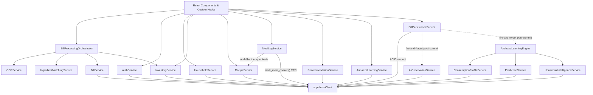
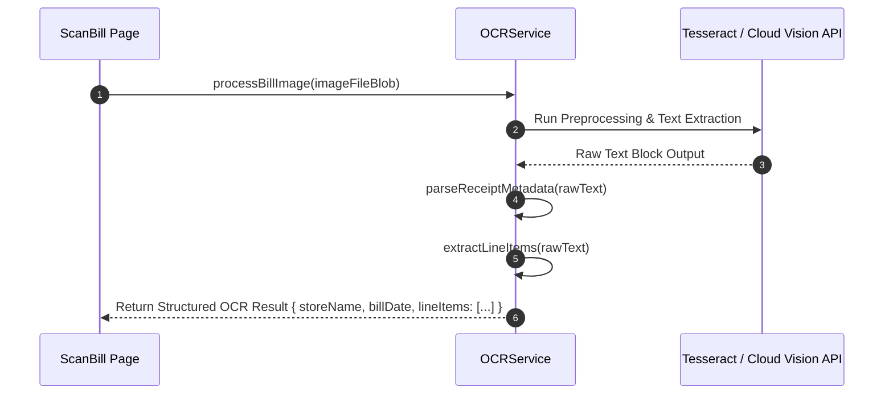

# KitchenMind: API & Services Catalogue

**Document Version:** 1.0.0  
**Status:** Approved Specification  
**Domain:** Core Frontend & API Integration Layer  

---

## 1. Executive Summary & Service Architecture Map

The **KitchenMind Services Layer** is a collection of modular JavaScript service classes and singletons that encapsulate all database communications, OCR image pipelines, intelligent ingredient matching, portion learning algorithms, and Supabase BaaS integrations.



---

## 2. Services Catalogue Specification

---

### 2.1 `AuthService`

Provides authentication methods powered by Supabase Auth (OAuth, Magic Link, Email/Password).

#### `signUp({ email, password, fullName })`
- **Parameters**: `email` (string), `password` (string), `fullName` (string).
- **Returns**: `Promise<{ user: Object|null, session: Object|null, error: Error|null }>`
- **Error Behavior**: Throws or returns error object if email exists or password fails strength validation.

#### `signIn({ email, password })`
- **Parameters**: `email` (string), `password` (string).
- **Returns**: `Promise<{ user: Object, session: Object }>`
- **Error Behavior**: Returns `Invalid login credentials` error on failure.

#### `signOut()`
- **Parameters**: None.
- **Returns**: `Promise<{ error: Error|null }>`
- **Error Behavior**: Clears local session storage and Zustand auth state.

#### `getSession()`
- **Parameters**: None.
- **Returns**: `Promise<Session|null>`

#### `onAuthStateChange(callback)`
- **Parameters**: `callback` (`(event: string, session: Session|null) => void`).
- **Returns**: `{ data: { subscription: Unsubscribe } }`

#### `resetPassword(email)`
- **Parameters**: `email` (string).
- **Returns**: `Promise<{ error: Error|null }>`

---

### 2.2 `HouseholdService`

Manages household onboarding, member profiling, role assignments, and dietary preferences.

#### `getHousehold(householdId)`
- **Parameters**: `householdId` (string UUID).
- **Returns**: `Promise<HouseholdObject>`

#### `createHousehold({ name, currency, nonVegProhibitedDays })`
- **Parameters**: Object with household metadata.
- **Returns**: `Promise<HouseholdObject>`

#### `updateHousehold(householdId, updates)`
- **Parameters**: `householdId` (string UUID), `updates` (Partial<HouseholdObject>).
- **Returns**: `Promise<HouseholdObject>`

#### `addMember(householdId, memberData)`
- **Parameters**: `householdId` (string UUID), `memberData` (`{ name, role, ageCategory, baseRotiAppetite, dietaryPreference }`).
- **Returns**: `Promise<HouseholdMember>`

#### `removeMember(memberId)`
- **Parameters**: `memberId` (string UUID).
- **Returns**: `Promise<{ success: boolean }>`

#### `updatePreferences(householdId, preferences)`
- **Parameters**: `householdId` (string UUID), `preferences` (Object).
- **Returns**: `Promise<HouseholdObject>`

---

### 2.3 `InventoryService`

Handles real-time inventory queries, manual additions, batch management, transaction logging, and FIFO meal deductions.

#### `getInventoryItems(householdId, filters)`
- **Parameters**: `householdId` (string UUID), `filters` (`{ category?: string, status?: string, search?: string }`).
- **Returns**: `Promise<Array<InventoryItemWithBatches>>`

#### `addInventoryItem(householdId, itemPayload)`
- **Parameters**: `householdId` (string UUID), `itemPayload` (`{ name, category, displayUnit, quantity, cost, expiryDate }`).
- **Returns**: `Promise<InventoryItem>`

#### `updateInventoryItem(itemId, updates)`
- **Parameters**: `itemId` (string UUID), `updates` (Object).
- **Returns**: `Promise<InventoryItem>`

#### `deleteInventoryItem(itemId)`
- **Parameters**: `itemId` (string UUID).
- **Returns**: `Promise<{ success: boolean }>`

#### `recordTransaction(transactionPayload)`
- **Parameters**: `transactionPayload` (`{ householdId, inventoryItemId, batchId, type, quantityChangeBase, notes }`).
- **Returns**: `Promise<TransactionRecord>`

#### `deductForMeal(householdId, recipeIngredients, servingsMultiplier)`
- **Parameters**: `householdId` (string UUID), `recipeIngredients` (Array), `servingsMultiplier` (number).
- **Returns**: `Promise<{ success: boolean, deductedItems: Array, warnings: Array }>`

---

### 2.4 `BillService`

Provides persistence and query APIs for receipts and line-item financial records.

#### `createBill(billPayload)`
- **Parameters**: `billPayload` (`{ householdId, storeName, billDate, totalAmount, taxAmount, imageUrl }`).
- **Returns**: `Promise<BillRecord>`

#### `getBills(householdId, pagination)`
- **Parameters**: `householdId` (string UUID), `pagination` (`{ page: number, limit: number }`).
- **Returns**: `Promise<{ bills: Array<BillRecord>, totalCount: number }>`

#### `getBillById(billId)`
- **Parameters**: `billId` (string UUID).
- **Returns**: `Promise<BillRecordWithItems>`

#### `deleteBill(billId)`
- **Parameters**: `billId` (string UUID).
- **Returns**: `Promise<{ success: boolean }>`

---

### 2.5 `OCRService`

Interfaces with Tesseract.js / Cloud OCR APIs to process raw receipt images into structured text line items.



#### `processBillImage(fileBlob, onProgress)`
- **Parameters**: `fileBlob` (File/Blob), `onProgress` (`(progress: number) => void`).
- **Returns**: `Promise<{ rawText: string, confidence: number }>`

#### `extractLineItems(rawText)`
- **Parameters**: `rawText` (string).
- **Returns**: `Array<{ rawName: string, quantity: number, unit: string, price: number }>`

#### `parseReceiptMetadata(rawText)`
- **Parameters**: `rawText` (string).
- **Returns**: `{ storeName: string|null, billDate: string|null, totalAmount: number|null }`

---

### 2.6 `IngredientMatchingService`

Employs fuzzy string matching (Levenshtein Distance & Token Jaccard Similarity) to map raw OCR receipt text to canonical master ingredient IDs.

#### `matchOcrToMasterIngredients(rawItemName, masterCatalogue)`
- **Parameters**: `rawItemName` (string), `masterCatalogue` (Array).
- **Returns**: `{ matchedItem: MasterIngredient|null, confidenceScore: number, matchType: 'EXACT'|'FUZZY'|'ALIAS' }`

#### `calculateMatchConfidence(strA, strB)`
- **Parameters**: `strA` (string), `strB` (string).
- **Returns**: `number` (Value between 0.0 and 1.0)

#### `suggestMappings(rawItemName, masterCatalogue, topN = 3)`
- **Parameters**: `rawItemName` (string), `masterCatalogue` (Array), `topN` (number).
- **Returns**: `Array<{ matchedItem: MasterIngredient, confidenceScore: number }>`

---

### 2.7 `BillProcessingOrchestrator`

Coordinates the end-to-end flow from image upload to verified inventory addition.

#### `orchestrateScanToInventory(fileBlob, householdId, onProgress)`
- **Parameters**: `fileBlob` (File/Blob), `householdId` (string UUID), `onProgress` (`(step: string, pct: number) => void`).
- **Returns**: `Promise<{ billId: string, processedItemsCount: number, matchedItems: Array }>`

#### `validateProcessedItems(itemsList)`
- **Parameters**: `itemsList` (Array).
- **Returns**: `{ isValid: boolean, validationErrors: Array }`

---

### 2.8 `BillPersistenceService`

Validates and commits a reviewed bill atomically via the `commit_scanned_bill()` PostgreSQL RPC, then fires the Phase 4A learning hooks without blocking the caller.

#### `commitBill(householdId, reviewedBillData)`
- **Parameters**: `householdId` (string UUID), `reviewedBillData` (`{ idempotencyKey?, merchant?, billDate?, totalAmount?, source?, items: Array }`).
- **Returns**: `Promise<{ success, commitId, billId, householdId, idempotencyKey, isDuplicate, metrics, committedAt }>` — resolves as soon as the ACID commit completes; does **not** wait on `AIObservationService` or `AndaazaLearningEngine`.
- **Error Behavior**: Throws `AppError` with code `PERSISTENCE_VALIDATION_ERROR` for pre-commit validation failures (missing household, zero active items, invalid quantities) or `BILL_COMMIT_FAILED` if the RPC itself errors.

---

### 2.9 `RecipeService` (Phase 4B)

Global master recipe catalogue (`household_id IS NULL`) plus household-owned custom recipes. `recipes.ingredients` is a jsonb array of `{ canonical_name, base_quantity_grams, is_optional? }` scaled for `base_servings` — see [09_RECIPE_AND_MEAL_LOGGING_SPECIFICATION.md §7](./09_RECIPE_AND_MEAL_LOGGING_SPECIFICATION.md) for why this differs from the originally-designed `recipe_ingredients` join table.

#### `getRecipes(householdId, filters)`
- **Parameters**: `householdId` (string UUID), `filters` (`{ mealType?: string, cuisine?: string }`).
- **Returns**: `Promise<Array<Recipe>>` — global recipes plus this household's own custom recipes.

#### `getRecipeById(recipeId)`
- **Parameters**: `recipeId` (string UUID).
- **Returns**: `Promise<Recipe|null>`

#### `createCustomRecipe(householdId, recipePayload)`
- **Parameters**: `householdId` (string UUID), `recipePayload` (`{ name, meal_type, cuisine?, base_servings, ingredients, instructions? }`).
- **Returns**: `Promise<Recipe>`

#### `scaleRecipeIngredients(recipe, targetServings)`
- **Parameters**: `recipe` (Recipe row), `targetServings` (number).
- **Returns**: `Array<{ canonical_name, quantity_grams, is_optional }>` — pure function, no I/O.

> `searchRecipesByInventory` (inventory-driven recipe matching) is **not implemented** — it's a recommendation-adjacent feature and out of scope for the Phase 4B core deduction pipeline, same as Phase 4A excluded recommendation logic.

---

### 2.10 `RecommendationService`

Intelligent recommendation engine producing daily meal plans and Tiffin box pairings.

#### `getMealRecommendations(householdId, targetDate, mealType)`
- **Parameters**: `householdId` (string UUID), `targetDate` (Date), `mealType` ('BREAKFAST'|'LUNCH'|'DINNER').
- **Returns**: `Promise<Array<{ recipe: Recipe, suitabilityScore: number, reason: string }>>`

#### `getTiffinRecommendations(householdId, memberId, targetDate)`
- **Parameters**: `householdId` (string UUID), `memberId` (string UUID), `targetDate` (Date).
- **Returns**: `Promise<{ container1: Recipe, container2: Recipe, leakRiskWarning: boolean }>`

---

### 2.11 `AndaazaLearningService`

Adaptive machine learning engine that calculates household-specific portion modifiers based on cooking feedback.

#### `recordHouseholdCookingRatio(householdId, recipeId, plannedServings, actualUsedGrams)`
- **Parameters**: `householdId`, `recipeId`, `plannedServings`, `actualUsedGrams`.
- **Returns**: `Promise<{ updatedModifier: number }>`

#### `predictPortionMultiplier(householdId, recipeId)`
- **Parameters**: `householdId` (string UUID), `recipeId` (string UUID).
- **Returns**: `Promise<number>` (Modifier multiplier e.g. `1.15`)

---

### 2.12 `AIObservationService` (Phase 3H / 4A)

Foundation service for generating discrete, fact-based AI observations from a committed bill — separate from the quantitative learning pipeline in §2.13–2.16. Runs asynchronously post-commit and never affects the committed transaction.

#### `generateObservations(householdId, activeItems, existingInventory)`
- **Parameters**: `householdId` (string UUID), `activeItems` (Array of reviewed line items), `existingInventory` (Array of current inventory rows, used for delta comparison).
- **Returns**: `Array<{ household_id, observation_type, canonical_name, details, created_at }>` — pure function, no I/O.
- **Observation Types**: `NEW_INGREDIENT_DISCOVERED`, `FIRST_PURCHASE`, `UNUSUAL_PURCHASE_QUANTITY` (≥3000g), `DUPLICATE_PURCHASE` (same ingredient twice in one receipt), `PANTRY_DIVERSITY` (milestone at 5/10/25/50/100 unique ingredients).

#### `recordPostCommitObservations(householdId, activeItems)`
- **Parameters**: `householdId` (string UUID), `activeItems` (Array).
- **Returns**: `Promise<{ success: boolean, observationsCount: number, observations?: Array, error?: string }>` — fetches current inventory, delegates to `generateObservations`, and never throws (errors are caught and logged).

---

### 2.13 `AndaazaLearningEngine` (Phase 4A)

The Phase 4A intelligence orchestrator. Single entry point invoked by `BillPersistenceService` after every successful commit; coordinates `ConsumptionProfileService`, `PredictionService`, and `HouseholdIntelligenceService` and persists their outputs. See [07_ANDAAZA_AI_LEARNING_ENGINE.md §6](./07_ANDAAZA_AI_LEARNING_ENGINE.md#6-learning-model) for the full learning model.

#### `processPostCommitLearning(householdId, activeItems, billMeta)`
- **Parameters**: `householdId` (string UUID), `activeItems` (Array of confirmed line items), `billMeta` (`{ billId?, billDate?, merchant? }`).
- **Returns**: `Promise<{ success: boolean, profilesUpdated: number, predictionsCount: number, executionTimeMs: number, householdProfileSummary, error?: string }>`.
- **Error Behavior**: Never throws — every per-item DB write and the household-profile recalculation are individually try/caught so one failing write cannot prevent the rest of the bill's items from being learned from.
- **Side Effects**: writes to `purchase_patterns` (insert), `ingredient_consumption_profile` (upsert), `prediction_cache` (upsert), and `household_learning_profile` (upsert).

---

### 2.14 `ConsumptionProfileService` (Phase 4A)

Calculates ingredient-level consumption statistics. Core calculation is a pure function for testability; fetch method is the read-side API.

#### `calculateProfileUpdate(currentProfile, newPurchaseEvent, history)`
- **Parameters**: `currentProfile` (existing profile row or `null`), `newPurchaseEvent` (`{ quantityGrams, purchaseDate, brand?, unit? }`), `history` (Array, used for brand-frequency evolution).
- **Returns**: `{ avg_interval_days, avg_purchase_grams, consumption_velocity_g_per_day, preferred_brand, preferred_unit, confidence_score, sample_count, last_purchased_at, updated_at }` — pure, deterministic, no I/O.

#### `getIngredientProfile(householdId, canonicalName)`
- **Parameters**: `householdId` (string UUID), `canonicalName` (string).
- **Returns**: `Promise<IngredientConsumptionProfile|null>` — read-only API; returns `null` (with a logged warning) on fetch failure rather than throwing.

---

### 2.15 `PredictionService` (Phase 4A)

Deterministic depletion and stock-health calculations consuming `ConsumptionProfileService` outputs.

#### `calculateDepletion(currentStockGrams, velocityGramsPerDay, fromDate = now)`
- **Returns**: `{ predictedDepletionDate: 'YYYY-MM-DD', daysUntilDepletion: number, isLowStockRisk: boolean }` — pure function.

#### `calculatePantryHealthScore(ingredientDepletions)`
- **Parameters**: `ingredientDepletions` (Array of `{ daysUntilDepletion }`).
- **Returns**: `number` (0–100) — pure function; returns `100` for an empty pantry (no ingredients tracked yet ≠ unhealthy pantry).

#### `getHouseholdPredictions(householdId)`
- **Parameters**: `householdId` (string UUID).
- **Returns**: `Promise<Array<PredictionCacheRow>>` — read-only API, sorted by `days_until_depletion` ascending (most urgent first).

---

### 2.16 `HouseholdIntelligenceService` (Phase 4A)

Household-wide (not per-ingredient) intelligence summary, recalculated once per commit.

#### `calculateHouseholdMetrics(householdId, inventoryItems, billHistory)`
- **Returns**: `{ household_id, pantry_diversity_score, shopping_frequency_days, top_categories, preferred_shopping_day, total_bills_analyzed, last_analyzed_at }` — pure function.

#### `getHouseholdProfile(householdId)`
- **Parameters**: `householdId` (string UUID).
- **Returns**: `Promise<HouseholdLearningProfile|null>` — read-only API.

---

### 2.17 `MealLogService` (Phase 4B)

Meal lifecycle (`planned` -> `cooked` | `skipped`) and the atomic, FIFO-aware stock deduction that runs when a meal transitions to `cooked`, via the `mark_meal_cooked()` RPC (migration `0006`).

#### `getMealLogs(householdId, dateRange)`
- **Parameters**: `householdId` (string UUID), `dateRange` (`{ from?: string, to?: string }`).
- **Returns**: `Promise<Array<MealLog>>`

#### `createMealLog(householdId, payload)`
- **Parameters**: `householdId` (string UUID), `payload` (`{ date, meal_type, recipe_id?, headcount?, notes? }`).
- **Returns**: `Promise<MealLog>` — created in `'planned'` status.

#### `markAsSkipped(householdId, mealLogId)`
- **Returns**: `Promise<{ success: boolean }>` — no inventory side effects.

#### `markAsCooked(householdId, mealLogId, requiredIngredients)`
- **Parameters**: `householdId` (string UUID), `mealLogId` (string UUID), `requiredIngredients` (`Array<{ canonical_name, quantity_grams }>`, typically `RecipeService.scaleRecipeIngredients(...)` output plus roti flour).
- **Returns**: `Promise<{ success, mealLogId, alreadyCooked, cookedAt, hasShortfall, deductions }>`.
- **Behavior**: Idempotent — re-calling on an already-cooked meal returns `alreadyCooked: true` without deducting stock again (enforced by the RPC, not just client-side). FIFO-deducts across `inventory_batches` (soonest expiry first); a shortfall never fails the call, it's reported per-ingredient in `deductions`.
- **Error Behavior**: Throws `AppError` with code `MEAL_COOK_VALIDATION_ERROR` for missing IDs, or `MEAL_COOK_FAILED` if the RPC errors.

---

### 2.18 `rotiCalculator` (Phase 4B, `src/utils/rotiCalculator.js`)

Pure calculation utility, not a service (no I/O). Computes flour/dough requirements from `household.roti_per_adult`/`roti_per_child`, per-member `roti_preference` overrides, and the `guests` table — see [09_RECIPE_AND_MEAL_LOGGING_SPECIFICATION.md §7.1](./09_RECIPE_AND_MEAL_LOGGING_SPECIFICATION.md) for why this differs from the originally-designed age-tiered formula.

#### `calculateRotiRequirement({ members, household, guestCount, andaazaFactor?, flourPerRotiGrams? })`
- **Returns**: `{ totalRotis, totalFlourGrams, estimatedDoughGrams }`

#### `getEffectiveGuestCount(guests, date, mealType)`
- **Returns**: `number` — sums `guests.count` for rows matching `date` and (`meal_scope === mealType` or `meal_scope === 'all'`).

---

### 2.19 `supabaseClient`

The unified client configuration initializing Supabase JS SDK.

```javascript
import { createClient } from '@supabase/supabase-js';

const supabaseUrl = import.meta.env.VITE_SUPABASE_URL || 'https://placeholder-url.supabase.co';
const supabaseAnonKey = import.meta.env.VITE_SUPABASE_ANON_KEY || 'placeholder-anon-key';

export const supabase = createClient(supabaseUrl, supabaseAnonKey, {
  auth: {
    persistSession: true,
    autoRefreshToken: true,
    detectSessionInUrl: true
  }
});
```
