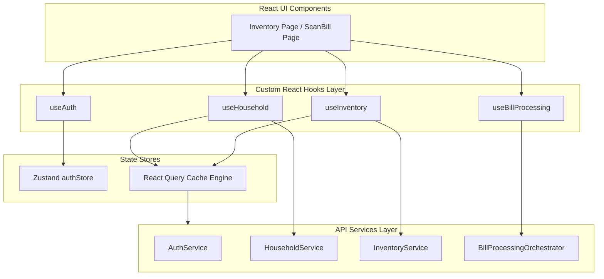
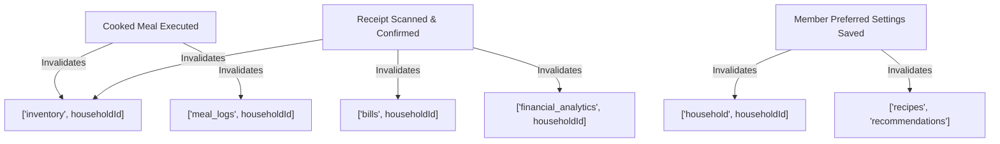

# KitchenMind: Custom Hooks & State Management Specification

**Document Version:** 1.0.0  
**Status:** Approved Specification  
**Domain:** Frontend Architecture - React Hooks, Zustand & React Query  

---

## 1. Executive Summary & State Architecture

KitchenMind implements a hybrid state management architecture optimized for real-time responsiveness, offline resilience, and fast UI updates:
1. **Zustand (`authStore`)**: Global client-side session state, active user profile, and current active household context.
2. **React Query (TanStack Query)**: Server state management, caching, background refetching, optimistic updates, and automatic cache invalidation.
3. **Custom React Hooks (`useAuth`, `useHousehold`, `useInventory`, `useBillProcessing`)**: Domain-specific logic controllers interfacing UI components with service layer APIs and state stores.



---

## 2. React Hooks Specification

---

### 2.1 `useAuth`

Encapsulates user authentication, session persistence, and active auth state subscriptions.

```javascript
import { useState, useEffect } from 'react';
import { AuthService } from '../services/AuthService';
import { useAuthStore } from '../store/authStore';

export function useAuth() {
  const { user, session, setAuth, clearAuth } = useAuthStore();
  const [loading, setLoading] = useState(true);

  useEffect(() => {
    AuthService.getSession().then((sessionData) => {
      if (sessionData) setAuth(sessionData.user, sessionData);
      else clearAuth();
      setLoading(false);
    });

    const { data: authListener } = AuthService.onAuthStateChange((event, newSession) => {
      if (newSession) setAuth(newSession.user, newSession);
      else clearAuth();
      setLoading(false);
    });

    return () => authListener?.subscription?.unsubscribe();
  }, []);

  const login = async (email, password) => {
    setLoading(true);
    try {
      const res = await AuthService.signIn({ email, password });
      setAuth(res.user, res.session);
      return res;
    } finally {
      setLoading(false);
    }
  };

  const logout = async () => {
    await AuthService.signOut();
    clearAuth();
  };

  return { user, session, isAuthenticated: !!user, loading, login, logout };
}
```

---

### 2.2 `useHousehold`

Manages household profile, member querying, and dietary preference mutations.

```javascript
import { useQuery, useMutation, useQueryClient } from '@tanstack/react-query';
import { HouseholdService } from '../services/HouseholdService';
import { useAuthStore } from '../store/authStore';

export function useHousehold() {
  const queryClient = useQueryClient();
  const { householdId } = useAuthStore();

  // Query Household Profile & Members
  const { data: household, isLoading, error } = useQuery({
    queryKey: ['household', householdId],
    queryFn: () => HouseholdService.getHousehold(householdId),
    enabled: !!householdId,
    staleTime: 10 * 60 * 1000, // 10 minutes
  });

  // Mutation: Add Member
  const addMemberMutation = useMutation({
    mutationFn: (memberData) => HouseholdService.addMember(householdId, memberData),
    onSuccess: () => {
      queryClient.invalidateQueries({ queryKey: ['household', householdId] });
    },
  });

  // Mutation: Update Preferences
  const updatePreferencesMutation = useMutation({
    mutationFn: (preferences) => HouseholdService.updatePreferences(householdId, preferences),
    onSuccess: () => {
      queryClient.invalidateQueries({ queryKey: ['household', householdId] });
    },
  });

  return {
    household,
    members: household?.members || [],
    isLoading,
    error,
    addMember: addMemberMutation.mutateAsync,
    updatePreferences: updatePreferencesMutation.mutateAsync,
  };
}
```

---

### 2.3 `useInventory`

Manages real-time inventory synchronization, optimistic UI updates, and batch deductions.

```javascript
import { useQuery, useMutation, useQueryClient } from '@tanstack/react-query';
import { InventoryService } from '../services/InventoryService';
import { useAuthStore } from '../store/authStore';

export function useInventory(filters = {}) {
  const queryClient = useQueryClient();
  const { householdId } = useAuthStore();

  const queryKey = ['inventory', householdId, filters];

  const { data: items = [], isLoading, error } = useQuery({
    queryKey,
    queryFn: () => InventoryService.getInventoryItems(householdId, filters),
    enabled: !!householdId,
    staleTime: 2 * 60 * 1000, // 2 minutes
  });

  // Optimistic Add Mutation
  const addItemMutation = useMutation({
    mutationFn: (newItem) => InventoryService.addInventoryItem(householdId, newItem),
    onMutate: async (newItem) => {
      await queryClient.cancelQueries({ queryKey });
      const previousItems = queryClient.getQueryData(queryKey);
      
      const optimisticItem = {
        id: 'temp-' + Date.now(),
        ...newItem,
        total_base_quantity: newItem.quantity * 1000, // normalized
      };

      queryClient.setQueryData(queryKey, (old = []) => [optimisticItem, ...old]);
      return { previousItems };
    },
    onError: (err, newItem, context) => {
      queryClient.setQueryData(queryKey, context.previousItems);
    },
    onSettled: () => {
      queryClient.invalidateQueries({ queryKey: ['inventory', householdId] });
    },
  });

  return {
    items,
    isLoading,
    error,
    addItem: addItemMutation.mutateAsync,
    isAdding: addItemMutation.isPending,
  };
}
```

---

### 2.4 `useBillProcessing`

Controls the state machine for bill scanning, OCR extraction, line-item verification, and persistence.

```javascript
import { useState } from 'react';
import { BillProcessingOrchestrator } from '../services/BillProcessingOrchestrator';
import { useAuthStore } from '../store/authStore';
import { useQueryClient } from '@tanstack/react-query';

export function useBillProcessing() {
  const { householdId } = useAuthStore();
  const queryClient = useQueryClient();

  const [step, setStep] = useState('IDLE'); // 'IDLE' | 'UPLOADING' | 'PROCESSING_OCR' | 'VERIFYING' | 'SAVED'
  const [progress, setProgress] = useState(0);
  const [scannedItems, setScannedItems] = useState([]);
  const [error, setError] = useState(null);

  const processBill = async (fileBlob) => {
    setStep('UPLOADING');
    setError(null);
    setProgress(10);

    try {
      setStep('PROCESSING_OCR');
      const result = await BillProcessingOrchestrator.orchestrateScanToInventory(
        fileBlob,
        householdId,
        (currentStep, pct) => setProgress(pct)
      );

      setScannedItems(result.matchedItems);
      setStep('VERIFYING');
      return result;
    } catch (err) {
      setError(err.message || 'Failed to process bill image');
      setStep('IDLE');
    }
  };

  const confirmAndPersist = async (verifiedItems) => {
    setStep('UPLOADING');
    await BillProcessingOrchestrator.validateProcessedItems(verifiedItems);
    // Invalidate inventory & bill query caches
    queryClient.invalidateQueries({ queryKey: ['inventory', householdId] });
    queryClient.invalidateQueries({ queryKey: ['bills', householdId] });
    setStep('SAVED');
  };

  return {
    step,
    progress,
    scannedItems,
    error,
    processBill,
    confirmAndPersist,
    reset: () => setStep('IDLE'),
  };
}
```

---

## 3. Zustand Store Architecture (`authStore`)

Zustand handles user authentication tokens, current user object, and active `householdId`.

```javascript
import { create } from 'zustand';
import { persist, createJSONStorage } from 'zustand/middleware';

export const useAuthStore = create(
  persist(
    (set) => ({
      user: null,
      session: null,
      householdId: null,
      setAuth: (user, session) =>
        set({
          user,
          session,
          householdId: user?.user_metadata?.household_id || null,
        }),
      setHouseholdId: (householdId) => set({ householdId }),
      clearAuth: () => set({ user: null, session: null, householdId: null }),
    }),
    {
      name: 'kitchenmind-auth-storage',
      storage: createJSONStorage(() => localStorage),
    }
  )
);
```

---

## 4. React Query Caching Policies & Cache Invalidation Hierarchy

To guarantee data consistency without redundant network requests, KitchenMind establishes clear stale times and invalidation triggers.

### 4.1 Query Key Hierarchy Matrix

| Query Key | Stale Time | Cache Time | Refetch On Window Focus | Primary Purpose |
| :--- | :--- | :--- | :--- | :--- |
| `['auth', 'session']` | Infinity | Infinity | False | Local session retention |
| `['household', id]` | 10 mins | 30 mins | False | Household baseline settings |
| `['inventory', id]` | 2 mins | 15 mins | True | Live pantry stock levels |
| `['recipes']` | 30 mins | 60 mins | False | Global master recipes |
| `['bills', id]` | 5 mins | 20 mins | False | Financial receipt history |
| `['meal_logs', id]` | 1 min | 10 mins | True | Daily schedule & cooked states |

### 4.2 Invalidation Trigger Map


