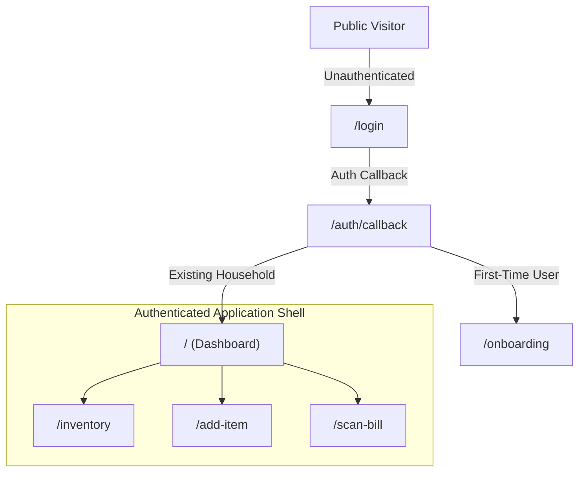
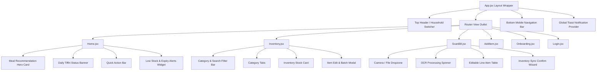

# KitchenMind: Frontend UI/UX & Component Hierarchy Specification

**Document Version:** 1.0.0  
**Status:** Approved Specification  
**Domain:** Frontend Engineering - Design Tokens, Routes & Component Architecture  

---

## 1. Executive Summary & Design Philosophy

The **KitchenMind Frontend Interface** delivers a modern, visually stunning experience built with React, Vite, and Tailwind CSS. The design system uses rich glassmorphic elements, vibrant emerald accent colors, micro-animations, clean typography (Inter & Outfit), and responsive navigation optimized for mobile devices and desktop viewports alike.

---

## 2. Route Sitemap & Application Flow



### 2.1 Route Definitions Table

| Path | Component Name | Access Policy | Primary Purpose |
| :--- | :--- | :--- | :--- |
| `/login` | `Login.jsx` | Public | Auth portal (Email/Password, Magic Link, OAuth). |
| `/auth/callback` | `AuthCallback.jsx` | Public | Handles OAuth redirect code exchange. |
| `/onboarding` | `Onboarding.jsx` | Protected | Multi-step household setup wizard. |
| `/` | `Home.jsx` | Protected | Main dashboard: Meal recommendations, Tiffin banner, quick actions. |
| `/inventory` | `Inventory.jsx` | Protected | Live pantry inventory list, filtering, batch inspector, search. |
| `/add-item` | `AddItem.jsx` | Protected | Manual item entry, barcode scanner toggle, unit selector. |
| `/scan-bill` | `ScanBill.jsx` | Protected | Receipt scanner, OCR extraction, line-item verification table. |

---

## 3. Visual Design Tokens & Tailwind Configuration

KitchenMind utilizes a dark modern baseline with emerald highlights and subtle glass translucent surfaces.

### 3.1 Color Palette & Tokens

- **Background Base**: Off-Black (`#0F172A` / `#090D16`)
- **Primary Emerald Accent**: Deep Emerald (`#059669` / `#10B981`)
- **Secondary Ochre Accent**: Warm Ochre (`#D97706` / `#F59E0B`)
- **Surface Layer**: Glassmorphic Dark (`rgba(30, 41, 59, 0.7)` with `backdrop-filter: blur(12px)`)
- **Border Overlay**: Subtle White (`rgba(255, 255, 255, 0.1)`)
- **Text High-Contrast**: Pure White (`#FFFFFF`)
- **Text Muted**: Slate Gray (`#94A3B8`)

### 3.2 Tailwind CSS Configuration (`tailwind.config.js`)

```javascript
/** @type {import('tailwindcss').Config} */
export default {
  content: ['./index.html', './src/**/*.{js,ts,jsx,tsx}'],
  theme: {
    extend: {
      colors: {
        brand: {
          50: '#ecfdf5',
          100: '#d1fae5',
          500: '#10b981',
          600: '#059669',
          700: '#047857',
        },
        ochre: {
          500: '#f59e0b',
          600: '#d97706',
        },
        surface: {
          dark: '#0f172a',
          card: 'rgba(30, 41, 59, 0.7)',
          border: 'rgba(255, 255, 255, 0.1)',
        },
      },
      fontFamily: {
        sans: ['Inter', 'sans-serif'],
        display: ['Outfit', 'sans-serif'],
      },
      backdropBlur: {
        glass: '12px',
      },
    },
  },
  plugins: [],
};
```

---

## 4. Component Hierarchy & Page Breakdowns



---

## 5. Page Components Breakdown

---

### 5.1 `Home.jsx` (Main Dashboard)
- **Hero Meal Recommendation Card**: Displays personalized meal suggestion based on current inventory, day restrictions, and prep time. Includes "Mark as Cooked" CTA.
- **Daily Tiffin Banner**: Highlights today's Tiffin Box 1 & Box 2 pairing for members with tiffin enabled.
- **Quick Action Bar**: Buttons for direct navigation to Scan Bill, Add Item, and Log Extra Meal.
- **Inventory Alerts Summary Widget**: Badge count of items that are `LOW_STOCK` or `EXPIRING_SOON`.

---

### 5.2 `Inventory.jsx` (Pantry & Stock Management)
- **Filter Bar**: Real-time search input with category filter pill buttons (`All`, `Grains`, `Produce`, `Dairy`, `Spices`).
- **Category Grouping & Stock Cards**: Displays stock items with color-coded status badges:
  - 🔴 **Red**: Out of Stock
  - 🟠 **Amber**: Low Stock / Expiring in < 3 Days
  - 🟢 **Green**: Healthy Stock Level
- **Batch Detail Drawer / Modal**: Inspects individual purchase batches, manufacture dates, and FIFO queue.

---

### 5.3 `ScanBill.jsx` (Receipt OCR Processing)
- **File Uploader / Camera Dropzone**: Accepts receipt image drop or camera capture on mobile devices.
- **OCR Processing State**: Displays real-time step progress bar ("Uploading image..." $\rightarrow$ "Running OCR text extraction..." $\rightarrow$ "Matching ingredients...").
- **Editable Line-Item Review Table**: Renders extracted items, matched canonical ingredient dropdowns, normalized quantities, unit cost, and line totals. Allows inline user corrections.
- **Confirmation Wizard**: Transacts verified line items into inventory batches and bill history.

---

### 5.4 `AddItem.jsx` (Manual Pantry Addition)
- **Manual Item Form**: Name, category selection, display unit selector (`kg`, `g`, `l`, `ml`, `packet`, `pc`), and quantity input.
- **Package Net Weight Field**: Appears conditionally when display unit is `packet`.
- **Barcode Scanner Toggle**: Activates camera barcode scanner for quick product scanning.

---

### 5.5 `Onboarding.jsx` (Household Wizard)
- **Multi-Step Carousel**: Step indicators (1: Household Info, 2: Roster, 3: Diet & Fasting Rules, 4: Tiffin Preferences).
- **Member Adder Form**: Dynamically adds family members with age categories and appetite sliders.
- **Restriction Toggles**: Clickable day pills (`Mon`, `Tue`, `Wed`, etc.) for setting vegetarian/fasting rules.

---

### 5.6 `Login.jsx` (Authentication Hub)
- **Glassmorphic Auth Card**: Centralized card featuring logo, tab toggle between "Password Login" and "Magic Link".
- **OAuth Social Providers**: Google & Apple sign-in buttons.

---

## 6. Layout & Navigation Hierarchy

```jsx
// Conceptual Layout Structure (App.jsx)
export default function AppLayout({ children }) {
  return (
    <div className="min-h-screen bg-surface-dark text-slate-100 font-sans flex flex-col">
      {/* Top Header */}
      <header className="h-16 border-b border-surface-border bg-slate-900/60 backdrop-blur-glass flex items-center justify-between px-4 sticky top-0 z-40">
        <Logo />
        <HouseholdSelector />
      </header>

      {/* Main Content Area */}
      <main className="flex-1 max-w-5xl w-full mx-auto p-4 pb-24">
        {children}
      </main>

      {/* Bottom Mobile Navigation */}
      <nav className="fixed bottom-0 left-0 right-0 h-16 border-t border-surface-border bg-slate-900/80 backdrop-blur-glass flex items-center justify-around z-40">
        <NavLink to="/" icon={<HomeIcon />}>Home</NavLink>
        <NavLink to="/inventory" icon={<BoxIcon />}>Inventory</NavLink>
        <NavLink to="/scan-bill" icon={<ScanIcon />} highlight>Scan</NavLink>
        <NavLink to="/add-item" icon={<PlusIcon />}>Add</NavLink>
      </nav>
    </div>
  );
}
```
