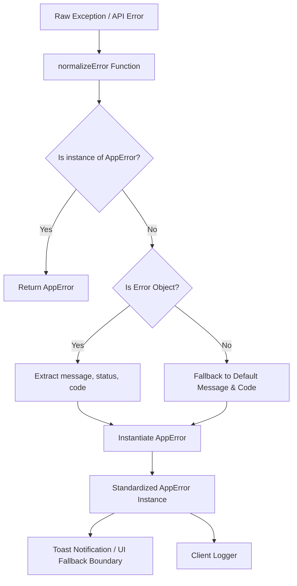

# KitchenMind Enterprise Documentation

## Document 16: Error Handling, Logging, and Monitoring Framework

---

### 1. Error Standardization Framework

KitchenMind enforces a uniform, centralized error standardization architecture across all frontend layers, services, and asynchronous hooks. Raw exceptions from network requests, Supabase PostgREST, Google Gemini API, or JS runtime errors are intercepted and transformed into predictable `AppError` instances via `normalizeError`.



#### 1.1 `AppError` Class Specification
Located in [`src/utils/errors.js`](file:///mnt/c/Users/keysh/github/kitchenmind/src/utils/errors.js):

```javascript
export class AppError extends Error {
  constructor(message, code = 'UNKNOWN_ERROR', status = null, originalError = null) {
    super(message)
    this.name = 'AppError'
    this.code = code
    this.status = status
    this.originalError = originalError
  }
}
```

#### 1.2 `normalizeError` Function Contract
The `normalizeError` utility ensures that no unhandled string or opaque object crashes UI code:

```javascript
export function normalizeError(err, defaultCode = 'UNKNOWN_ERROR') {
  if (err instanceof AppError) {
    return err
  }

  if (err && typeof err === 'object') {
    const message = err.message || err.error_description || err.details || 'An unexpected error occurred.'
    const status = err.status || err.statusCode || null
    const code = err.code || defaultCode
    return new AppError(message, code, status, err)
  }

  if (typeof err === 'string') {
    return new AppError(err, defaultCode)
  }

  return new AppError('An unexpected error occurred.', defaultCode, null, err)
}
```

---

### 2. Standardized Application Error Taxonomy

| Error Code | HTTP / PostgREST Mapping | Domain Meaning | Recovery Strategy |
| :--- | :--- | :--- | :--- |
| `AUTH_INVALID_CREDENTIALS` | 401 | Invalid login or expired JWT | Redirect user to Login page |
| `AUTH_UNAUTHORIZED` | 403 | RLS denial or missing household session | Clear local session and re-authenticate |
| `DB_RECORD_NOT_FOUND` | 404 / `PGRST116` | Expected database row missing | Display 404 state or default fallback |
| `DB_DUPLICATE_KEY` | 409 / `23505` | Unique constraint violation (e.g. andaaza profile) | Prompt user to edit existing item |
| `INVENTORY_LOW_STOCK` | 422 | Insufficient quantity during meal deduction | Warn user, display deficit badge |
| `OCR_PARSE_FAILED` | 422 / Gemini 400 | Bill image unreadable or distorted | Prompt manual bill entry fallback |
| `AI_GEMINI_QUOTA_EXCEEDED` | 429 | Gemini API rate limit reached | Fallback to rule-based recipe algorithm |
| `NETWORK_DISCONNECTED` | 0 / FetchError | Device lost internet connectivity | Queue mutation offline or notify toast |
| `RPC_EXECUTION_ERROR` | 500 / Postgres | Transaction rollback inside SQL function | Display actionable error, preserve UI state |

---

### 3. Resilience & Degradation Patterns

#### 3.1 React Query Resilience Policy
KitchenMind utilizes `@tanstack/react-query` to govern server-state fetch retries and query caching:

```javascript
import { QueryClient } from '@tanstack/react-query'
import { logger } from '../utils/logger'

export const queryClient = new QueryClient({
  defaultOptions: {
    queries: {
      staleTime: 1000 * 60 * 5, // 5 minutes fresh window
      gcTime: 1000 * 60 * 30,    // 30 minutes cache retention
      retry: (failureCount, error) => {
        // Do not retry authorization or duplicate key errors
        if (error?.status === 401 || error?.status === 403 || error?.code === '23505') {
          return false
        }
        return failureCount < 3
      },
      retryDelay: (attemptIndex) => Math.min(1000 * 2 ** attemptIndex, 30000), // Exponential backoff
    },
    mutations: {
      onError: (err) => {
        logger.error('Mutation execution failure:', err)
      }
    }
  }
})
```

#### 3.2 Optimistic State Rollback
When updating inventory or logging meals, mutations apply optimistic updates to Zustand UI state. In case of API failure:
1. `onMutate`: Snapshot current state into context.
2. `onError`: Restore snapshot into state store immediately.
3. `onSettled`: Invalidate query cache to trigger background sync.

---

### 4. Client-Side Logging Framework

Client logging is encapsulated inside [`src/utils/logger.js`](file:///mnt/c/Users/keysh/github/kitchenmind/src/utils/logger.js) to keep production browser consoles clean while providing rich diagnostic output in development.

```javascript
const IS_DEV = import.meta.env.DEV

export const logger = {
  info: (...args) => {
    if (IS_DEV) console.log('[INFO]', ...args)
  },
  warn: (...args) => {
    console.warn('[WARN]', ...args)
  },
  error: (...args) => {
    console.error('[ERROR]', ...args)
  },
}
```

#### 4.1 Production Monitoring Telemetry (Roadmap Integration)
For enterprise production deployments, `logger.error` is designed to pipe normalized `AppError` payloads directly to external APM / Error Monitoring tools (e.g. Sentry or LogRocket) by configuring a lightweight transport listener.
