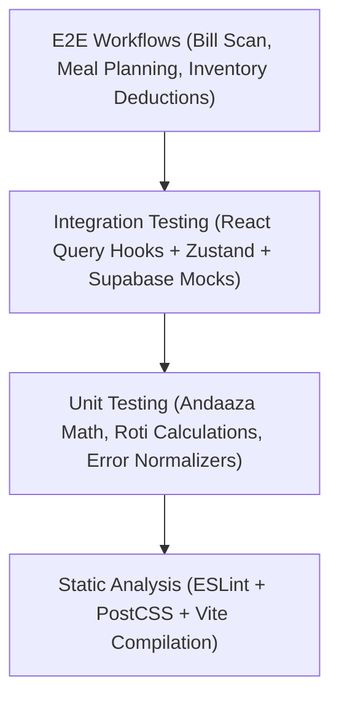
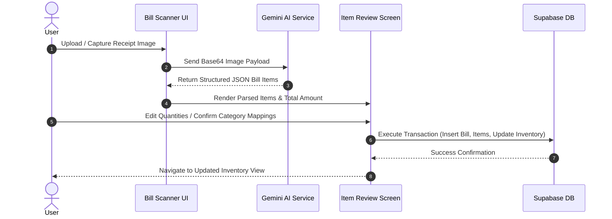

# KitchenMind Enterprise Documentation

## Document 17: Testing and Quality Assurance Strategy

---

### 1. Quality Assurance Philosophy & Testing Pyramid

KitchenMind targets high software reliability across complex domain calculations (such as Andaaza unit conversions, roti count algorithms, and multi-tenant inventory deductions). The project mandates a multi-layered testing strategy that combines static code analysis, isolated unit testing, component integration verification, and end-to-end user workflows.



---

### 2. Testing Pyramid Matrix

| Test Level | Scope | Tools & Libraries | Target Coverage | Key Focus Areas |
| :--- | :--- | :--- | :--- | :--- |
| **Static Analysis** | Codebase syntax, types, style | ESLint, Vite, PostCSS | 100% Files | Syntax rules, unused imports, hook dependency arrays |
| **Unit Tests** | Pure domain functions & algorithms | Vitest / Jest | > 85% Logic | `andaaza.js`, roti calculation logic, `normalizeError`, formatters |
| **Service Mocking** | Data access layer & APIs | MSW / Vitest Mocks | 100% Endpoints | Supabase PostgREST client methods, Gemini AI OCR payload stubs |
| **Integration** | Custom hooks & state management | React Testing Library | Key Workflows | Zustand store state mutations, React Query cache invalidation |
| **E2E Protocols** | Critical path UI workflows | Playwright / Manual Protocol | End-to-End | Scan Bill -> Review Items -> Save to Inventory & Budget Flow |

---

### 3. Unit Testing Policies & Core Algorithms

#### 3.1 Domain Calculation Testing Targets
Unit tests must validate edge cases in pure utility functions:
* **Headcount and Roti Formula**:
  $$\text{Total Roti} = (\text{Adults} \times \text{Roti}_{\text{adult}}) + (\text{Children} \times \text{Roti}_{\text{child}}) + \sum (\text{Guest Count} \times \text{Roti}_{\text{default}})$$
* **Andaaza Unit Calibration**:
  Testing confidence updates based on observed vs assumed gram measurements.
* **Date & Calendar Helpers**:
  Fasting day matching, non-veg day exclusions, tiffin box scheduling.

#### 3.2 Service Layer Mocking Example
When testing UI components interacting with Supabase or Gemini, external HTTP endpoints must be mocked to prevent brittle or network-dependent tests.

```javascript
// Example Supabase Client Mock Pattern
export const mockSupabaseClient = {
  from: (table) => ({
    select: () => ({
      eq: () => Promise.resolve({ data: [{ id: '123', name: 'Basmati Rice' }], error: null }),
    }),
    insert: (data) => Promise.resolve({ data, error: null }),
  }),
  rpc: (fnName, args) => Promise.resolve({ data: { success: true }, error: null }),
}
```

---

### 4. End-to-End (E2E) Scan-and-Review Test Protocols

Bill Scanning (OCR) and automated inventory insertion is a primary user path. The E2E test protocol follows an explicit 5-phase verification checklist:



#### E2E Verification Protocol Checklist:
1. **Upload Trigger**: Verify file input accepts `.png`, `.jpg`, and `.webp` images up to 10MB.
2. **Gemini OCR Processing**: Verify loading skeleton displays while AI extraction is in progress.
3. **Parse Validation**: Ensure total bill amount matches the sum of parsed line items.
4. **Review & Mutation**: Confirm user can modify unit types (e.g. convert "2 packets" to "1000g").
5. **Database Commit**: Verify records created in `bills`, `bill_items`, and updated in `inventory`.

---

### 5. Build, Lint & Static Pipeline

#### 5.1 Linting Configuration
ESLint 9 is configured with standard React hooks and refresh plugins ([`package.json`](file:///mnt/c/Users/keysh/github/kitchenmind/package.json)):

```bash
# Execute lint check across all source files
npm run lint
```

#### 5.2 Build Verification Command
Before PR merge or deployment, local compilation must succeed cleanly without bundle warnings:

```bash
# Execute production Vite build
npm run build
```
