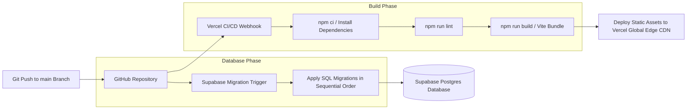
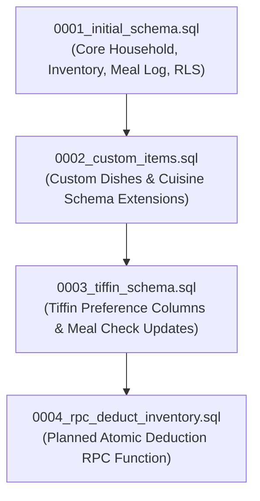

# KitchenMind Enterprise Documentation

## Document 18: Deployment, DevOps, and CI/CD Architecture

---

### 1. Overview & CI/CD Lifecycle

KitchenMind is built as a cloud-native single-page application (SPA) optimized for deployment on Vercel with backend services powered by Supabase. Production builds are managed deterministically using Vite 5 and Node.js.



---

### 2. Vite Build & Optimization Setup

#### 2.1 Configuration File (`vite.config.js`)
The application uses `@vitejs/plugin-react` for fast HMR and optimized ES module bundling:

```javascript
import { defineConfig } from 'vite'
import react from '@vitejs/plugin-react'
import path from 'path'

export default defineConfig({
  plugins: [react()],
  resolve: {
    alias: {
      '@': path.resolve(__dirname, './src'),
    },
  },
  build: {
    outDir: 'dist',
    sourcemap: false,
    chunkSizeWarningLimit: 1000,
  },
})
```

---

### 3. Vercel Hosting & SPA Routing Setup

#### 3.1 Rewrites Engine Configuration (`vercel.json`)
Because KitchenMind uses `react-router-dom` for client-side navigation, all incoming HTTP paths must rewrite to `index.html` to prevent 404 errors on browser page reloads:

```json
{
  "rewrites": [
    { "source": "/(.*)", "destination": "/index.html" }
  ]
}
```

---

### 4. Environment Variables Matrix

KitchenMind separates application secrets into client-safe public variables and restricted backend variables.

| Variable Name | Client / Server Scope | Required in Prod? | Description / Example Value |
| :--- | :--- | :--- | :--- |
| `VITE_SUPABASE_URL` | Client (Vite Bundle) | Yes | URL for Supabase backend project (`https://<ref>.supabase.co`) |
| `VITE_SUPABASE_ANON_KEY` | Client (Vite Bundle) | Yes | Public anon key protected by Postgres RLS policies |
| `VITE_GEMINI_API_KEY` | Client (Vite Bundle) | Yes | API key for Gemini OCR scanning and recipe generation |
| `SUPABASE_SERVICE_ROLE_KEY` | Server Only (CI/CD) | CI Migrations | Administrative key for schema migrations (never in frontend) |

#### 4.1 Environment Template (`.env.example`)
```env
# Supabase Configuration
VITE_SUPABASE_URL=https://your-project-ref.supabase.co
VITE_SUPABASE_ANON_KEY=your-anon-key-here

# Google Gemini API (for bill scanning & recipe suggestions)
VITE_GEMINI_API_KEY=your-gemini-api-key-here
```

---

### 5. Supabase Migration Execution Order

Database migrations are located in [`supabase/migrations/`](file:///mnt/c/Users/keysh/github/kitchenmind/supabase/migrations/) and MUST be executed in exact numerical sequence.



#### Migration Execution Log:
1. **`0001_initial_schema.sql`**:
   * Enables `uuid-ossp` extension.
   * Creates `household`, `members`, `preferences`, `guests`, `bills`, `bill_items`, `inventory`, `andaaza_profile`, `ingredient_aliases`, `recipes`, `meal_log`, `stock_deductions`, `budget_monthly`.
   * Defines helper function `auth_household_id()` and establishes RLS policies on all tables.
2. **`0002_custom_items.sql`**:
   * Creates `custom_items` table for non-catalogue dishes.
   * Extends `recipes` with `cuisine_region` and `cuisine_sub`.
   * Extends `preferences` with basic tiffin fields.
3. **`0003_tiffin_schema.sql`**:
   * Extends `preferences` with detailed multi-box tiffin configuration (`tiffin_default`, `tiffin_boxes`, `tiffin_box1_options`, `tiffin_box2_options`).
   * Updates `meal_log` constraint to include `'tiffin'` in valid `meal_type` values.
4. **`0004_rpc_deduct_inventory.sql` (Pending Milestone)**:
   * Atomic PostgreSQL RPC function to execute stock deductions and inventory decrements inside a single transaction.

---

### 6. Production Deployment Checklist

Before releasing a new deployment to production:
- [ ] Run `npm run lint` with 0 errors.
- [ ] Run `npm run build` and ensure `dist/` builds cleanly.
- [ ] Confirm all Supabase migrations are applied in sequential order.
- [ ] Verify environment variables are configured in Vercel Project Settings.
- [ ] Test auth signup/login flow and tenant isolation.
- [ ] Verify Gemini OCR scanning on mobile & desktop browsers.
