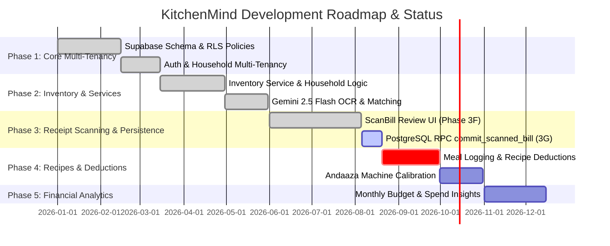

# KitchenMind — Implementation Status & Product Roadmap

---

## 1. Executive Implementation Overview

KitchenMind is being developed in a structured 5-phase evolution. The system currently sits at **Phase 3F Complete** (Bill processing pipeline with in-memory review UI verified) and is preparing to begin **Phase 3G** (PostgreSQL RPC `commit_scanned_bill()` atomic persistence).

---

## 2. Component Audit Matrix

The table below provides a comprehensive audit of all frontend pages, components, services, and hooks within [`src/`](file:///mnt/c/Users/keysh/github/kitchenmind/src/).

| Component / File Path | Module Area | Implementation Status | Purpose & Responsibility |
| :--- | :--- | :--- | :--- |
| [`src/App.jsx`](file:///mnt/c/Users/keysh/github/kitchenmind/src/App.jsx) | Router / Layout | **Completed** | Main routing table, layout shell, auth state listener |
| [`src/pages/Home.jsx`](file:///mnt/c/Users/keysh/github/kitchenmind/src/pages/Home.jsx) | Page View | **Completed** | Today's meals overview, low stock alerts, quick actions |
| [`src/pages/Inventory.jsx`](file:///mnt/c/Users/keysh/github/kitchenmind/src/pages/Inventory.jsx) | Page View | **Completed** | Inventory grid, category grouping, threshold badges |
| [`src/pages/ScanBill.jsx`](file:///mnt/c/Users/keysh/github/kitchenmind/src/pages/ScanBill.jsx) | Page View | **Completed (Phase 3F)** | Receipt upload, Gemini OCR, in-memory line item review UI |
| [`src/pages/AddItem.jsx`](file:///mnt/c/Users/keysh/github/kitchenmind/src/pages/AddItem.jsx) | Page View | **Completed** | Manual inventory item entry with unit conversion |
| [`src/pages/Onboarding.jsx`](file:///mnt/c/Users/keysh/github/kitchenmind/src/pages/Onboarding.jsx) | Page View | **Completed** | Multi-step household setup wizard |
| [`src/pages/Login.jsx`](file:///mnt/c/Users/keysh/github/kitchenmind/src/pages/Login.jsx) | Page View | **Completed** | Supabase auth login screen |
| [`src/pages/AuthCallback.jsx`](file:///mnt/c/Users/keysh/github/kitchenmind/src/pages/AuthCallback.jsx) | Auth Flow | **Completed** | OAuth login callback handler |
| [`src/services/AuthService.js`](file:///mnt/c/Users/keysh/github/kitchenmind/src/services/AuthService.js) | Auth Service | **Completed** | Auth login, logout, session management |
| [`src/services/HouseholdService.js`](file:///mnt/c/Users/keysh/github/kitchenmind/src/services/HouseholdService.js) | Data Service | **Completed** | Household creation, member & preference updates |
| [`src/services/InventoryService.js`](file:///mnt/c/Users/keysh/github/kitchenmind/src/services/InventoryService.js) | Data Service | **Completed** | Inventory CRUD and canonical name queries |
| [`src/services/OCRService.js`](file:///mnt/c/Users/keysh/github/kitchenmind/src/services/OCRService.js) | AI Integration | **Completed** | Gemini 2.5 Flash receipt OCR parsing |
| [`src/services/IngredientMatchingService.js`](file:///mnt/c/Users/keysh/github/kitchenmind/src/services/IngredientMatchingService.js) | AI Service | **Completed** | Alias resolution and confidence scoring |
| [`src/services/BillProcessingOrchestrator.js`](file:///mnt/c/Users/keysh/github/kitchenmind/src/services/BillProcessingOrchestrator.js) | Orchestration | **Completed** | In-memory OCR + matching workflow pipeline |
| [`src/services/BillPersistenceService.js`](file:///mnt/c/Users/keysh/github/kitchenmind/src/services/BillPersistenceService.js) | Persistence | **Designed (Phase 3G)** | Pre-commit validation & RPC wrapper |
| [`src/services/AndaazaLearningService.js`](file:///mnt/c/Users/keysh/github/kitchenmind/src/services/AndaazaLearningService.js) | AI Learning | **Completed** | Post-commit async calibration logger |
| [`src/hooks/useBillProcessing.js`](file:///mnt/c/Users/keysh/github/kitchenmind/src/hooks/useBillProcessing.js) | Custom Hook | **Completed** | Hook connecting ScanBill UI to Orchestrator |
| [`src/hooks/useInventory.js`](file:///mnt/c/Users/keysh/github/kitchenmind/src/hooks/useInventory.js) | Custom Hook | **Completed** | React Query hook for inventory fetching |
| [`src/hooks/useHousehold.js`](file:///mnt/c/Users/keysh/github/kitchenmind/src/hooks/useHousehold.js) | Custom Hook | **Completed** | React Query hook for household state |
| [`src/hooks/useAuth.js`](file:///mnt/c/Users/keysh/github/kitchenmind/src/hooks/useAuth.js) | Custom Hook | **Completed** | Auth session hook |
| [`src/store/authStore.js`](file:///mnt/c/Users/keysh/github/kitchenmind/src/store/authStore.js) | State Store | **Completed** | Zustand auth store |
| `commit_scanned_bill()` | Database RPC | **Next Up (Phase 3G)** | PostgreSQL atomic commit stored procedure |

---

## 3. Feature Matrix: Completed vs. Pending

### 3.1 Completed Milestones (Phases 1 - 3F)
- [x] **Phase 1: Multi-Tenant Database & RLS**
  - Database schema for households, members, preferences, inventory, and meal logs (`0001_initial_schema.sql`, `0002_custom_items.sql`, `0003_tiffin_schema.sql`).
  - PostgreSQL `auth_household_id()` security definer function and RLS policies on all tables.
- [x] **Phase 2: Core Domain Services & OCR Engine**
  - Receipt image scanning via Gemini 2.5 Flash API (`OCRService.js`).
  - Ingredient alias matching with confidence scores (`IngredientMatchingService.js`).
  - Non-persisting processing pipeline orchestrator (`BillProcessingOrchestrator.js`).
- [x] **Phase 3F: ScanBill Review UI Integration**
  - Refactored `ScanBill.jsx` to consume `useBillProcessing()` hook.
  - Interactive line item review UI with in-memory editing of merchant, date, quantities, units, prices, and categories.
  - Zero database writes during scanning and review.

### 3.2 Pending Engineering Milestones

#### Next Up: Phase 3G — PostgreSQL RPC `commit_scanned_bill()`
* **Goal**: Implement `commit_scanned_bill(p_payload jsonb)` stored procedure in Supabase.
* **Responsibilities**:
  - Idempotency verification (`idempotency_key`).
  - Atomic inventory upsert (`INSERT ... ON CONFLICT (household_id, canonical_name) DO UPDATE SET quantity_grams = inventory.quantity_grams + EXCLUDED.quantity_grams`).
  - Batch creation (`inventory_batches`) and audit logging (`inventory_transactions`).
  - Non-blocking post-commit AI observation logging hook.

#### Phase 4: Automated Recipe Deductions & Andaaza Machine Calibration
* **Goal**: Automatically deduct ingredient stock when meal logs transition to `cooked`.
* **Andaaza Calibration**: Update `andaaza_profile` volumetric weights based on feedback.

#### Phase 5: Monthly Budget & Financial Analytics Dashboard
* **Goal**: Aggregate bill totals and category expenditures into `budget_monthly`.
* **Insights**: Provide visual breakdowns of home grocery vs restaurant spend.
