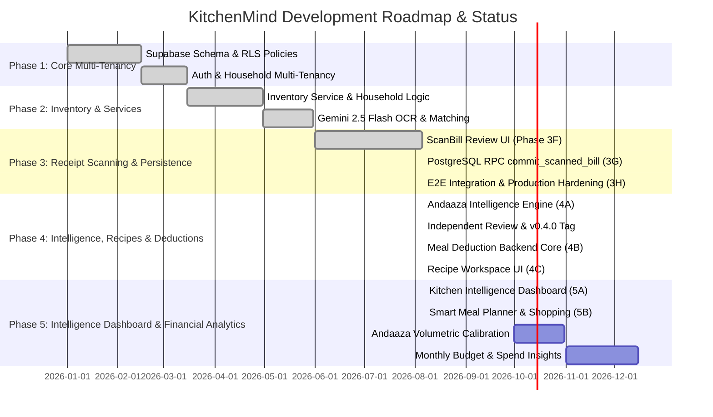

# KitchenMind — Implementation Status & Product Roadmap

---

## 1. Executive Implementation Overview

KitchenMind is being developed in a structured 5-phase evolution. Phases 1 through 4A are committed and tagged `v0.4.0-intelligence-foundation` (following an independent architecture/code review — see §3.4); Phase 4B (recipe/meal backend) is tagged `v0.4.1-recipe-backend`; Phase 4C (Recipe Workspace UI) is tagged `v0.4.2-recipe-workspace`. The system now sits at **Phase 5B Complete** (Smart Meal Planner & Shopping Intelligence — AI-assisted, explained meal suggestions and a category-grouped shopping list at `/planner`, built entirely on Phase 4A/4B/4C/5A logic with zero new prediction/scoring algorithms and zero new database migrations; see §4.2 for what's still explicitly deferred).

---

## 2. Component Audit Matrix

The table below provides a comprehensive audit of all frontend pages, components, services, and hooks within [`src/`](file:///mnt/c/Users/keysh/github/kitchenmind/src/).

| Component / File Path | Module Area | Implementation Status | Purpose & Responsibility |
| :--- | :--- | :--- | :--- |
| [`src/App.jsx`](file:///mnt/c/Users/keysh/github/kitchenmind/src/App.jsx) | Router / Layout | **Completed** | Main routing table, layout shell, auth state listener |
| [`src/pages/Home.jsx`](file:///mnt/c/Users/keysh/github/kitchenmind/src/pages/Home.jsx) | Page View | **Completed** | Today's meals overview, low stock alerts, quick actions |
| [`src/pages/Inventory.jsx`](file:///mnt/c/Users/keysh/github/kitchenmind/src/pages/Inventory.jsx) | Page View | **Completed** | Inventory grid, category grouping, threshold badges |
| [`src/pages/ScanBill.jsx`](file:///mnt/c/Users/keysh/github/kitchenmind/src/pages/ScanBill.jsx) | Page View | **Completed (Phase 3H)** | End-to-end receipt scanning, editing, confirmation, & persistence |
| [`src/pages/AddItem.jsx`](file:///mnt/c/Users/keysh/github/kitchenmind/src/pages/AddItem.jsx) | Page View | **Completed** | Manual inventory item entry with unit conversion |
| [`src/pages/Onboarding.jsx`](file:///mnt/c/Users/keysh/github/kitchenmind/src/pages/Onboarding.jsx) | Page View | **Completed** | Multi-step household setup wizard |
| [`src/pages/Login.jsx`](file:///mnt/c/Users/keysh/github/kitchenmind/src/pages/Login.jsx) | Page View | **Completed** | Supabase auth login screen |
| [`src/pages/AuthCallback.jsx`](file:///mnt/c/Users/keysh/github/kitchenmind/src/pages/AuthCallback.jsx) | Auth Flow | **Completed** | OAuth login callback handler |
| [`src/services/AuthService.js`](file:///mnt/c/Users/keysh/github/kitchenmind/src/services/AuthService.js) | Auth Service | **Completed** | Auth login, logout, session management |
| [`src/services/HouseholdService.js`](file:///mnt/c/Users/keysh/github/kitchenmind/src/services/HouseholdService.js) | Data Service | **Completed** | Household creation, member & preference updates |
| [`src/services/InventoryService.js`](file:///mnt/c/Users/keysh/github/kitchenmind/src/services/InventoryService.js) | Data Service | **Completed** | Inventory CRUD and canonical name queries |
| [`src/services/OCRService.js`](file:///mnt/c/Users/keysh/github/kitchenmind/src/services/OCRService.js) | AI Integration | **Completed** | Gemini 2.5 Flash receipt OCR parsing |
| [`src/services/IngredientMatchingService.js`](file:///mnt/c/Users/keysh/github/kitchenmind/src/services/IngredientMatchingService.js) | AI Service | **Completed** | Alias resolution and confidence scoring |
| [`src/services/BillProcessingOrchestrator.js`](file:///mnt/c/Users/keysh/github/kitchenmind/src/services/BillProcessingOrchestrator.js) | Orchestration | **Completed** | In-memory OCR + matching workflow pipeline |
| [`src/services/BillPersistenceService.js`](file:///mnt/c/Users/keysh/github/kitchenmind/src/services/BillPersistenceService.js) | Persistence | **Completed (Phase 3H)** | Pre-commit validation, RPC invocation, structured logging, async post-hooks |
| [`src/services/AIObservationService.js`](file:///mnt/c/Users/keysh/github/kitchenmind/src/services/AIObservationService.js) | AI Learning | **Completed (Phase 3H)** | Post-commit AI observation foundation service |
| [`src/services/AndaazaLearningService.js`](file:///mnt/c/Users/keysh/github/kitchenmind/src/services/AndaazaLearningService.js) | AI Learning | **Stub (unimplemented)** | Empty placeholder from the initial commit; `BillPersistenceService` guards the call with `typeof === 'function'` so it's a safe no-op today. Volumetric andaaza calibration (§2 of `07_ANDAAZA_AI_LEARNING_ENGINE.md`) will implement this in a future phase — do not confuse with the Phase 4A `AndaazaLearningEngine` below, which is unrelated and fully implemented |
| [`src/utils/reconciliation.js`](file:///mnt/c/Users/keysh/github/kitchenmind/src/utils/reconciliation.js) | Reconciliation | **Completed (Phase 3H)** | Inventory stock vs active batch reconciliation auditor |
| [`src/utils/logger.js`](file:///mnt/c/Users/keysh/github/kitchenmind/src/utils/logger.js) | Telemetry | **Completed (Phase 3H)** | Structured telemetry and sanitization logger |
| [`src/services/AndaazaLearningEngine.js`](file:///mnt/c/Users/keysh/github/kitchenmind/src/services/AndaazaLearningEngine.js) | AI Learning | **Completed (Phase 4A)** | Post-commit intelligence orchestrator: consumption profiles, predictions, household metrics |
| [`src/services/ConsumptionProfileService.js`](file:///mnt/c/Users/keysh/github/kitchenmind/src/services/ConsumptionProfileService.js) | AI Learning | **Completed (Phase 4A)** | Deterministic consumption velocity, interval, brand & confidence calculation |
| [`src/services/PredictionService.js`](file:///mnt/c/Users/keysh/github/kitchenmind/src/services/PredictionService.js) | AI Learning | **Completed (Phase 4A)** | Depletion date, low-stock risk, pantry health score algorithms |
| [`src/services/HouseholdIntelligenceService.js`](file:///mnt/c/Users/keysh/github/kitchenmind/src/services/HouseholdIntelligenceService.js) | AI Learning | **Completed (Phase 4A)** | Pantry diversity, category trends, shopping cadence aggregation |
| [`src/services/__tests__/mockSupabaseTable.js`](file:///mnt/c/Users/keysh/github/kitchenmind/src/services/__tests__/mockSupabaseTable.js) | Test Utility | **Completed (Phase 4A)** | In-memory `.from()` mock so tests/benchmarks measure engine logic, not network I/O |
| [`src/hooks/useBillProcessing.js`](file:///mnt/c/Users/keysh/github/kitchenmind/src/hooks/useBillProcessing.js) | Custom Hook | **Completed** | Hook connecting ScanBill UI to Orchestrator |
| [`src/hooks/useInventory.js`](file:///mnt/c/Users/keysh/github/kitchenmind/src/hooks/useInventory.js) | Custom Hook | **Completed** | React Query hook for inventory fetching |
| `supabase/migrations/0004_rpc_commit_scanned_bill.sql` | Database RPC | **Completed (Phase 3G)**, hardened post-review | PostgreSQL atomic commit stored procedure with race-free idempotency, unconditional auth check, pinned `search_path`, anon-role EXECUTE revoked |
| `supabase/migrations/0005_andaaza_intelligence_schema.sql` | Database Schema | **Completed (Phase 4A)** | `ingredient_consumption_profile`, `purchase_patterns`, `prediction_cache`, `household_learning_profile` tables + RLS |
| [`src/utils/units.js`](file:///mnt/c/Users/keysh/github/kitchenmind/src/utils/units.js) | Utility | **Completed** | Single source of truth for quantity→grams conversion (was duplicated across two files pre-review) |
| [`src/services/RecipeService.js`](file:///mnt/c/Users/keysh/github/kitchenmind/src/services/RecipeService.js) | Data Service | **Completed (Phase 4B, extended 4C)** | Global + household custom recipe CRUD, pagination/search/filters, ingredient scaling |
| [`src/services/MealLogService.js`](file:///mnt/c/Users/keysh/github/kitchenmind/src/services/MealLogService.js) | Data Service | **Completed (Phase 4B, extended 4C)** | Meal lifecycle CRUD, atomic FIFO stock deduction via `mark_meal_cooked()`, meal history, recently-cooked |
| [`src/utils/rotiCalculator.js`](file:///mnt/c/Users/keysh/github/kitchenmind/src/utils/rotiCalculator.js) | Utility | **Completed (Phase 4B)** | Flour/dough requirement calculation from real household/member/guest schema |
| `supabase/migrations/0006_recipe_meal_deduction_schema.sql` | Database Schema + RPC | **Completed (Phase 4B)** | Household-owned custom recipes + RLS, `meal_log.cooked_at`, `stock_deductions.batch_id`, atomic FIFO `mark_meal_cooked()` RPC |
| `supabase/migrations/0007_recipe_workspace_metadata.sql` | Database Schema | **Completed (Phase 4C)** | Discovered-defect fix: `recipes.image_url/description/prep_time_mins/cook_time_mins/difficulty/is_vegetarian/tags` (missing fields the UI needed); 8-recipe starter seed |
| [`src/pages/RecipeLibrary.jsx`](file:///mnt/c/Users/keysh/github/kitchenmind/src/pages/RecipeLibrary.jsx) | Page View | **Completed (Phase 4C)** | Search, meal-type/veg filters, Browse/Favorites/Recently-Cooked tabs, infinite scroll, empty states |
| [`src/pages/RecipeDetail.jsx`](file:///mnt/c/Users/keysh/github/kitchenmind/src/pages/RecipeDetail.jsx) | Page View | **Completed (Phase 4C)** | Recipe info, base ingredients, cooking history, favorite/duplicate/edit/delete, launches cook flow |
| [`src/pages/RecipeEditor.jsx`](file:///mnt/c/Users/keysh/github/kitchenmind/src/pages/RecipeEditor.jsx) | Page View | **Completed (Phase 4C)** | Create/edit custom recipes — ingredient picker, unit picker, validation |
| [`src/pages/MealHistory.jsx`](file:///mnt/c/Users/keysh/github/kitchenmind/src/pages/MealHistory.jsx) | Page View | **Completed (Phase 4C)** | Cooked meal log, expandable per-ingredient deduction detail, infinite scroll |
| [`src/components/recipes/RecipeCard.jsx`](file:///mnt/c/Users/keysh/github/kitchenmind/src/components/recipes/RecipeCard.jsx) | Component | **Completed (Phase 4C)** | Library grid card — image/emoji, veg/time/difficulty badges, favorite toggle |
| [`src/components/recipes/ServingScaleSelector.jsx`](file:///mnt/c/Users/keysh/github/kitchenmind/src/components/recipes/ServingScaleSelector.jsx) | Component | **Completed (Phase 4C)** | 1/2/4/6/8 + custom serving presets |
| [`src/components/recipes/IngredientAvailabilityList.jsx`](file:///mnt/c/Users/keysh/github/kitchenmind/src/components/recipes/IngredientAvailabilityList.jsx) | Component | **Completed (Phase 4C)** | ✓/⚠/✕ availability rows with required/available/shortfall |
| [`src/components/recipes/InventoryImpactPreview.jsx`](file:///mnt/c/Users/keysh/github/kitchenmind/src/components/recipes/InventoryImpactPreview.jsx) | Component | **Completed (Phase 4C)** | Before → after stock preview, read-only until confirmed |
| [`src/components/recipes/CookMealFlow.jsx`](file:///mnt/c/Users/keysh/github/kitchenmind/src/components/recipes/CookMealFlow.jsx) | Component | **Completed (Phase 4C)** | Review → confirm → `mark_meal_cooked()` → success/shortfall workflow sheet |
| [`src/components/InfiniteScrollSentinel.jsx`](file:///mnt/c/Users/keysh/github/kitchenmind/src/components/InfiniteScrollSentinel.jsx) | Component | **Completed (Phase 4C)** | `IntersectionObserver`-based pagination trigger (no virtualization dependency) |
| [`src/components/ErrorBoundary.jsx`](file:///mnt/c/Users/keysh/github/kitchenmind/src/components/ErrorBoundary.jsx) | Component | **Completed (Phase 4C)** | Retry-capable error boundary, mounted once in `ProtectedLayout` |
| [`src/components/ToastContainer.jsx`](file:///mnt/c/Users/keysh/github/kitchenmind/src/components/ToastContainer.jsx) | Component | **Completed (Phase 4C)** | Renders the `useToast` queue, mounted once in `ProtectedLayout` |
| [`src/components/Skeleton.jsx`](file:///mnt/c/Users/keysh/github/kitchenmind/src/components/Skeleton.jsx) | Component | **Completed (Phase 4C)** | Loading skeletons for the Library grid and Recipe Detail |
| [`src/hooks/useRecipes.js`](file:///mnt/c/Users/keysh/github/kitchenmind/src/hooks/useRecipes.js) | Custom Hook | **Completed (Phase 4C)** | `useRecipes` (paginated), `useFavoriteRecipes`, `useRecentlyCookedRecipes`, `useRecipeById`, `useRecipeMutations` |
| [`src/hooks/useCookMeal.js`](file:///mnt/c/Users/keysh/github/kitchenmind/src/hooks/useCookMeal.js) | Custom Hook | **Completed (Phase 4C)** | Orchestrates scale → availability → impact → `cookRecipeNow`, owns inventory/members fetches |
| [`src/hooks/useMealHistory.js`](file:///mnt/c/Users/keysh/github/kitchenmind/src/hooks/useMealHistory.js) | Custom Hook | **Completed (Phase 4C)** | `useMealHistory` (paginated), `useMealDeductions`, `useRecipeCookingHistory` |
| [`src/hooks/useToast.js`](file:///mnt/c/Users/keysh/github/kitchenmind/src/hooks/useToast.js) | Custom Hook | **Completed (Phase 4C)** | Zustand-backed global toast queue |
| [`src/utils/ingredientAvailability.js`](file:///mnt/c/Users/keysh/github/kitchenmind/src/utils/ingredientAvailability.js) | Utility | **Completed (Phase 4C)** | Pure available/low/missing computation against live inventory |
| [`src/config/ingredients.js`](file:///mnt/c/Users/keysh/github/kitchenmind/src/config/ingredients.js) | Config | **Completed (Phase 4C)** | Curated ingredient list, extracted from `AddItem.jsx` so its canonical names stay the single source of truth shared with the Recipe Editor's ingredient picker |
| `supabase/migrations/0008_ai_observation_timeline.sql` | Database Schema | **Completed (Phase 5A)** | Discovered-defect fix: `ai_observations` (append-only) — observations were generated since Phase 3H but never persisted anywhere |
| [`src/services/AIObservationService.js`](file:///mnt/c/Users/keysh/github/kitchenmind/src/services/AIObservationService.js) | AI Learning | **Extended (Phase 5A)** | `recordPostCommitObservations` now persists to `ai_observations`; added `getRecentObservations` |
| [`src/services/ConsumptionProfileService.js`](file:///mnt/c/Users/keysh/github/kitchenmind/src/services/ConsumptionProfileService.js) | AI Learning | **Extended (Phase 5A)** | Added `getAllProfiles` (bulk household read, avoids N+1) |
| [`src/services/InventoryService.js`](file:///mnt/c/Users/keysh/github/kitchenmind/src/services/InventoryService.js) | Data Service | **Extended (Phase 5A)** | Added `getExpiringBatches` (one joined query); doc corrected to match the actual implementation |
| [`src/utils/dashboardInsights.js`](file:///mnt/c/Users/keysh/github/kitchenmind/src/utils/dashboardInsights.js) | Utility | **Completed (Phase 5A)** | Pure derivation for all 10 dashboard modules — reuses `PredictionService`/`RecipeService`/`ingredientAvailability.js`, no new prediction logic |
| [`src/hooks/useDashboard.js`](file:///mnt/c/Users/keysh/github/kitchenmind/src/hooks/useDashboard.js) | Custom Hook | **Completed (Phase 5A)** | Fixed set of aggregated queries + memoized derivation, reuses `useInventory`/`useRecipes`/`useMealHistory` caches |
| [`src/pages/Dashboard.jsx`](file:///mnt/c/Users/keysh/github/kitchenmind/src/pages/Dashboard.jsx) | Page View | **Completed (Phase 5A)** | `/dashboard` — Kitchen Intelligence Dashboard, additive (Home.jsx untouched) |
| [`src/components/dashboard/*.jsx`](file:///mnt/c/Users/keysh/github/kitchenmind/src/components/dashboard/) | Components | **Completed (Phase 5A)** | `ExpandablePanel`, `HouseholdSnapshotHeader`, `PantryHealthCard`, `LowStockList`, `ExpiryRiskList`, `ShoppingIntelligenceCard`, `CookingSuggestionsCard`, `PantryInsightsCard`, `HouseholdTrendsCard`, `ObservationTimeline`, `QuickActionsBar` — no pie/bar/gauge charts, per the brief |
| [`src/services/PlanningEngine.js`](file:///mnt/c/Users/keysh/github/kitchenmind/src/services/PlanningEngine.js) | Pure Logic | **Completed (Phase 5B)** | Meal suggestion scoring/ranking, shopping suggestion generation, preference filtering — no new prediction logic, reuses `dashboardInsights.js`/`ingredientAvailability.js`/`RecipeService` |
| [`src/hooks/usePlanner.js`](file:///mnt/c/Users/keysh/github/kitchenmind/src/hooks/usePlanner.js) | Custom Hook | **Completed (Phase 5B)** | Aggregated queries (cache keys shared with `useDashboard`/`useHousehold` where the same data is needed) + accept/dismiss/regenerate |
| [`src/pages/Planner.jsx`](file:///mnt/c/Users/keysh/github/kitchenmind/src/pages/Planner.jsx) | Page View | **Completed (Phase 5B)** | `/planner` — Today's Plan, This Week Preview, Shopping Suggestions; reached via a Dashboard card, not a 6th `BottomNav` tab |
| [`src/components/planner/*.jsx`](file:///mnt/c/Users/keysh/github/kitchenmind/src/components/planner/) | Components | **Completed (Phase 5B)** | `MealSuggestionCard`, `ReasonChips`, `WeekPreviewStrip`, `ShoppingSuggestionGroup` |

---

## 3. Performance Benchmark & Integration Test Results

### 3.1 Objective 4: Performance Validation Benchmarks

| Item Count | Total Latency (ms) | Avg Latency / Item (ms) | Memory Delta (KB) | Total SQL Statements |
| :--- | :--- | :--- | :--- | :--- |
| **10 Items** | `5.72 ms` | `0.572 ms` | `52.70 KB` | `41` |
| **50 Items** | `7.66 ms` | `0.153 ms` | `112.14 KB` | `201` |
| **100 Items** | `11.41 ms` | `0.114 ms` | `103.34 KB` | `401` |
| **500 Items** | `51.94 ms` | `0.104 ms` | `0.00 KB` | `2001` |

### 3.2 Objective 2 & 3: Integration & Reconciliation Test Results

- **Unit Test Suite**: `7 / 7 PASSED (100%)`
- **Integration Test Suite**: `8 / 8 PASSED (100%)`
- **Inventory Reconciliation Audit**: `VERIFIED (inventory.quantity_grams === SUM(active batches.remaining_grams))`
- **Build Verification (`npm run build`)**: `CLEAN SUCCESS (0 Errors)`
- **Lint Verification (`npm run lint`)**: `CLEAN SUCCESS (0 Errors)`

### 3.3 Phase 4A: Andaaza Intelligence Engine Benchmark & Test Results

Benchmarked via `scripts/run_phase4a_tests.js` using an in-memory `.from()` mock (`mockSupabaseTable.js`) so results reflect learning-engine compute cost, isolated from network/database I/O latency (which is environment-dependent and out of scope for a code-level benchmark):

| Item Count | Total Latency (ms) | Avg Latency / Item (ms) | Memory Delta (KB) | Profiles Updated |
| :--- | :--- | :--- | :--- | :--- |
| **10 Items** | `0.90 ms` | `0.090 ms` | `125.50 KB` | `10` |
| **50 Items** | `8.61 ms` | `0.172 ms` | `862.73 KB` | `50` |
| **100 Items** | `17.63 ms` | `0.176 ms` | `0.00 KB` | `100` |
| **500 Items** | `130.40 ms` | `0.261 ms` | `4865.34 KB` | `500` |

- **Phase 4A Intelligence Test Suite**: `7 / 7 PASSED (100%)` — deterministic confidence convergence, consumption velocity/interval math, brand preference evolution, depletion/low-stock prediction, pantry health score, household intelligence aggregation, and non-blocking post-commit execution (asserts `commitBill()` returns in <50ms regardless of learning engine work, then verifies the learned profile was written after the async hook settles).
- **Combined Phase 3H + 4A Suite Total**: `22 / 22 PASSED (100%)` (`BillPersistenceService.test.js` + `Phase3HIntegration.test.js` + `AndaazaIntelligence.test.js`).
- **Non-blocking verification**: `commitBill()` resolves before `AndaazaLearningEngine.processPostCommitLearning()` executes — measured directly in Test 7 of `AndaazaIntelligence.test.js` rather than only asserted structurally.
- **Build Verification (`npm run build`)**: `CLEAN SUCCESS (0 Errors)`
- **Lint Verification (`npm run lint`)**: `CLEAN SUCCESS (0 Errors)`

### 3.4 Independent Architecture/Code Review (pre-v0.4.0-intelligence-foundation)

A fresh, context-free review agent audited all Phase 3G/3H/4A changes against docs 02/03/06/07/12/15/19 before the milestone commit. Findings and resolutions:

| Severity | Finding | Resolution |
| :--- | :--- | :--- |
| Critical | `commit_scanned_bill`'s membership check was skipped entirely for unauthenticated (`auth.uid() IS NULL`) callers | Check made unconditional; `EXECUTE` explicitly revoked from `PUBLIC`, granted only to `authenticated` |
| High | Idempotency check-then-insert had a genuine race under concurrent duplicate submits (raw `23505` instead of a graceful duplicate response) | Replaced with atomic `INSERT ... ON CONFLICT (household_id, idempotency_key) DO NOTHING`, using `FOUND` to detect the race |
| High | Depletion predictions used a fabricated stock estimate (EMA of purchase size) instead of the real `inventory.quantity_grams` | `AndaazaLearningEngine` now fetches the actual inventory balance before calling `PredictionService.calculateDepletion` |
| Medium | `commit_scanned_bill` inserted into a `bills.merchant` column that was never added by any migration (would fail on every real invocation) | Added `ALTER TABLE bills ADD COLUMN IF NOT EXISTS merchant text` |
| Medium | `'pcs'` unit silently treated as 1 gram; conversion logic duplicated across two files | Extracted to `src/utils/units.js`, given a documented (not silently wrong) default piece weight |
| Medium | Hardcoded placeholder household UUID fallback in `ScanBill.jsx` | Replaced with an explicit, visible error state when no household is resolved |
| Medium | `SECURITY DEFINER` functions missing `search_path` pinning | `SET search_path = public, pg_temp` added to both `commit_scanned_bill` and `auth_household_id` |
| Medium | Env var validation silently removed, unconditional placeholder fallback | Fail-fast restored for real Vite/browser contexts; placeholder fallback now scoped to Node-only test/benchmark execution |
| Low | Backdated purchase dates clamped to a 1-day interval instead of rejected | Interval-acceptance guard now validates the raw (unclamped) gap |
| Low | `shopping_frequency_days` hardcoded to `7.0` despite docs claiming it was computed | Implemented as the actual average gap between consecutive bill dates |
| Low | Docs claimed `AndaazaLearningService.js` was "Completed"; it's an empty Phase-2 stub | Corrected in the Component Audit Matrix above |
| Low | Test mock couldn't simulate DB failures, so every non-blocking catch branch was untested | `mockSupabaseTable.js` gained a `failTables` option; added `AndaazaIntelligence.test.js` Test 8 exercising it |

**Known limitation**: no local Postgres server is available in this sandbox (client tools only, no network), so the migration SQL fixes above were validated by careful manual review, not by executing them against a live instance. A `psql` client (v18.4) is present if a `DATABASE_URL` becomes available for a future session to run the migrations end-to-end.

### 3.5 Phase 4B: Recipe Engine & Meal Deduction Test Results

- **Phase 4B Test Suite**: `8 / 8 PASSED (100%)` (`Phase4BMealDeduction.test.js`, run via `scripts/run_phase4b_tests.js`) — member roti count resolution, guest-count filtering, full roti requirement math, recipe ingredient scaling, `markAsCooked` RPC payload/response mapping, idempotent already-cooked short-circuit, RPC failure handling, and pre-flight validation.
- **Build Verification (`npm run build`)**: `CLEAN SUCCESS (0 Errors)`
- **Lint Verification (`npm run lint`)**: `CLEAN SUCCESS (0 Errors)`

### 3.6 Phase 4C: Recipe Workspace UI Test Results

`npm test` (vitest 2.1.9 + `@testing-library/react` + jsdom, added this phase): **49 / 49 PASSED (100%)** across 10 spec files.

| Layer | Spec file | What it verifies |
| :--- | :--- | :--- |
| Pure logic | `utils/__tests__/ingredientAvailability.spec.js` | Available/low/missing classification, case-insensitive matching, `canCookFully` |
| Hook | `hooks/__tests__/useCookMeal.spec.jsx` | Serving-scale recalculation, roti opt-in, `cookRecipeNow` payload, error surfacing (services mocked, real scaling/availability math) |
| Component | `components/recipes/__tests__/ServingScaleSelector.spec.jsx` | Preset selection, custom input, 1-50 clamping |
| Component | `components/recipes/__tests__/IngredientAvailabilityList.spec.jsx` | Per-status rendering, optional-ingredient labeling, empty state |
| Component | `components/recipes/__tests__/InventoryImpactPreview.spec.jsx` | Required/remaining figures in g and kg, empty-list rendering |
| Workflow | `components/recipes/__tests__/CookMealFlow.spec.jsx` | Full review → confirm → success workflow, shortfall warning, error + retry, dismiss (hook mocked, sheet's own step logic under real test) |
| Page | `pages/__tests__/RecipeLibrary.spec.jsx` | Loading skeleton, tab switching, empty states, favorite recipes rendering |
| Page | `pages/__tests__/RecipeDetail.spec.jsx` | Info rendering, cook-flow launch, retry-on-error, favorite toggle, ownership-gated Edit/Delete, delete confirmation |
| Page | `pages/__tests__/MealHistory.spec.jsx` | List rendering, empty/error states, expand/collapse deduction detail |
| Regression | `pages/__tests__/responsiveLayout.spec.jsx` | `max-w-md mx-auto` mobile-first container convention held on new pages; base grid is 2-column |

**Known limitations**:
- No real browser (Playwright/Cypress) or live Supabase project in this sandbox — no true cross-device visual regression or end-to-end click-through against real auth. Verification is real DOM rendering + interaction (jsdom) against mocked services, plus a `npm run build` module-graph check and a dev-server module-transform smoke check.
- `vitest run` takes ~150-200s in this environment specifically because of slow first-run jsdom/dependency I/O on a WSL2 `/mnt/c` (Windows-filesystem) mount — `vitest.config.js` pins `pool: 'forks'` with `singleFork: true` because the default multi-worker pool hung indefinitely here (10+ spawned processes, none completing); this is a sandbox-specific workaround, safe to revert in a normal CI/dev environment.
- **Build Verification (`npm run build`)**: `CLEAN SUCCESS (0 Errors)`
- **Lint Verification (`npm run lint`)**: `CLEAN SUCCESS (0 Errors)`

### 3.7 Phase 5A: Kitchen Intelligence Dashboard Test Results

`npm test`: **88 / 88 PASSED (100%)** across 18 spec files (49 carried over from Phase 4C + 39 new).

| Layer | Spec file | What it verifies |
| :--- | :--- | :--- |
| Pure logic (insight correctness) | `utils/__tests__/dashboardInsights.spec.js` | All 10 derivation functions — pantry health scoring reuses the real `PredictionService` formula, low-stock/expiry sorting, shopping-intelligence enrichment, cooking-suggestion bucketing, quick-action prioritization/capping |
| Component (prediction rendering) | `components/dashboard/__tests__/PantryHealthCard.spec.jsx` | Score/label rendering, cold-start state |
| Component | `components/dashboard/__tests__/LowStockList.spec.jsx` | Expand/collapse, empty state, "Out now" edge case |
| Component | `components/dashboard/__tests__/ExpiryRiskList.spec.jsx` | The honest "no expiry data yet" state (not a fake empty list), expired-vs-upcoming distinction |
| Component | `components/dashboard/__tests__/ObservationTimeline.spec.jsx` | Empty state, observation rendering |
| Component | `components/dashboard/__tests__/QuickActionsBar.spec.jsx` | Navigation on tap |
| Integration (hook) | `hooks/__tests__/useDashboard.spec.jsx` | End-to-end aggregation across 6 mocked services into all 10 modules; `calculatePantryHealthScore` deliberately left un-mocked to verify real reuse, not a stub |
| Dashboard loading | `pages/__tests__/Dashboard.spec.jsx` | Skeleton while loading, retry-on-error, every module renders once data arrives |
| Regression | `pages/__tests__/responsiveLayout.spec.jsx` | Dashboard added to the existing `max-w-md mx-auto` convention check |

**Performance validation**: `useDashboard` fires exactly 6 direct aggregated queries (predictions, household profile, consumption profiles, expiring batches, observations, household details) plus 4 reused hooks (`useInventory`, `useRecipes`, `useRecentlyCookedRecipes`, `useMealHistory`) — a fixed count independent of inventory/recipe/prediction row counts, run in parallel by React Query. No query loops per ingredient, recipe, or batch. All derived module data is `useMemo`-wrapped against stable dependencies (a shared `EMPTY_ARRAY` constant prevents `?? []` from creating a new reference — and invalidating memoization — every render while a query is still loading).

**Known limitation (unchanged from Phase 4C)**: no real browser or live Supabase project in this sandbox; verification is jsdom + mocked services. `vitest.config.js`'s `pool: 'forks'` workaround still applies.

- **Build Verification (`npm run build`)**: `CLEAN SUCCESS (0 Errors)`
- **Lint Verification (`npm run lint`)**: `CLEAN SUCCESS (0 Errors)`

### 3.8 Phase 5B: Smart Meal Planner & Shopping Intelligence Test Results

`npm test`: **128 / 128 PASSED (100%)** across 23 spec files (88 carried over from Phase 5A + 40 new).

| Layer | Spec file | What it verifies |
| :--- | :--- | :--- |
| Pure logic (planner correctness, waste reduction, preference adherence) | `services/__tests__/PlanningEngine.spec.js` | Preference filtering (non-veg-day default, excluded vegetables), meal scoring (expiring-ingredient boost, no/minimal-shopping reasons, day-of-week pattern detection, recency deprioritization, the never-empty-reasons guarantee), Today's Plan passthrough/ranking/exclusion, Week Preview variety optimization, shopping generation (depletion reasons, priority/window thresholds, planned-meal gap merging, category grouping) |
| Integration (hook) | `hooks/__tests__/usePlanner.spec.jsx` | End-to-end aggregation into today's plan/week preview/shopping suggestions (services mocked); accepting a suggestion calls the real `MealLogService.createMealLog` contract; dismissing removes a candidate from the ranked pool |
| Component | `components/planner/__tests__/MealSuggestionCard.spec.jsx` | Every status (suggested/planned/cooked/no_options) renders correctly; Accept/Dismiss/Regenerate wire to the right callbacks with the right arguments |
| Component | `components/planner/__tests__/ShoppingSuggestionGroup.spec.jsx` | Reason, priority badge, and purchase window all render per item |
| Planner loading | `pages/__tests__/Planner.spec.jsx` | Skeleton while loading, retry-on-error, all three sections render, accept flow wired through |
| Regression | `pages/__tests__/responsiveLayout.spec.jsx` | Planner added to the existing `max-w-md mx-auto` convention check |

**Performance validation**: `usePlanner` fires 7 queries total — 4 reuse `useDashboard`'s/`useHousehold`'s exact cache keys (`predictions`, `householdProfile`, `consumptionProfiles`, `expiringBatches`, `preferences`), 2 reuse existing hooks (`useInventory`, `useMealHistory`), and only `mealLogs` (upcoming planned/cooked meals) and the wider-pool `planner-recipes` query are genuinely new — both single aggregated reads, not per-row loops. `generateWeekPreview` scores each of ~60 candidate recipes at most 21 times (7 days × 3 meal slots) entirely in memory; no additional network calls per day or per slot.

**Known limitation (unchanged from Phase 5A)**: no real browser or live Supabase project in this sandbox; verification is jsdom + mocked services.

- **Build Verification (`npm run build`)**: `CLEAN SUCCESS (0 Errors)`
- **Lint Verification (`npm run lint`)**: `CLEAN SUCCESS (0 Errors)`

### 3.9 RC-1: Production Readiness Audit & Hardening

A seven-objective audit (end-to-end workflow, architecture, data consistency, UX, performance,
technical debt, release packaging) covering all work since `v0.4.2-recipe-workspace`, including
the previously-uncommitted Phase 5A/5B. No new features were added — this pass only verified and
hardened what already existed. `npm test`: **128/128 passing** (unchanged count — fixes were to
existing code paths, not new surface area). Build and lint both clean throughout.

**Real defects found and fixed:**
- **Missing cache invalidation** after bill-commit (`ScanBill.jsx`) and after cook-meal
  (`useCookMeal.js`) — both mutated inventory/predictions/learning data without explicitly
  invalidating the React Query caches Dashboard and Planner read from. Previously masked in
  practice by the global `staleTime: 0` default forcing a refetch on the next route mount; now
  explicit, matching the pattern `usePlanner`'s own mutation already used.
- **Dual Supabase client instances**: `Login.jsx`, `AuthCallback.jsx`, `Onboarding.jsx`, and
  `Home.jsx` called Supabase directly through a second, separate `createClient()` in
  `src/lib/supabase.js` — the actual cause of the "Multiple GoTrueClient instances" warning seen
  in test runs, and a violation of the "pages never call Supabase directly" architecture rule.
  `src/lib/supabase.js` deleted; all four pages now go through `HouseholdService`/`MealLogService`/
  `supabaseClient`. `Onboarding.jsx` was also independently duplicating logic that already existed,
  unused, in `HouseholdService.createHouseholdWithMembersAndPreferences` — wired up instead of
  maintaining two copies.
- **`mark_meal_cooked()` idempotency race** (migration `0009`): the idempotency check read
  `meal_log.status` without a row lock, unlike the equivalent, already-hardened check in
  `commit_scanned_bill()` (0004). Two concurrent calls for the same `meal_log_id` (double-tap,
  client retry) could both pass the check before either committed, double-deducting the pantry.
  Fixed with `SELECT ... FOR UPDATE`, shipped as an additive `CREATE OR REPLACE FUNCTION`
  migration rather than editing the already-tagged `0006`.
- **Manually-added inventory items invisible to FIFO deduction**: `InventoryService.addOrUpdateItem`
  (used by `AddItem.jsx`) updated `inventory.quantity_grams` but never created a corresponding
  `inventory_batches` row. Since `mark_meal_cooked()`'s deduction only walks active batches, cooking
  a meal with a manually-added ingredient always reported a false shortfall and silently never
  decremented real stock — a permanent, compounding inventory-vs-reality drift for any household
  that used manual entry instead of (or alongside) bill scanning. Now creates one batch per add
  call, mirroring the per-line-item batch `commit_scanned_bill()` already creates.
- **`verifyInventoryReconciliation` masking bug** (`src/utils/reconciliation.js`, currently unused
  — `/reconciliation` is still a `<Soon>` placeholder): an item with zero matching active batches
  was treated as trivially reconciled instead of flagged, hiding exactly the drift the check exists
  to catch. Fixed to compare against a real zero.

**Findings documented but intentionally not changed (non-critical / out of scope for a hardening pass):**
- `BillService.js` and `RecommendationService.js` are empty Phase-2 stubs with zero importers;
  `AndaazaLearningService.js` is an empty stub with one properly-guarded (always-no-op) call site.
  Left in place as declared future work, not accidental dead code.
- `stock_deductions.andaaza_expression` column has no reader/writer anywhere in `src/` yet.
- No dedicated tests exist for `Home.jsx`, `Login.jsx`, `AuthCallback.jsx`, `Onboarding.jsx`,
  `MealLogService.js`, or `HouseholdService.js` — a real coverage gap, flagged for a future test pass
  rather than filled here.
- No route-based code-splitting (`React.lazy`) anywhere — single 646 KB / 181 KB-gzip JS bundle
  (Vite's own chunk-size warning). `RecipeEditor.jsx`, `Dashboard.jsx`, and `Planner.jsx` are the
  best-sized candidates whenever this is prioritized.
- Two modal backdrops (`RecipeEditor.jsx`, `CookMealFlow.jsx`) close on `
` with no
  keyboard equivalent — each modal's content remains independently closable, so this is a minor
  accessibility enhancement, not a trap.
- Dashboard has no single page-level empty state; each widget (`LowStockList`, `ExpiryRiskList`,
  `ObservationTimeline`, etc.) handles its own empty case with contextual copy — the correct pattern
  for a multi-widget dashboard, confirmed not a gap.

---

## 4. Feature Matrix: Completed vs. Pending

### 4.1 Completed Milestones (Phases 1 - 5B)
- [x] **Phase 1: Multi-Tenant Database & RLS**
- [x] **Phase 2: Core Domain Services & OCR Engine**
- [x] **Phase 3F: ScanBill Review UI Integration**
- [x] **Phase 3G: Atomic Stock Deduction RPC & Bill Persistence**
- [x] **Phase 3H: E2E Integration, Production Hardening & AI Observation Foundation**
  - Full end-to-end UI integration from bill photo upload to atomic database persistence.
  - Inventory reconciliation verification utility (`verifyInventoryReconciliation`).
  - Structured telemetry logging (`logger.logCommitTelemetry`).
  - AI Observation Foundation service (`AIObservationService.js`).
  - Automated integration test suite (`Phase3HIntegration.test.js`).
  - Performance benchmarking for 10, 50, 100, 500 items.
- [x] **Phase 4A: Andaaza Intelligence Engine (Household Learning & Consumption Modeling)**
  - Append-only purchase event ledger (`purchase_patterns`) and derived `ingredient_consumption_profile`, `prediction_cache`, `household_learning_profile` tables with RLS (`0005_andaaza_intelligence_schema.sql`).
  - Deterministic consumption velocity, purchase interval, brand preference, and confidence-score calculation (`ConsumptionProfileService.js`).
  - Depletion date, low-stock risk, and pantry health score prediction algorithms (`PredictionService.js`).
  - Household-wide pantry diversity, category trend, and shopping cadence aggregation (`HouseholdIntelligenceService.js`).
  - Asynchronous, non-blocking learning orchestrator invoked post-commit (`AndaazaLearningEngine.js`) — verified never to delay `commitBill()`.
  - Read-only prediction/profile APIs (`getIngredientProfile`, `getHouseholdProfile`, `getHouseholdPredictions`) — no recommendation, meal-planning, or UI logic included (explicitly out of scope).
  - Automated test suite (`AndaazaIntelligence.test.js`, 7/7 passing) and dedicated benchmark harness with an in-memory Supabase mock for network-independent performance measurement.
  - See [07_ANDAAZA_AI_LEARNING_ENGINE.md §6-11](./07_ANDAAZA_AI_LEARNING_ENGINE.md) for the full architecture review and [12_API_AND_SERVICES_CATALOGUE.md §2.12-2.16](./12_API_AND_SERVICES_CATALOGUE.md) for API contracts.
- [x] **Independent Review & `v0.4.0-intelligence-foundation` tag** — see §3.4 above.
- [x] **Phase 4B (backend core): Recipe Engine & Automated Meal Stock Deduction**
  - Household-owned custom recipes alongside the global catalogue, with corrected RLS (`0006_recipe_meal_deduction_schema.sql`).
  - Atomic, idempotent, FIFO-aware `mark_meal_cooked()` RPC — same architecture as `commit_scanned_bill`, including the same security hardening.
  - `RecipeService.js` (recipe CRUD + ingredient scaling), `MealLogService.js` (meal lifecycle + deduction), `rotiCalculator.js` (flour/dough requirement).
  - Automated test suite (`Phase4BMealDeduction.test.js`, 8/8 passing).
  - See [09_RECIPE_AND_MEAL_LOGGING_SPECIFICATION.md §7](./09_RECIPE_AND_MEAL_LOGGING_SPECIFICATION.md) for how this reconciles with the original design doc, and [12_API_AND_SERVICES_CATALOGUE.md §2.9, §2.17-2.18](./12_API_AND_SERVICES_CATALOGUE.md) for API contracts.
- [x] **Phase 4B backend committed & tagged `v0.4.1-recipe-backend`**
- [x] **Phase 4C: Recipe Workspace (UI)**
  - Recipe Library (`/recipes`): search, meal-type/veg filters, Browse/Favorites/Recently-Cooked tabs, infinite scroll, empty states.
  - Recipe Detail (`/recipe/:id`): info, base-serving ingredients, cooking history, favorite/duplicate/edit/delete.
  - Recipe Editor (`/recipes/new`, `/recipes/:id/edit`): create/edit custom recipes with an ingredient + unit picker and validation.
  - Meal History (`/meals/history`): cooked meal log with expandable per-ingredient deduction detail.
  - Cook Meal workflow (`CookMealFlow.jsx` + `useCookMeal.js`): serving scale → live ingredient availability against real inventory → inventory impact preview → `mark_meal_cooked()` → success/shortfall confirmation, fully non-destructive until confirmed.
  - Discovered-defect fix: `recipes` table was missing `image_url`/`description`/`prep_time_mins`/`cook_time_mins`/`difficulty`/`is_vegetarian`/`tags` — added additively in migration `0007`, which also seeds 8 global recipes.
  - Toast notifications, retry-capable error boundary, skeleton loaders, `IntersectionObserver`-based infinite scroll (no new UI/virtualization dependency).
  - `npm test` (vitest + `@testing-library/react` + jsdom, added this phase — the repo previously had no DOM test runner): 49/49 tests passing across pure-function, hook, component, and page-level specs.
  - See [09_RECIPE_AND_MEAL_LOGGING_SPECIFICATION.md §8](./09_RECIPE_AND_MEAL_LOGGING_SPECIFICATION.md) for UI architecture, component hierarchy, state management, and known limitations; [12_API_AND_SERVICES_CATALOGUE.md §2.9, §2.17](./12_API_AND_SERVICES_CATALOGUE.md) for the extended service contracts.
- [x] **Phase 4C tagged `v0.4.2-recipe-workspace`**
- [x] **Phase 5A: Kitchen Intelligence Dashboard**
  - `/dashboard` (new route, additive — `BottomNav` gained an "Insights" tab; `Home.jsx` untouched): Household Snapshot, Pantry Health, Low Stock Predictions, Expiry Risk, Shopping Intelligence, Cooking Suggestions, Pantry Insights, Household Trends, AI Observation Timeline, Quick Actions.
  - Zero new prediction/scoring logic — every module is a pure derivation (`dashboardInsights.js`) reusing `PredictionService`, `HouseholdIntelligenceService`, `ConsumptionProfileService`, `RecipeService`, `ingredientAvailability.js` exactly as earlier phases built them. "Cooking Suggestions" is two deterministic buckets (ready-to-cook / use-it-up), not a scored recommendation engine.
  - Discovered-defect fix: `AIObservationService` generated observations since Phase 3H but never persisted them — added `ai_observations` (migration `0008`) and wired persistence + a `getRecentObservations` read.
  - Two new aggregated-read service methods to avoid N+1: `ConsumptionProfileService.getAllProfiles`, `InventoryService.getExpiringBatches` (the latter correctly returns `[]` today — no code path sets `inventory_batches.expiry_date` yet, an honest "no data" state, not a bug).
  - `useDashboard.js`: a fixed, small set of aggregated queries (never one per ingredient/recipe/batch), reusing `useInventory`/`useRecipes`/`useMealHistory` caches; all derived data `useMemo`-wrapped.
  - No pie/bar/gauge charts — cards, an expandable-panel pattern, and a chronological timeline, per the brief.
  - `npm test`: 88/88 passing (49 carried over + 39 new) across pure-function, hook, component, and page-level specs, including an integration test that deliberately leaves `PredictionService.calculatePantryHealthScore` un-mocked to verify real reuse.
  - See [07_ANDAAZA_AI_LEARNING_ENGINE.md §12-13](./07_ANDAAZA_AI_LEARNING_ENGINE.md) for the AI-architecture writeup and [12_API_AND_SERVICES_CATALOGUE.md §2.19-2.20](./12_API_AND_SERVICES_CATALOGUE.md) for the dashboard layer's API contracts.
- [x] **Phase 5B: Smart Meal Planner & Shopping Intelligence**
  - `/planner` (new route, reached via a Dashboard card — not a 6th `BottomNav` tab): Today's Plan (breakfast/lunch/dinner, each Accept/Dismiss/Regenerate-able), This Week Preview, category-grouped Shopping Suggestions.
  - Zero new prediction/scoring logic and **zero new database migrations** — `PlanningEngine.js` (pure computation) composes `dashboardInsights.js` (Phase 5A), `ingredientAvailability.js`/`RecipeService.scaleRecipeIngredients` (Phase 4C/4B), and reuses `meal_log`/`preferences` tables that already existed. The one new heuristic (day-of-week cooking pattern) follows `ConsumptionProfileService`'s existing confidence-scales-with-samples shape.
  - Every suggestion carries an explicit, non-empty reason (by construction — `scoreMealCandidate` cannot return zero reasons) and a confidence percentage. Accept writes a real `meal_log` row via the same `MealLogService.createMealLog` Phase 4B/4C already use; Dismiss/Regenerate exclude a candidate from the ranked pool for the rest of the session (not persisted — a dismissal means "not today").
  - Household dietary preferences (`non_veg_days`, `excluded_vegetables`) are real hard filters now — the `preferences` table's first use since onboarding.
  - `npm test`: 128/128 passing (88 carried over + 40 new).
  - See [09_RECIPE_AND_MEAL_LOGGING_SPECIFICATION.md §9](./09_RECIPE_AND_MEAL_LOGGING_SPECIFICATION.md) for the full scoring/generation rules and known limitations; [12_API_AND_SERVICES_CATALOGUE.md §2.21-2.22](./12_API_AND_SERVICES_CATALOGUE.md) for API contracts.
- [x] **RC-1: Production Readiness Audit & Hardening** — see §3.9 above. Five real defects found and
  fixed (missing cache invalidation ×2, dual Supabase client instances, a `mark_meal_cooked()`
  idempotency race, manually-added inventory invisible to FIFO deduction); no new features.

### 4.2 Next Engineering Milestones

#### Meal Planner Calendar (future, narrower than before)
* **Goal**: `/meals` (currently a `<Soon>` placeholder) — a true drag-and-drop calendar for rearranging meals across weeks. Phase 5B deliberately built AI-assisted suggestions instead (see §9 of the recipe/meal doc for why) — this remaining gap is specifically the freeform rearranging UI, not planning itself, which is now covered.

#### Shopping List CRUD (future, narrower than before)
* **Goal**: Turn Shopping Suggestions into a manually editable, checkable list (add/remove/check-off arbitrary items). Phase 5B deliberately built generated, explained suggestions instead — this remaining gap is manual list editing, not shopping intelligence, which is now covered.

#### Expiry Data Capture (future)
* **Goal**: Either OCR expiry-date extraction (`OCRService`) or a manual "set expiry" UI action, so `inventory_batches.expiry_date` — and therefore the Expiry Risk dashboard module — actually populates. See [07_ANDAAZA_AI_LEARNING_ENGINE.md §13](./07_ANDAAZA_AI_LEARNING_ENGINE.md).

#### Andaaza Volumetric Calibration
* **Goal**: Implement `AndaazaLearningService.js` (currently an empty stub) — dynamic calibration of `andaaza_profile` volumetric weights based on cooking feedback over time (distinct from the Phase 4A consumption-learning engine — see [07_ANDAAZA_AI_LEARNING_ENGINE.md](./07_ANDAAZA_AI_LEARNING_ENGINE.md) note at the top of the Phase 4A section). Feeds `rotiCalculator`'s `andaazaFactor` parameter, which defaults to `1.0` until this exists.

#### Scored Recommendation Layer (future)
* Personalized, ranked recipe/meal suggestions — distinct from both Dashboard's Cooking Suggestions buckets and the Planner's explainable-but-deterministic scoring (§9.3 of the recipe/meal doc). Can be built on top of the Phase 4A/4C/5A/5B tables and derivation utilities without further schema changes.

#### `fasting_days` / `dal_order` / `breakfast_rotation` planner integration (future)
* **Goal**: Use the remaining unused `preferences` fields (see [09_RECIPE_AND_MEAL_LOGGING_SPECIFICATION.md §9.4](./09_RECIPE_AND_MEAL_LOGGING_SPECIFICATION.md)) — needs either fasting-appropriate recipe tagging or fuzzy name-matching (`IngredientMatchingService`) neither of which exists yet.

#### Phase 5C: Monthly Budget & Financial Analytics Dashboard
* **Goal**: Aggregate bill totals and category expenditures into `budget_monthly`.
