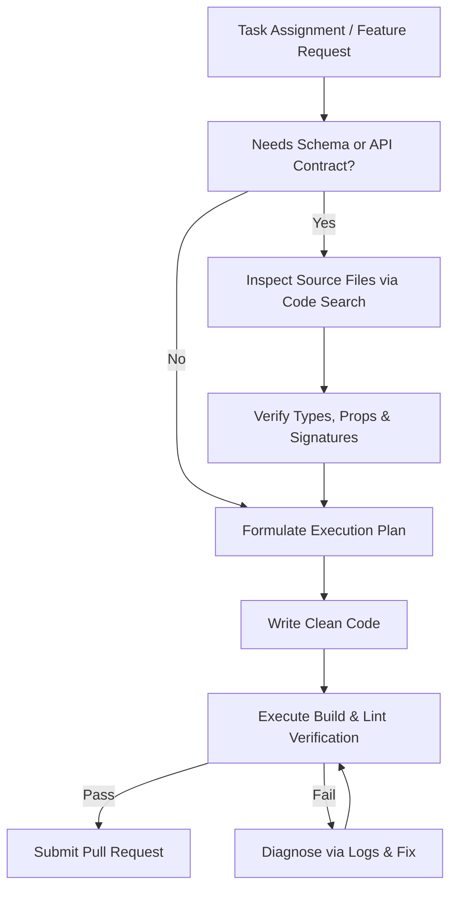

# KitchenMind Enterprise Documentation

## Document 20: Development Standards and Contribution Guide

---

### 1. Development Philosophy: The Zero-Guessing Policy

KitchenMind maintains an uncompromised standard of software engineering quality. Central to this philosophy is the **Zero-Guessing Policy**:

> **Zero-Guessing Rule**: No developer (human or AI agent) shall ever infer database schema definitions, API signatures, file locations, or variable names from memory or partial snippets. Always inspect authoritative source files using codebase search tools (`view_file`, `grep_search`, `list_dir`) before writing or editing code.



---

### 2. Coding Guidelines & JavaScript Standards

#### 2.1 React & Component Design Rules
* **Functional Components**: Write modern React functional components using standard hooks (`useState`, `useMemo`, `useCallback`, custom hooks).
* **Component Granularity**: Keep components focused on a single responsibility. Large page views must delegate UI sections to subcomponents in `src/components/`.
* **Prop Validation & Types**: Verify prop structures explicitly. Avoid unvalidated object property access that can trigger runtime `TypeError` or `NullPointerException`.
* **Dynamic Layout Math**: Calculate layout heights dynamically using flexbox/grid or container bounds. Never hardcode arbitrary static pixel offsets (e.g. `top: calc(100% + 14px)` without container context).

#### 2.2 Formatting & Style
* **Indent**: 2 spaces (no tab characters).
* **Quotes**: Single quotes `'...'` for strings; backticks `` `...` `` for template literals.
* **Semicolons**: Omit unnecessary semicolons (Standard JS style as enforced by ESLint).

---

### 3. File & Directory Naming Conventions

To ensure clean project navigation, adhere to the following file naming conventions:

| Entity Type | Convention | Example File Path |
| :--- | :--- | :--- |
| **React Components** | PascalCase (`.jsx`) | `src/components/MealCard.jsx` |
| **Page Components** | PascalCase (`.jsx`) | `src/pages/BillScanner.jsx` |
| **Zustand Stores** | camelCase with `use` prefix (`.js`) | `src/store/useInventoryStore.js` |
| **Custom React Hooks** | camelCase with `use` prefix (`.js`) | `src/hooks/useMealPlanner.js` |
| **Utility Modules** | camelCase (`.js`) | `src/utils/formatters.js` |
| **Services / Clients** | camelCase (`.js`) | `src/services/supabase.js` |
| **Database Migrations**| Sequential 4-digit prefix (`.sql`) | `supabase/migrations/0004_rpc.sql` |
| **Documentation** | Numbered UPPERCASE (`.md`) | `docs/20_DEVELOPMENT_STANDARDS.md` |

---

### 4. State Mutation Rules

#### 4.1 Zustand Local State Mutations
* **Immutable Updates**: State stores must return new state copies without mutating the previous state object directly.
* **Transient vs Global State**: Keep transient form inputs local to components (`useState`). Only sync committed domain models to Zustand or React Query cache.

```javascript
// ✅ Correct Zustand Immutable Mutation
set((state) => ({
  inventory: state.inventory.map((item) =>
    item.id === updatedItem.id ? { ...item, ...updatedItem } : item
  ),
}))

// ❌ WRONG: Direct State Mutation
set((state) => {
  state.inventory.push(newItem) // Mutates state array in-place!
  return state
})
```

#### 4.2 Error Normalization in Mutations
All asynchronous service invocations inside Zustand actions or React Query mutations must wrap call sites in `try/catch` blocks and pass caught errors through `normalizeError`:

```javascript
import { normalizeError } from '../utils/errors'
import { logger } from '../utils/logger'

try {
  await supabaseService.updateItem(id, payload)
} catch (err) {
  const normalized = normalizeError(err, 'INVENTORY_UPDATE_FAILED')
  logger.error('Failed to update inventory item:', normalized)
  throw normalized
}
```

---

### 5. Git Workflow & PR Quality Criteria

#### 5.1 Branch Naming Standard
* `feature/<short-description>` (e.g. `feature/tiffin-multi-box`)
* `fix/<bug-description>` (e.g. `fix/andaaza-unit-conversion`)
* `docs/<doc-title>` (e.g. `docs/enterprise-architecture`)

#### 5.2 Pull Request Submission Criteria
Before opening or merging a Pull Request, the developer MUST satisfy all of the following requirements:
1. **Zero Lint Errors**: `npm run lint` passes cleanly.
2. **Build Compilation**: `npm run build` generates a production build without errors.
3. **No Superfluous Comments**: Code changes preserve existing documentation comments while removing transient debug statements.
4. **Empirical Verification**: Run the local application (`npm run dev`) and test the affected UI flow end-to-end.

---

### 6. Developer & AI Subagent Onboarding Guide

Welcome to the KitchenMind codebase! Follow these step-by-step instructions to set up your environment and contribute safely:

1. **Clone & Install**:
   ```bash
   git clone https://github.com/keshavaibuilder/kitchenmind.git
   cd kitchenmind
   npm install
   ```
2. **Configure Environment Variables**:
   Copy `.env.example` to `.env` and fill in your Supabase project credentials and Google Gemini API key:
   ```bash
   cp .env.example .env
   ```
3. **Run Local Database Migrations**:
   If using the Supabase CLI:
   ```bash
   supabase db reset
   ```
4. **Start Development Server**:
   ```bash
   npm run dev
   ```
5. **Review Core Documentation**:
   Before modifying database queries or auth handlers, review:
   * [`docs/15_SECURITY_AUTHENTICATION_AND_RLS_POLICIES.md`](file:///mnt/c/Users/keysh/github/kitchenmind/docs/15_SECURITY_AUTHENTICATION_AND_RLS_POLICIES.md)
   * [`docs/16_ERROR_HANDLING_LOGGING_AND_MONITORING.md`](file:///mnt/c/Users/keysh/github/kitchenmind/docs/16_ERROR_HANDLING_LOGGING_AND_MONITORING.md)
   * [`docs/18_DEPLOYMENT_DEVOPS_AND_CI_CD.md`](file:///mnt/c/Users/keysh/github/kitchenmind/docs/18_DEPLOYMENT_DEVOPS_AND_CI_CD.md)
