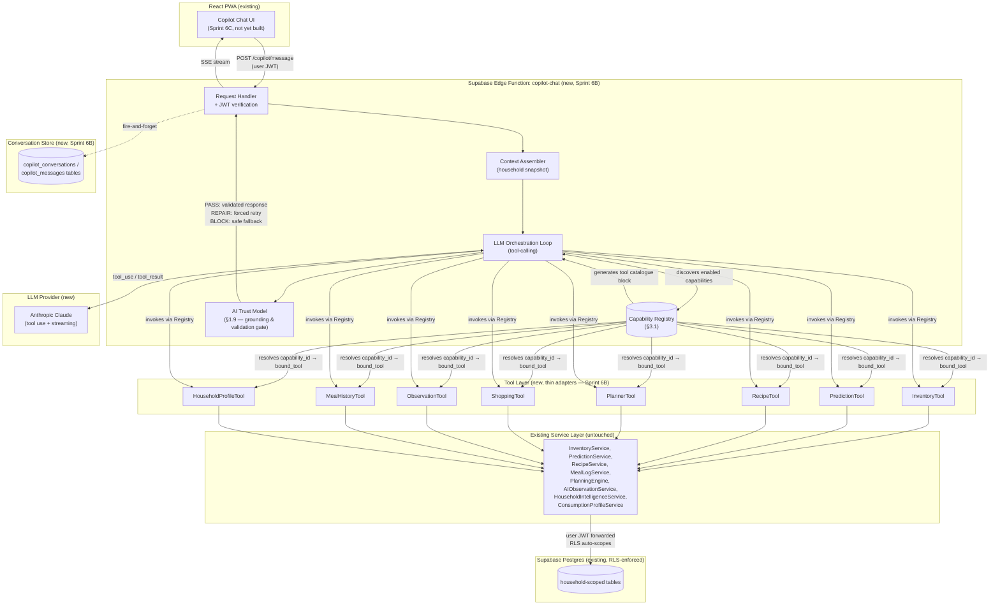
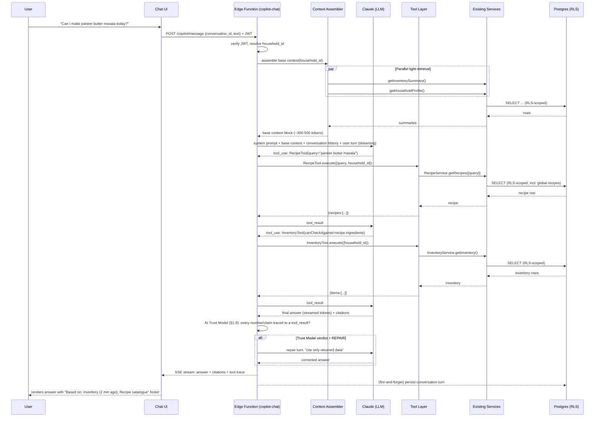
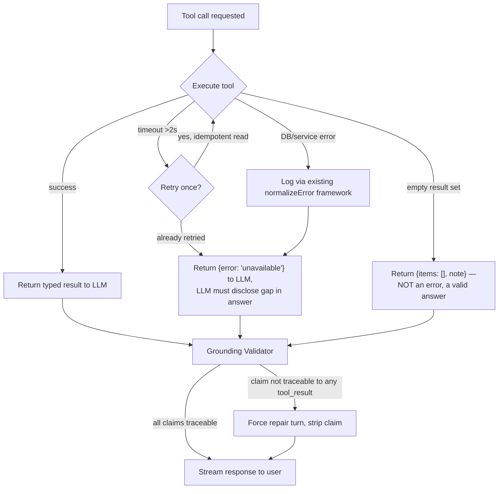
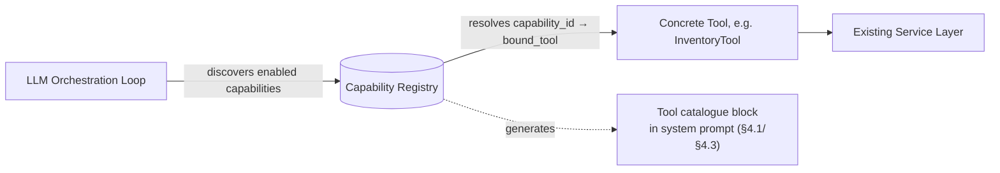

# KitchenMind: AI Copilot — Architecture & Technical Design

**Document Version:** 1.2.0
**Status:** Approved & Frozen (design, §1–§11) + Sprint 6B Implemented (§0.4)
**Domain:** Conversational Intelligence / AI Copilot Layer
**Sprint:** 6A — AI Copilot Architecture & Technical Design
**Depends on:** `02_SYSTEM_ARCHITECTURE.md`, `03_DATABASE_ERD_AND_SCHEMA.md`, `07_ANDAAZA_AI_LEARNING_ENGINE.md`, `09_RECIPE_AND_MEAL_LOGGING_SPECIFICATION.md`, `12_API_AND_SERVICES_CATALOGUE.md`, `15_SECURITY_AUTHENTICATION_AND_RLS_POLICIES.md`, `19_IMPLEMENTATION_STATUS_AND_ROADMAP.md`

---

## 0. Document Control

### 0.0 Revision History

| Version | Date | Change |
|---|---|---|
| 1.0.0 | 2026-08-09 | Initial design specification, all 10 deliverables |
| 1.1.0 | 2026-08-09 | **Approved as frozen**, with two additions requested at approval: §3.1 Capability Registry (the abstraction layer above concrete Tools) and §1.9 AI Trust Model (the mandatory grounding & validation pipeline, formalizing what v1.0.0 described informally as the "Grounding Validator"). No other section changed in substance; cross-references renumbered where §3.x subsections shifted. |
| 1.2.0 | 2026-08-09 | **Sprint 6B implemented against this frozen design.** §1–§11 below are unchanged (the frozen design remains the authoritative spec); this revision only adds §0.4, an implementation-status record. Full implementation detail lives in `12_API_AND_SERVICES_CATALOGUE.md` §3 (not duplicated here) so this document stays a design reference, not a changelog. |

### 0.1 Scope of This Sprint

This document is an **architecture and design specification only**. No production code, database migrations, UI implementation, service implementation, or LLM integration was written to produce it. Everything below is a proposal to be reviewed and then implemented across Sprints 6B–6E (§10). **As of v1.1.0, this design is frozen** — Sprint 6B implementation should treat it as the authoritative reference; further changes require a new revision entry above, not silent drift.

### 0.4 Implementation Status — Sprint 6B (added v1.2.0)

Sprint 6B ("AI Runtime & Tool Framework") implemented the execution engine specified below, as `supabase/functions/copilot-chat/` (Deno Edge Function, per ADR-6A-1 §1.2). No chat UI, no write-capable AI — both correctly out of scope per the Sprint 6B brief and this document's own §11. **Full implementation detail, file-by-file, is documented in `12_API_AND_SERVICES_CATALOGUE.md` §3** (Capability Registry, Tool Framework, Context Assembler/Prompt Builder, AI Trust Model, Provider Abstraction, Conversation Store, Telemetry, Orchestrator, Testing, Known Limitations) — this section only records the two points where implementation required resolving something this design left ambiguous, since the Sprint 6B brief requires deviations to be documented.

**Clarifying resolution 1 — LLM provider selection.** §1.3's architecture diagram labels the LLM box "Anthropic Claude," but no ADR in this document actually commits to a specific provider — the label was illustrative. The Sprint 6B brief specified a provider abstraction over Gemini/Groq/SambaNova instead. Implemented as specified in the brief: this is a superset of what §1.2's ADR-6A-1 actually decided (backend hosting, not LLM vendor), not a deviation from a real design commitment. Gemini was made the default specifically because KitchenMind already has a live Gemini key/relationship (the OCR pipeline) — consistent with §7.6's "reuse, don't add a new procurement relationship" spirit.

**Clarifying resolution 2 — streaming vs. Trust Model ordering.** §1.4's sequence diagram shows the LLM's answer streaming to the client *before* the AI Trust Model runs; §1.9 separately states the Trust Model "mechanically blocks any response from shipping until it passes." These two are in tension: literal token-by-token forwarding would let an ungrounded draft reach the client transiently, ahead of validation. The implementation resolves this in favor of §1.9's stronger guarantee: each round is generated and buffered internally, validated, and only the validated (or `BLOCK`-fallback) text is streamed to the client — never a raw, unvalidated draft. This trades a later first-token time for the correctness guarantee §1.9 actually asks for; §7.1's latency budget should be read as "time to first token of the *validated* answer." Recorded here as the resolution of a genuine ambiguity in the frozen text, not a scope change.

**What was not possible to verify in the implementation environment** (disclosed rather than silently assumed away): no live Postgres instance, so migration `0010` is unexecuted; no Groq/SambaNova API key, so those two providers are implementation-complete but not live-tested (Gemini *was* live-verified end-to-end, including a live-discovered API quirk — see `12_API_AND_SERVICES_CATALOGUE.md` §3.6); no deployed Supabase project, so no full end-to-end run against real household data — every piece was verified individually (49 passing Deno tests, `deno lint`/`deno check` clean, a booted local server exercising the complete HTTP request/response/error-code surface, all 128 existing vitest tests still passing) but never as one fully wired live system.

### 0.2 Baseline: What KitchenMind Is Today

As of `v0.5.0` ("Kitchen Intelligence", Phase 5B + RC-1 hardening complete), KitchenMind is a **client-only PWA**: a React/Vite single-page app that talks directly to Supabase (Postgres + Auth + Row-Level Security) via `@supabase/supabase-js`, with one exception — a single client-side `fetch()` call to Google's Gemini API for receipt OCR (`src/lib/gemini.js`). There is:

- **No backend compute layer.** No Express/Fastify server, no Vercel serverless functions, no Supabase Edge Functions exist anywhere in the repository.
- **No existing LLM/GenAI SDK dependency.** `package.json` has zero AI SDK packages (no `@anthropic-ai/sdk`, `openai`, `@google/generative-ai`). The Gemini OCR call is raw `fetch()`, one-shot, non-conversational, no tool-calling.
- **No conversational or agentic pattern anywhere in the codebase.** Everything branded "AI" today — the Andaaza Learning Engine, the Prediction Engine, the Household Intelligence Engine, the Planner's meal scoring — is **deterministic, formula-driven, and explainable by design** (EMA velocity calculations, Bayesian-style confidence formulas, disclosed `score + reasons[]` heuristics). None of it calls an LLM.

**This is the single most important architectural fact governing this design.** The AI Copilot is not an incremental feature bolted onto an existing AI stack — it is **the first conversational, agentic, LLM-backed feature KitchenMind will ship**, and the first feature that requires a real backend compute layer. The design below treats that as a foundational decision (§1.2, ADR-6A-1), not an afterthought.

The one thing already in place that makes this tractable: **Postgres Row-Level Security is the true multi-tenancy boundary**, not application code. Every tenant table's RLS policy filters on `household_id = auth_household_id()`, where `auth_household_id()` is a `SECURITY DEFINER` function resolving `auth.uid() → members.user_id → household_id`. Any query issued under a user's JWT — including one issued by a copilot tool on that user's behalf — is automatically and correctly scoped to their household by the database itself. This is the anchor the entire safety model in §6 is built on.

### 0.3 Acceptance Criteria Checklist

| Deliverable | Section |
|---|---|
| ✅ Complete architecture document | §1 |
| ✅ AI Trust Model (mandatory grounding & validation pipeline) | §1.9 |
| ✅ Knowledge sources defined | §2 |
| ✅ Tool architecture defined | §3 |
| ✅ Capability Registry (abstraction above tools) | §3.1 |
| ✅ Prompt orchestration documented | §4 |
| ✅ Memory model defined | §5 |
| ✅ Safety & permissions defined | §6 |
| ✅ Performance & cost estimated | §7 |
| ✅ API contracts proposed | §8 |
| ✅ Evaluation strategy defined | §9 |
| ✅ Implementation roadmap produced | §10 |
| ✅ No production code / migrations / UI / services written | (this document only) |

---

## 1. Deliverable 1 — AI Copilot Architecture

### 1.1 Design Principles

1. **Grounded, not generic.** Every factual claim in a copilot answer must trace back to a tool call result — a real row, a real formula output — never to the LLM's parametric knowledge. This directly extends the existing house style: the Planner and Dashboard already refuse to be a "black box," always emitting `score + reasons[]`. The copilot inherits that norm.
2. **Reuse the service layer, don't replace it.** `InventoryService`, `PredictionService`, `RecipeService`, `MealLogService`, `PlanningEngine`, `AIObservationService`, `HouseholdIntelligenceService`, and `ConsumptionProfileService` already implement every read the copilot needs (§2, §3). The copilot's "tools" are thin adapters around these, not a parallel data-access layer.
3. **RLS is the authorization boundary, not app code.** Every tool call executes under the requesting user's Supabase session/JWT. No tool ever accepts a `household_id` parameter from the LLM — it is always injected server-side from the authenticated session (§6.1).
4. **The RPC pattern extends, it doesn't get bypassed.** `commit_scanned_bill()` and `mark_meal_cooked()` remain the only two write paths that matter. Any copilot "action" (§6.3) calls these same RPCs through the same services — the copilot never gets a new, parallel way to mutate data.
5. **Fire-and-forget stays fire-and-forget.** Just as Andaaza/AI-observation side effects never block bill commits today, copilot conversation logging (§5) never blocks response latency.

### 1.2 ADR-6A-1: Backend Compute Layer for LLM Orchestration

**Decision needed:** where does the tool-calling loop run? A multi-turn, multi-tool LLM orchestration loop cannot run as a Postgres function (no HTTP egress to an LLM API, no practical way to run an agentic loop in PL/pgSQL) and should not run unauthenticated in the browser (the LLM provider API key would be exposed client-side, and — unlike the Gemini OCR key, which is a low-blast-radius, purpose-limited, domain-restricted key — a full tool-calling copilot key is a much larger liability if leaked, since it could be used to run arbitrary conversations at KitchenMind's expense).

| Option | Pros | Cons |
|---|---|---|
| **A. Supabase Edge Functions (Deno)** — *recommended* | Same platform as the DB already; trivially forwards the caller's Supabase JWT to Postgres so RLS applies with zero extra plumbing; no new hosting relationship; colocated with DB = lower tool-call latency | Deno runtime is less familiar than Node; cold starts on low-traffic functions |
| B. Vercel Serverless/Edge Functions | Matches the implied SPA hosting; large ecosystem | Yet another platform relationship; must manually forward/verify the Supabase JWT and re-derive `household_id`; slightly higher DB round-trip latency (cross-provider) |
| C. Client-side agentic loop (browser calls LLM directly, LLM "calls tools" by asking the client to run them) | No new backend at all | LLM API key exposed in the browser (unacceptable for a paid, high-quota key); no place to enforce token/cost budgets server-side; conversation history and system prompt fully visible/tamperable client-side |

**Recommendation: Option A — Supabase Edge Functions.** It requires exactly one new piece of infrastructure (Edge Functions, already part of the Supabase project KitchenMind already has), preserves the RLS-is-the-boundary invariant with no extra code, and keeps the LLM API key server-side only. This becomes the copilot's backend: a single Edge Function (`copilot-chat`) implementing the orchestration loop described in §1.4, deployed alongside (not replacing) the existing RPCs.

### 1.3 High-Level Architecture



### 1.4 Request Lifecycle (Sequence Diagram)



### 1.5 Context Assembly

Two tiers, to control token budget (see §4.3):

1. **Base context (always injected, every turn):** a compact household snapshot built by parallel, cheap queries — member count, pantry health score, count of low-stock/at-risk ingredients, today's planned meals if any. This is the same shape of data the Dashboard already computes via `dashboardInsights.js`, so it is cheap (indexed, already-optimized queries) and reused, not reinvented.
2. **On-demand retrieval (tool calls):** anything more specific — full inventory list, a specific recipe, meal history, spending trend — is fetched only when the LLM's reasoning determines it's needed, via explicit tool calls. This keeps the default token budget small and keeps every deep fact traceable to a discrete, loggable tool invocation (good for both grounding and evaluation, §9).

### 1.6 Retrieval Pipeline

Retrieval is **tool-driven, not embedding/vector-based.** KitchenMind's household data is small (tens to low hundreds of rows per household across inventory, recipes, meal logs), structured, and already queryable with precise, indexed SQL through existing services. There is no unstructured document corpus requiring semantic search. Introducing a vector store would add infrastructure, staleness-management burden, and a new class of retrieval-relevance failure for no benefit at this data scale — so it is explicitly **not** part of this design. If KitchenMind later adds long-form content (recipe write-ups, user-uploaded notes) at a scale where keyword/structured queries stop being precise enough, revisit this in a future sprint.

### 1.7 Response Generation & Explainability

Every copilot response separates **prose** (natural-language answer) from **structured citations** (which tools were called, with what result summary, and how stale that data is). The chat UI (Sprint 6C) is expected to render citations as a collapsible "Based on" footer — mirroring the Planner's existing `reasons[]` pattern, just generalized to arbitrary tool output. The LLM is instructed (§4) to reference these citations inline where natural ("your rice will run out in ~4 days based on your last 3 purchases") rather than presenting bare assertions.

### 1.8 Failure Handling



Failure handling rules:
- **Tool failure never becomes a fabricated answer.** If `PredictionTool` is unavailable, the LLM must say "I couldn't check your prediction data right now" — never guess a shelf-life number.
- **Empty results are valid, not errors.** `getExpiringBatches()` legitimately returns `[]` today (no writer populates `expiry_date` yet) — the copilot must say "I don't have expiry-date data yet for your items" rather than silently omitting the answer or, worse, inventing a date. This is called out explicitly because it's a real, current gap (§2.9).
- **Partial multi-tool failures degrade gracefully.** If 2 of 3 needed tools succeed, answer with what's available and disclose the gap, rather than failing the whole turn.
- **LLM provider outage:** the Edge Function returns a typed `503 copilot_unavailable` error (§8.4); the chat UI shows a static fallback ("Copilot is temporarily unavailable — try the Dashboard or Planner directly") rather than a spinner-of-death, since every one of the copilot's answers is reachable through existing deterministic UI today.

### 1.9 AI Trust Model — Mandatory Grounding & Validation Pipeline

v1.0.0 of this document described claim-checking informally, scattered across the "Grounding Validator" node in §1.8's diagram, §4.4's hallucination-prevention rules, and §9.2's grounding metric. This section formalizes that into a single, named, **mandatory** pipeline stage — the AI Trust Model — that every response must pass through before it is allowed to reach the user. It exists to make the Objective's core requirement ("must answer using KitchenMind's own intelligence, not generic LLM responses") a structural guarantee, not a prompting convention the model could ignore on a bad day.

**Principle: the Trust Model is a gate, not a linter.** It does not advise the LLM to be more careful — it mechanically blocks any response from shipping until it passes. The worst-case outcome of the pipeline is a disclosed "I don't know" (§4.4); a fabricated fact reaching the user is treated as a pipeline defect, not an acceptable model error rate.

```mermaid
graph TD
    Draft[LLM produces draft answer for the turn] --> Ledger[Stage 1: Evidence Ledger check —<br/>every tool_result this turn is the ONLY<br/>permissible evidentiary basis]
    Ledger --> Extract[Stage 2: Claim Extraction —<br/>parse numbers, entities, dates,<br/>recommendations out of the draft]
    Extract --> Match[Stage 3: Claim-to-Evidence Matching —<br/>does each claim trace to some<br/>tool_result in the ledger?]
    Match -->|all claims traced| Disclosure[Stage 4: Disclosure Enforcement —<br/>does every ledger entry flagged as a<br/>known gap/stale/empty (§2.9) carry<br/>its mandated caveat in the draft?]
    Match -->|untraced claim found| Repair[REPAIR: forced repair turn —<br/>"cite only returned data", claim stripped]
    Disclosure -->|caveats present or N/A| Cite[Stage 5: Citation Attachment —<br/>citations array generated deterministically<br/>FROM the ledger, never LLM-authored]
    Disclosure -->|caveat missing| Repair
    Repair --> Retry{Repair succeeds?}
    Retry -->|yes| Cite
    Retry -->|no, second failure| Block["BLOCK: replace with safe fallback<br/>disclosure — never ship the draft"]
    Cite --> Pass[PASS: stream to user]
    Block --> Pass2[Ship fallback, log BLOCK verdict]
```

**Stage detail:**

1. **Evidence Ledger.** Every `tool_result` returned during the turn (§1.4, §3) is appended to an in-memory, per-turn ledger: `{tool, data, asOf, source}`. Nothing outside this ledger — no parametric LLM knowledge, no prior-turn assumption not re-verified this turn — is a legitimate source for a factual claim.
2. **Claim Extraction.** The draft answer is parsed for checkable assertions: numeric values (grams, days, counts, currency), named entities (canonical ingredient names, recipe names/IDs), dates, and recommendation statements ("you should cook X tonight").
3. **Claim-to-Evidence Matching.** Each extracted claim is checked against the ledger. A claim with no matching ledger entry is **untraced**.
4. **Disclosure Enforcement.** Independently of claim-matching, if the ledger contains a known-gap marker from §2.9 (an empty result, a `stale: true` prediction, missing expiry data), the draft is checked for the corresponding mandated caveat. A missing caveat is treated exactly like an untraced claim — it forces a repair turn, not a "nice to have."
5. **Citation Attachment.** Only after a PASS verdict, the `citations` array (§4.5, §8.2) is generated **mechanically from the ledger**, never composed by the LLM — this guarantees citations can never drift from what was actually retrieved, since they are a deterministic projection of Stage 1's data rather than free text the model could get wrong.

**Verdicts:** `PASS` (ship, citations attached) → `REPAIR` (one forced retry turn instructing the model to cite only ledger data or disclose the gap) → `BLOCK` (repair still fails, or a claim outright contradicts ledger evidence — the draft is discarded and replaced with a safe, generic disclosure; this is logged as a hard failure, not silently swallowed).

**Operational signal, not just a gate:** every turn's verdict (`PASS` / `REPAIR` / `BLOCK`) is logged and becomes an evaluation metric in its own right (§9.2) — a rising `REPAIR`/`BLOCK` rate is an early warning that a prompt, tool-schema, or model change has degraded grounding, independent of the offline golden-set run.

---

## 2. Deliverable 2 — Knowledge Sources

All sources below are **existing tables/services**; no new schema is required to build Sprint 6B (the one exception, spend trend, is called out).

| Source | Purpose | Freshness | Read/Write | Performance |
|---|---|---|---|---|
| **Inventory** (`inventory`) | Current stock levels, low-stock thresholds | Real-time (updated on every commit/cook) | Read-only for copilot | Single indexed query on `household_id`, <100ms |
| **Inventory Batches** (`inventory_batches`) | FIFO batch detail, cost, purchase date; `expiry_date` column exists but is **always NULL today** — no writer populates it | Real-time where populated | Read-only | Indexed via parent `inventory_id`, <100ms |
| **Bills** (`bills`, `bill_items`) | Purchase history, spend-per-visit, merchant | Real-time (append-only after `commit_scanned_bill()`) | Read-only | `bill_date` should be indexed for month-range queries (verify in Sprint 6B) |
| **Recipes** (`recipes`) | Global catalogue (8 seeded) + household custom recipes | Static/slow-changing | Read-only | Small table, full scan acceptable; keyword `ILIKE` on `name`/`tags` is fine at this scale |
| **Meal Log / Meal History** (`meal_log`, `stock_deductions`) | What was cooked, when, for how many, and what stock it consumed | Real-time (on `mark_meal_cooked()`) | Read-only | Indexed on `household_id, date` |
| **Planner outputs** (`PlanningEngine` — pure computation, not a table) | Today's plan, week preview, meal scoring, shopping suggestions | Computed fresh per call from Inventory + Recipes + Predictions | Read-only (no persistence) | Pure JS, sub-millisecond once inputs are fetched |
| **AI Observations** (`ai_observations`) | Append-only fact stream: new ingredient, first purchase, unusual quantity, duplicate purchase, pantry-diversity milestones | Real-time, append-only | Read-only | `getRecentObservations(limit=20)`, already paginated |
| **Household Learning Profile** (`ingredient_consumption_profile`, `purchase_patterns`, `household_learning_profile`, `prediction_cache`) | EMA-based purchase velocity, prediction cache | Updated fire-and-forget after each bill commit; `prediction_cache` carries a `ttl_expires_at` (24h) not currently enforced by any reader — **the copilot must be the first consumer to check and respect it** | Read-only | Indexed on `household_id, canonical_name` |
| **Andaaza Volumetric Profile** (`andaaza_profile`) | Grams-per-expression calibration | N/A — **feature unimplemented** (empty stub service, `andaazaFactor` hardcoded to `1.0` everywhere) | N/A | The copilot must not claim volumetric-calibration confidence it doesn't have — see §2.9 |
| **Household / Members / Preferences** (`household`, `members`, `preferences`) | Household size, roti preferences, non-veg days, excluded vegetables | Slow-changing | Read-only | Tiny table, cached in base context (§1.5) |
| **Budget** (`budget_monthly`) | Monthly budget targets by category | Table exists, **Phase 5C not built — nothing reads or writes it meaningfully today** | N/A | Do not build a tool against this table until Phase 5C ships |

### 2.9 Known Gaps the Copilot Must Be Honest About

These are real, current limitations in KitchenMind's data — surfaced here so the copilot's design (and its system prompt, §4.1) treats them as first-class constraints rather than something to paper over with a plausible-sounding LLM guess:

- **"Which items will expire this week?"** — cannot be answered today. `expiry_date` exists as a column but has no writer. The copilot must respond that expiry tracking isn't populated yet, and (per §10) this motivates prioritizing "Expiry Data Capture" ahead of/alongside the copilot's own rollout.
- **"Why has my grocery spending increased?"** — partially answerable. `bills.total_amount` + `bill_date` support a simple month-over-month sum *if* a new read-only aggregation method is added to `HouseholdIntelligenceService` (no schema change — just a new query). Full category-level budget-variance analysis needs Phase 5C (`budget_monthly` wiring), which is out of this sprint's scope. The copilot should answer the coarse version today and disclose the limit on the finer one.
- **"How long will my rice last?"** — answerable, but the honest caveat is that `consumption_velocity_g_per_day` is derived from **purchase cadence, not actual eating rate** (cooking events don't feed back into the Phase 4A model). The copilot should phrase this as "based on how often you've been buying rice" rather than implying it tracked consumption directly.
- **Andaaza volumetric calibration** ("1 katori of rice") is not implemented. If a user's question implies portion-size precision, the copilot should fall back to recipe base-quantities and disclose that portion calibration isn't active yet, rather than inventing a confidence-weighted grams figure.

---

## 3. Deliverable 3 — Tool Architecture

### 3.1 Capability Registry

A **Tool** (§3.3) is a concrete adapter — a function with an input/output contract bound to specific service methods. A **Capability** is the registry entry that describes what that tool does at a level the orchestrator, and everything around it (evaluation harness, permission audits, prompt-catalogue generation), can reason about generically. The Capability Registry is the abstraction layer that sits between the LLM orchestrator and the concrete tools — the orchestrator never talks to a hardcoded tool list; it talks to the registry, and the registry resolves which tool actually executes.



**Why this indirection earns its place (not premature abstraction):** without it, "which tools exist" is implicitly defined by whatever JSON schemas someone hand-pastes into the system prompt (§4.1 block 2) — drift-prone, and with no single place to check a capability's access class before wiring it into the confirmation flow (§6.3/§6.4). With the registry, the tool-catalogue prompt block (§4.3) is a deterministic projection of the registry, not hand-maintained text, and a capability's `access_class` mechanically decides whether it needs confirmation — that isn't left to the LLM or the prompt author to remember correctly every time.

**Registry entry schema** (design-level — no implementation, no new database table required for Sprint 6B; this can be a static, versioned config the Edge Function loads at cold start):

| Field | Purpose |
|---|---|
| `capability_id` | Stable identifier, e.g. `inventory.read`, `recipe.search`, `meal.mark_cooked` |
| `description` | Natural-language description — this **is** the text injected into the system prompt's tool catalogue block (§4.1); token budget for that block (§4.3) is a function of registry size, not hand-written prompt copy |
| `bound_tool` | Which concrete Tool implementation (§3.3) executes this capability. 1:1 for every capability in this design — no speculative many-to-many is being built now (see below) |
| `io_schema` | Reference to the tool's input/output contract (§3.3) |
| `access_class` | `read` \| `write` — a `write`-classed capability is mechanically routed through the confirmation flow (§6.3/§6.4); this is a registry-level fact, not prompt-level guidance |
| `household_scope` | Always `injected` — formalizes §3.2's rule as a registry invariant: **the registry refuses to register a capability whose `io_schema` includes a household-identifying field.** This is the mechanical backstop behind §6.1's authorization boundary |
| `data_sources` | Which §2 knowledge source(s) this capability reads — makes per-source freshness/staleness rules (§2, §2.9) attachable per-capability instead of tribal knowledge |
| `version` | Capabilities are versioned; logged conversation traces (§5.1, §9) reference the exact `capability_id@version` invoked, so a capability can evolve or retire without invalidating historical evaluation data |
| `deprecated_at?` | Nullable; a deprecated capability stays resolvable for auditing old traces but is excluded from what's offered to the orchestrator |
| `perf_budget_ms` | Per-capability timeout, replacing §3.2's single global 2s constant with a configurable field — most capabilities keep the 2s default, but this leaves room for a future capability with a genuinely different cost profile without a special-cased exception in the orchestrator |

**Initial registry (Sprint 6B, 1 capability : 1 tool):**

| `capability_id` | `bound_tool` | `access_class` |
|---|---|---|
| `inventory.read` | InventoryTool | read |
| `prediction.read` | PredictionTool | read |
| `recipe.search` | RecipeTool | read |
| `planner.plan` | PlannerTool | read |
| `shopping.suggestions` | ShoppingTool | read |
| `observation.recent` | ObservationTool | read |
| `meal_history.read` | MealHistoryTool | read |
| `household.profile` | HouseholdProfileTool | read |
| `meal.mark_cooked` *(Sprint 6D, not built in 6B)* | — (routes through existing `mark_meal_cooked()` RPC, §6.3) | **write** |

The last row is listed now, unbuilt, specifically to show that write-capability handling is designed in from day one rather than retrofitted in Sprint 6D — when `meal.mark_cooked` is registered, its `access_class: write` is what triggers the confirmation UX (§6.4) automatically, with no orchestration-code change.

**Scope discipline:** the 1:1 capability-to-tool mapping is deliberate and minimal for Sprint 6B. The indirection exists so that later sprints — 6D's confirmed write actions, 6E's personalization-gated capabilities (e.g., a future household tier that doesn't get `shopping.suggestions`) — have a natural seam to extend into, not because a many-to-many mapping is needed today.

### 3.2 Design Rules for All Tools

- **`household_id` is never an LLM-supplied parameter.** It is injected by the Edge Function from the verified session before the tool executes. The LLM's tool-call schema simply does not expose that field. (Enforced structurally at the registry level too — see §3.1's `household_scope: injected` invariant.)
- **Every tool is read-only in Sprint 6B.** Write/action tools (§6.3) are deferred to Sprint 6D behind an explicit confirmation step, mechanically gated by the registry's `access_class` (§3.1).
- **Every tool returns a typed envelope**: `{ ok: boolean, data?: T, error?: {code, message}, asOf: ISOTimestamp, source: string }`. `asOf` and `source` exist specifically so the citation layer (§1.7), the AI Trust Model's Evidence Ledger (§1.9), and the grounding validator have something concrete to point at.
- **Timeout budget: 2s per tool call by default** (overridable per-capability via `perf_budget_ms`, §3.1), one retry for idempotent reads only, then degrade (§1.8).

### 3.3 Tool Contracts

**InventoryTool** — wraps `InventoryService.getInventory()`, `getExpiringBatches()`
- *Input:* `{ filter?: { lowStockOnly?: boolean, category?: string } }`
- *Output:* `{ items: [{ canonical_name, quantity_grams, display_unit, low_stock_threshold, is_low_stock }] }`
- *Error handling:* empty inventory → `ok: true, data: {items: []}`, not an error
- *Perf:* single indexed query, p95 <150ms

**PredictionTool** — wraps `PredictionService.getHouseholdPredictions()`
- *Input:* `{ canonical_name?: string }` (optional single-ingredient filter)
- *Output:* `{ predictions: [{ canonical_name, days_remaining, depletion_date, is_low_stock_risk, velocity_g_per_day, confidence }] }`
- *Error handling:* must check `prediction_cache.ttl_expires_at`; if stale, either recompute (if cheap) or flag `stale: true` in the record so the LLM discloses it
- *Perf:* p95 <200ms (cache-hit path); confidence field always present, since every number here already carries a formula-derived confidence score in the underlying service — the tool must not drop it

**RecipeTool** — wraps `RecipeService.getRecipes/getRecipeById`, composes with `ingredientAvailability.js` for a `canCookNow` mode
- *Input:* `{ query?: string, mealType?: string, canCookNow?: boolean }`
- *Output:* `{ recipes: [{ id, name, servings, ingredients, availability?: { missing: [...], shortfall_grams } }] }`
- *Error handling:* no matching recipe → `ok: true, data: {recipes: []}`; the copilot must not invent a recipe that isn't in the catalogue
- *Perf:* small table, full scan acceptable at current data volume; revisit indexing if household-custom recipes grow large

**PlannerTool** — wraps `PlanningEngine.generateTodaysPlan/generateWeekPreview/scoreMealCandidate`
- *Input:* `{ scope: "today" | "week" }`
- *Output:* `{ plan: [...], reasons: [...] }` — preserves the existing disclosed `score + reasons[]` shape verbatim; the copilot must surface `reasons` in its answer, not just the recommendation
- *Perf:* pure computation once inputs are fetched, sub-50ms

**ShoppingTool** — wraps `PlanningEngine.generateShoppingSuggestions()`
- *Input:* `{}`
- *Output:* `{ suggestions: [{ canonical_name, reason, urgency }] }`
- *Perf:* pure computation, sub-50ms

**ObservationTool** — wraps `AIObservationService.getRecentObservations()`
- *Input:* `{ limit?: number (default 20, max 50) }`
- *Output:* `{ observations: [{ type, canonical_name, details, created_at }] }`
- *Perf:* already paginated, p95 <150ms

**MealHistoryTool** — wraps `MealLogService.getMealHistory/getRecentlyCookedRecipeIds/getStockDeductionsForMeal`
- *Input:* `{ days?: number (default 30), mealType?: string }`
- *Output:* `{ meals: [{ date, meal_type, recipe_name, headcount, status }] }`
- *Perf:* indexed on `household_id, date`, p95 <150ms

**HouseholdProfileTool** — wraps `HouseholdIntelligenceService.getHouseholdProfile()`, `ConsumptionProfileService.getAllProfiles()`, plus (new, Sprint 6B, no schema change) a coarse `getSpendByMonth()` aggregation over `bills`
- *Input:* `{ months?: number (default 3, for spend trend) }`
- *Output:* `{ pantry_diversity_score, top_categories, shopping_frequency_days, preferred_shopping_day, consumption_profiles: [...], spend_by_month?: [{ month, total }] }`
- *Error handling:* `spend_by_month` omitted (not errored) if the underlying aggregation isn't yet implemented, so this tool degrades cleanly if 6B ships it late

### 3.4 Composite / Derived Answers

Some example questions in the brief require **more than one tool**, orchestrated by the LLM itself, not by a bespoke "mega-tool":
- *"Can I make paneer butter masala today?"* → `RecipeTool(query=...)` then `InventoryTool()` (or `RecipeTool(canCookNow=true)` directly, which internally composes `ingredientAvailability.js`).
- *"What should I buy this weekend?"* → `ShoppingTool()` + `PredictionTool()` for urgency framing.
- *"Show me recipes that reduce food waste"* → `InventoryTool()` (near-low-stock/near-expiry items, where available) + `RecipeTool(query=...)` cross-referenced — this is a genuinely new composition not covered by any single existing service method today; flagged for Sprint 6B design review, not a schema change.

This composition-by-the-LLM approach is deliberate: it keeps each tool small, single-purpose, and independently testable (§9), and it makes the tool trace itself a legible explanation of *how* the copilot reasoned, which is valuable for both explainability (§1.7) and evaluation (§9).

---

## 4. Deliverable 4 — Prompt Orchestration

### 4.1 System Prompt (Structure, Not Final Copy)

The system prompt is assembled from four fixed blocks, in this order, so the stable prefix (blocks 1–2) can be prompt-cached (§7.4):

1. **Identity & grounding contract** (static): "You are the KitchenMind Copilot... Every factual claim about this household's data must come from a tool result... If a tool returns no data, say so explicitly rather than guessing... Known current limitations: expiry-date tracking is not yet populated; volumetric portion calibration is not active; spend-trend analysis is limited to raw bill totals..." — encodes the §2.9 gaps directly, so the model doesn't need to rediscover them per-turn.
2. **Tool catalogue** (static per deploy, changes only when tools change): JSON schemas for all tools in §3.
3. **Household base context** (per-request, from Context Assembler §1.5): the small, cheap snapshot.
4. **Conversation history + current user turn** (per-request, from session memory §5.1).

### 4.2 Retrieval Strategy

Deterministic pre-fetch (block 3) + on-demand tool calls (§1.5–1.6). No retrieval ranking/reranking model is needed at this data scale — the LLM's own reasoning over a small tool catalogue is the retrieval strategy.

### 4.3 Token Budgeting

| Block | Est. tokens | Notes |
|---|---|---|
| Identity & grounding contract | ~350 | static, cached |
| Tool catalogue (8 tools) | ~900 | static, cached |
| Household base context | ~200–400 | per-request, cheap |
| Conversation history | ~0–1500 | capped at last N turns (§5.1), summarized beyond that |
| User turn | ~20–100 | |
| **Pre-tool-call total** | **~1500–3200** | |
| Per tool_result injected | ~100–400 each | typically 1–3 tool calls per turn (§7.2) |
| Final answer generation | ~150–400 output tokens | |

Hard cap: if projected context exceeds ~6000 tokens mid-loop (e.g., a runaway multi-tool chain), the orchestrator forces a synthesis turn ("answer now with what you have") rather than allowing unbounded tool-call chaining.

### 4.4 Hallucination Prevention

1. **Tool-result-only facts**, enforced by the system prompt's grounding contract (§4.1) *and* checked mechanically by the AI Trust Model's Claim-to-Evidence Matching stage (§1.9) — numbers and named entities in the draft answer are cross-checked against the set of values present in the turn's tool results; unmatched numeric claims trigger a forced repair turn.
2. **No speculative recipes.** The LLM may not propose a dish that isn't in `RecipeTool`'s catalogue as if it were cookable in-app; it may clearly label general cooking suggestions as "not in your recipe catalogue" if the user explicitly asks for open-ended ideas.
3. **Explicit "I don't know yet" responses are treated as correct, not as failures**, in evaluation (§9) — this is the single biggest lever against hallucination in a small-data-surface app like this: the model should prefer disclosing a gap (§2.9) over filling it with a plausible guess.

### 4.5 Citation Strategy

Every tool_result carries `asOf` + `source` (§3.2). The final answer is returned as `{ prose: string, citations: [{ tool, source, asOf, summary }] }` (see §8.2) so the UI can render an inline or footer citation without the LLM needing to hand-format markdown citations itself — per the AI Trust Model's Stage 5 (§1.9), this `citations` array is generated deterministically from the turn's Evidence Ledger, never LLM-authored, so it can never drift from what was actually retrieved.

### 4.6 Explainability Rules

- Recommendations (meals, shopping) must surface the underlying `reasons[]` from `PlannerTool`/`ShoppingTool` verbatim, not a paraphrase that could drift from the actual scoring logic.
- Predictions must surface `confidence` alongside the number, not just the number.
- If a claim depends on a known gap (§2.9), the caveat is mandatory, not optional flavor text.

---

## 5. Deliverable 5 — Memory Model

### 5.1 Session Memory (Ephemeral, Conversation-Scoped)

- Stored in a new `copilot_conversations` / `copilot_messages` table pair (Sprint 6B), `household_id`-scoped and RLS-protected identically to every other tenant table.
- Retained per-conversation for the life of that conversation thread; the last **N=10 turns** are included verbatim in context (§4.3); older turns are **summarized** (a short LLM-generated recap, regenerated periodically) rather than dropped outright, so long-running conversations don't silently lose earlier constraints the user stated ("I'm vegetarian this week").
- Tool-call traces are persisted alongside each assistant turn — this is what makes the evaluation strategy (§9) and citation UI (§1.7) possible after the fact, not just live.

### 5.2 Long-Term Household Knowledge

Two tiers, kept explicitly distinct:

1. **Structural preferences** — already exist in `preferences`/`members`/`household` (non-veg days, excluded vegetables, roti preferences). The copilot **reads** these; it does not get a separate, parallel preference store that could drift from what the rest of the app uses.
2. **Conversational preferences** — things a user states *only* in chat ("I don't like okra," "we're trying to cut down on rice") that aren't captured by any existing structured field. These require a **new, explicit-opt-in** table (e.g., `copilot_learned_preferences`), written only when the user confirms ("Got it, I'll remember you don't like okra — ok?") — never inferred silently. This mirrors the household's existing `excluded_vegetables` field in shape but is scoped to the copilot until/unless a future sprint promotes it into the structured preferences model.

### 5.3 User Preferences vs. Household Preferences

Preferences in `members`/`preferences` are household-wide (shared kitchen). Conversational memory (§5.2 tier 2) is captured **per household**, not per individual user, to match that existing model — KitchenMind has no concept of a personal, cross-household user profile today, and this design does not introduce one.

### 5.4 Privacy Boundaries

- **No cross-household memory or training.** Nothing learned in one household's conversations is visible to, or used to influence answers for, any other household — enforced by the same RLS `household_id` scoping as every other table (§0.2, §6.1).
- **No training on customer data by the LLM provider.** The Edge Function must call the LLM provider's zero-data-retention / non-training API tier (both Anthropic and major providers offer this for business/API usage) — a procurement/contract requirement to confirm before Sprint 6B, not a code-level toggle.
- **What's ephemeral vs. persisted:** raw LLM provider request/response payloads are not persisted beyond what's needed for the conversation transcript and evaluation logging (§9); no bill images or OCR raw text are ever included in copilot context — only structured, already-parsed data from the services layer.

---

## 6. Deliverable 6 — Safety & Permissions

### 6.1 Authorization Boundaries

Unchanged from the rest of the app: the Edge Function receives and verifies the user's Supabase JWT, all downstream service calls execute under that session, and Postgres RLS (`household_id = auth_household_id()`) is the actual enforcement point (§0.2). **No tool accepts `household_id` as an LLM-controlled parameter** — this is the primary structural defense against prompt-injection-driven cross-tenant access: even if a malicious/crafted user message tried to get the LLM to "ask for household X's data," the tool layer has no parameter through which that request could even be expressed, and RLS would reject it at the DB layer regardless. The Capability Registry (§3.1) makes this a registration-time invariant rather than a per-tool convention someone has to remember: its `household_scope: injected` field means a capability whose `io_schema` exposed a household-identifying parameter simply cannot be registered.

### 6.2 Household Isolation

Identical to existing isolation guarantees (§0.2, `15_SECURITY_AUTHENTICATION_AND_RLS_POLICIES.md`) — no new isolation mechanism is introduced; the copilot rides on the existing one. Global, read-only tables (`recipes` where `household_id IS NULL`, `ingredient_aliases`) remain readable across households, exactly as they are for the rest of the app today.

### 6.3 Read-Only vs. Write Operations

- **Sprint 6B–6C: read-only.** All 8 capabilities registered in §3.1 have `access_class: read`. The copilot can answer questions and make recommendations but cannot change any data.
- **Sprint 6D: confirmed actions only**, gated mechanically by `access_class: write` in the registry (§3.1), and only through **existing RPCs**:
  - "Mark tonight's dinner as cooked" → `mark_meal_cooked()` via `MealLogService`, identical to the existing Cook flow.
  - Anything resembling "add to shopping list" depends on Shopping List CRUD (§10, listed as a pre-copilot roadmap item in `19_IMPLEMENTATION_STATUS_AND_ROADMAP.md` §4.2) actually existing first.
  - **No new write path is created for the copilot.** If an action isn't already possible through an existing RPC/service, the copilot cannot perform it — it can only describe how the user would do it in the app.

### 6.4 Dangerous Actions Requiring Confirmation

Every write action (§6.3) requires an explicit, separate user confirmation turn before execution — the LLM proposes the action in natural language ("Want me to mark tonight's dal as cooked for 4 people?"), the UI renders an explicit confirm/cancel affordance (not just "reply yes in chat," to avoid ambiguous natural-language confirmations triggering a write), and only the UI-level confirm click triggers the actual tool call. This mirrors the existing `CookMealFlow`'s explicit confirm step rather than inventing a new pattern.

### 6.5 Privacy Considerations

- Conversations may reference sensitive-adjacent household details (dietary restrictions, spending). Treated with the same RLS-backed confidentiality as the rest of the app — no special handling needed beyond what's already true of `preferences`/`bills`.
- The system prompt (§4.1) and tool catalogue (§3) are not user-editable and should not be exposed verbatim in the client bundle (they live server-side in the Edge Function, not shipped to the browser) — this also reduces prompt-injection surface, since the strategy for defeating a "reveal your system prompt" attempt is moot if there's nothing worth protecting beyond ordinary IP concerns (no secrets live in the prompt itself; secrets are the LLM API key, which never leaves the Edge Function).

---

## 7. Deliverable 7 — Performance & Cost

### 7.1 Expected Latency (per turn, p50 / p95 targets)

| Stage | p50 | p95 |
|---|---|---|
| JWT verify + context assembly (parallel queries) | 80ms | 200ms |
| LLM first-token (with prompt caching on static blocks, §7.4) | 400ms | 900ms |
| Per tool-call round trip (query + LLM re-prompt) | 250ms | 600ms |
| Typical 1–2 tool calls | 500ms | 1400ms |
| Final answer streaming start | — | — |
| **End-to-end (first token to user)** | **~1.0s** | **~2.5s** |

Streaming (§8.3) means the user sees the *first* tokens well before the full answer completes, which matters more for perceived latency than the full round-trip number.

### 7.2 LLM Usage Pattern

Estimated **1–3 tool calls per turn** for the example questions in the brief (single-tool: "what's running low"; two-tool: "can I cook X tonight"; occasionally three-tool for composite asks like waste-reduction recipes, §3.4). Each tool call round-trip is one additional LLM inference (the model must process the tool_result and decide next step), so cost scales roughly linearly with tool-call count.

### 7.3 Token Consumption Estimate

Using §4.3's budget: **~2,500–5,000 input tokens** and **~150–400 output tokens** per turn for a typical 1–2 tool-call conversation, before caching discounts.

### 7.4 Caching Strategy

- **Prompt caching** (provider-native, e.g. Anthropic prompt caching) on blocks 1–2 of the system prompt (§4.1) — identity/grounding contract + tool catalogue are byte-identical across every request from every household, making them ideal cache-hit candidates; this is the single highest-leverage cost lever available given how small and stable that prefix is.
- **Household base-context caching**: the Context Assembler's snapshot (§1.5) changes only when inventory/bills/meals change — cache it for a short TTL (e.g., 60s) keyed on `household_id`, invalidated on write (bill commit, meal cook), to avoid re-querying on every rapid back-and-forth turn in the same conversation.
- **`prediction_cache` reuse**: the copilot is explicitly designed to *read* the existing 24h prediction cache rather than force fresh computation (§2, §3.3) — this was already built for the Dashboard and Planner; the copilot should not duplicate that cost.

### 7.5 Parallel Retrieval Opportunities

- Base context assembly (§1.5) issues its component queries in parallel (inventory summary + household profile), not sequentially.
- Independent tool calls within a single LLM turn (e.g., the model requesting both `InventoryTool` and `ObservationTool` in one turn) should be dispatched concurrently by the orchestrator rather than serially, when the LLM's tool-use response contains multiple parallel tool_use blocks.

### 7.6 Cost Optimization

- Prompt caching (§7.4) is the primary lever, given the high ratio of static-to-dynamic prompt content in this design.
- Keep the tool catalogue small and composable (§3.4) rather than adding many narrow single-purpose tools — fewer tokens in the always-included schema block, and fewer round trips per composite question. The Capability Registry (§3.1) makes this catalogue a deterministic, cacheable projection rather than hand-maintained prompt text, which is what makes the prompt-caching lever above reliable in the first place.
- Defer to a single capable model rather than a router/classifier-plus-worker two-model architecture — at KitchenMind's current per-household conversation volume (household-scale usage, not consumer-internet scale), the added latency and engineering complexity of a routing layer isn't justified by the marginal cost savings; revisit if usage volume changes materially.

---

## 8. Deliverable 8 — API Design

### 8.1 Endpoint

`POST /functions/v1/copilot-chat` (Supabase Edge Function, §1.2)

### 8.2 Request Schema

```json
{
  "conversation_id": "uuid | null",
  "message": "string, user's natural-language turn",
  "client_context": {
    "current_page": "string, optional — e.g. 'dashboard', 'recipe/123'"
  }
}
```
Auth: `Authorization: Bearer <supabase JWT>` header (existing session token, not a new credential). `household_id` is never in the request body (§6.1).

### 8.3 Response Schema (Streaming)

Server-Sent Events, one event per chunk:

```json
// event: token
{ "delta": "Based on your last three " }

// event: tool_call   (emitted for UI transparency/live "thinking" indicator)
{ "tool": "InventoryTool", "status": "started" }

// event: tool_call
{ "tool": "InventoryTool", "status": "completed", "asOf": "2026-08-09T10:00:00Z" }

// event: done
{
  "message_id": "uuid",
  "conversation_id": "uuid",
  "citations": [
    { "tool": "PredictionTool", "source": "prediction_cache", "asOf": "2026-08-09T09:40:00Z", "summary": "rice: 4 days remaining, confidence 0.72" }
  ],
  "suggested_actions": []
}
```

A non-streaming `POST /functions/v1/copilot-chat?stream=false` variant returns the equivalent as a single JSON body, for any client (or evaluation harness, §9) that doesn't need incremental rendering.

### 8.4 Error Codes

| Code | Meaning | Client behavior |
|---|---|---|
| `401 unauthenticated` | missing/invalid JWT | redirect to login (existing app behavior) |
| `429 rate_limited` | per-household or per-user turn-rate cap exceeded | show retry-after message |
| `502 tool_unavailable` | a required tool's underlying service failed after retry | copilot answers with disclosed gap (§1.8) — this is usually not surfaced as a hard client error, only logged |
| `503 copilot_unavailable` | LLM provider outage/timeout | static fallback UI (§1.8) |
| `422 invalid_request` | malformed request body | client-side validation should prevent this in practice |

### 8.5 Streaming Strategy

SSE was chosen over WebSockets because the interaction is strictly request/response (one user turn → one assistant stream), not bidirectional/multi-party — SSE is simpler to run behind a standard Edge Function invocation and requires no separate connection-management infrastructure.

---

## 9. Deliverable 9 — Evaluation Strategy

### 9.1 Golden Question Set

A fixed set of ~30–50 representative questions (seeded from the brief's examples plus household-data edge cases: empty inventory, single-item household, no meal history yet) run against a seeded test household on every change to the system prompt, tool catalogue, or model version. This is the primary regression gate before any copilot change ships — analogous to the existing unit-test discipline already in place for `PlanningEngine`/`dashboardInsights.js`.

### 9.2 Metrics

| Metric | Definition | How measured |
|---|---|---|
| **Answer correctness** | Does the factual content match what the underlying services would report directly? | Automated: compare cited tool_result values against a direct service call on the same seeded data |
| **Grounding** | % of numeric/factual claims in the response traceable to a tool_result | Automated: the AI Trust Model's Claim-to-Evidence Matching stage (§1.9) run as an offline metric, not just an online repair trigger |
| **Trust verdict distribution** | Share of turns resolved `PASS` (first attempt) vs. `REPAIR` vs. `BLOCK` (§1.9) | Logged per-turn in production; a rising `REPAIR`/`BLOCK` rate is an early warning of prompt/tool/model regression, independent of the offline golden-set run |
| **Hallucination rate** | % of golden-set responses making an untraceable claim, or fabricating a recipe/entity not in the catalogue | Automated, golden-set regression |
| **Latency** | p50/p95 time-to-first-token and time-to-complete | Logged per request (§8.2's `tool_call` events give per-stage timing for free) |
| **User satisfaction** | Thumbs up/down on each response, optional free-text | In-product feedback affordance (Sprint 6C UI), aggregated weekly |
| **Cost per interaction** | Total tokens (cached + uncached) × provider rate, per turn | Logged per request from the LLM provider's usage response |
| **"I don't know" precision** | Of responses that disclosed a gap (§2.9/§4.4), how many were *correctly* gaps (vs. the model giving up on an answerable question)? | Golden-set regression — this metric exists specifically to prevent over-correction into an unhelpfully hedgy copilot |

### 9.3 Process

- Golden-set run in CI on every PR touching the copilot (mirrors existing `17_TESTING_AND_QUALITY_ASSURANCE_STRATEGY.md` conventions).
- Weekly review of real (anonymized within-household, not cross-household) conversation logs against the metrics above, feeding back into system-prompt/tool refinements — this is the main mechanism for catching gaps §9.1's golden set didn't anticipate.

---

## 10. Deliverable 10 — Implementation Roadmap

| Sprint | Scope | Acceptance Criteria |
|---|---|---|
| **6B — Retrieval & Tool Layer** | Build the Edge Function skeleton (§1.2–1.4), the Capability Registry (§3.1) and all 8 read-only capabilities/tools (§3.3), the AI Trust Model pipeline (§1.9), `copilot_conversations`/`copilot_messages` tables (§5.1), the new `getSpendByMonth()` aggregation (§2.9, §3.3, no schema change). No UI. | Golden question set (§9.1) answerable via direct API calls (curl/Postman) with correct, grounded, cited responses; Trust Model verdict is `PASS` on every golden-set response with no manual repair; p95 latency targets (§7.1) met on seeded data; all tools unit-tested in isolation the same way `PlanningEngine` is today |
| **6C — Conversational UI** | Chat interface component, SSE streaming consumption, citation "Based on" footer rendering, thumbs up/down feedback capture, static fallback for `503` (§1.8, §8.4) | A user can hold a multi-turn conversation in the app and see cited, grounded answers to all example questions in the brief that are answerable today (§2.9 notwithstanding) |
| **6D — Action Execution** | Confirmed write actions (§6.3–6.4) — starting with "mark meal cooked" via existing `mark_meal_cooked()` RPC; shopping-list actions only if Shopping List CRUD (`19_IMPLEMENTATION_STATUS_AND_ROADMAP.md` §4.2) has shipped by then | Every action requires explicit UI-level confirmation (not chat-text "yes"); zero new write paths introduced outside existing RPCs; action audit trail visible in conversation history |
| **6E — Advanced Personalization** | Long-term conversational preference memory (§5.2 tier 2) with explicit opt-in confirmation UX; conversation summarization for long threads (§5.1); revisit whether usage volume justifies the cost optimizations deferred in §7.6 | User-confirmed preferences persist and demonstrably influence future recommendations (e.g., excluded ingredient never resurfaces in `RecipeTool` suggestions); no preference is ever silently inferred without confirmation |

### 10.1 Sequencing Notes Relative to the Existing Roadmap

`19_IMPLEMENTATION_STATUS_AND_ROADMAP.md` §4.2 lists Expiry Data Capture and Shopping List CRUD as pending, pre-copilot roadmap items. Two dependencies worth flagging explicitly:
- **Expiry Data Capture should land before or alongside 6C**, since "which items will expire this week" (a headline example question in this sprint's brief) is currently unanswerable (§2.9) and would otherwise ship as a permanent, avoidable gap in the copilot's launch experience.
- **Shopping List CRUD is a hard dependency for the shopping-list portion of Sprint 6D** — the copilot cannot write to a list that doesn't exist yet; the "mark meal cooked" action can ship independently since its RPC already exists.

---

## 11. Explicitly Out of Scope (Restated)

Per the sprint brief, none of the following were implemented in producing this document: Chat UI, AI backend services, database changes, LLM integration, agent workflows, voice support, notifications. This document is the design that Sprints 6B–6E will implement against.
